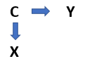

# Experimental Design {#Experimental}

[Screencasted Lecture Link](https://spu.hosted.panopto.com/Panopto/Pages/Viewer.aspx?pid=8b4b668f-3ec7-4c20-93de-ac4a01874ff4) 
 
```{r include=FALSE}
knitr::opts_chunk$set(echo = TRUE)
knitr::opts_chunk$set(comment = NA) #keeps out the hashtags in the knits
```

```{r include=FALSE}
options(scipen=999)#eliminates scientific notation
```

This lesson focuses on ...
 

## Navigating this Lesson

There is about 1 hour of lecture.  

### Learning Objectives

Learning objectives from this lecture include the following:

* Starting with a simple post-test only design, identify limitations and remedies that lead, incrementally, to more robust conclusions with regard to ruling out confounds and plausible rival hypotheses.
* Define internal, external, construct, and statistical conclusion validity and well as each of their subtypes.
* In the context of research design vignettes, specify the threats to validity and identify potential remedies.  
* Discuss the tension between internal and external validity (and its connection to efficacy and effectiveness research).  Support the discussion with citations.
 

### Readings & Resources

In preparing this chapter, I drew heavily from the following resource(s). Other resources are cited (when possible, linked) in the text with complete citations in the reference list.

* Jhangiani, R. S., Chiang, I.-C. A., Cuttler, C., & Leighton, D. C. (2019). Research Methods in Psychology. https://doi.org/10.17605/OSF.IO/HF7DQ 
  -  Chapter V:  Experiment basics (23), Experimental design (24), Experimentation and validity (25), practical considerations (26)
  - Chaper VIII:  One group designs (38), Non-equivalent group designs (39)
* Brewer, M. B. (2000). Research design and issues of validity. In H. T. Reis & C. M. Judd (Eds.), Handbook of research methods in social and personality psychology. Cambridge University Press.
  - A favorite chapter on validity.  Both accessible and rigorous.
  

## In the Beginning There Was...

*“The backbone of psychology, rightly so, rests on randomized-studies, analyzed by analysis of variance”* [@kenny_enhancing_2019]

Because I give these lectures in our analysis of variance class, this chapter is:

* located in positivist and post-positivist philosophies of science
* presumes there is the aspirational goal of inferring causality

It is impossible to discuss causality or ANOVA without discussion of validity.  In [-@campbell_factors_1957], Campbell introduced the concepts of internal and external validity.  Campbell and  Stanley [-@campbell_experimental_1963-1] expanded these ideas.  More than a decade later, Cook and Campbell [-@cook_quasi-experimentation_1979] introduced construct and conclusion  (aka “statistical conclusion” or “statistical conclusive”) validity.  In 2002, those discussions were extended in Shadish, Cook, and Campbell's [-@shadish_experimental_2002] text, Experimental and quasi-experimental designs for generalized causal inference.

This path of articles often focuses on methods associated with the research design.  In his [-@kenny_enhancing_2019] article on enhancing validity in psychological research, Kenny argued for sophisticated statistical approaches (e.g., structural equation modeling, dyadic analysis, mediation) that also support causal inference.  However, the focus of our class is the research design and the use of the ANOVA family of statistics.

As we talk through today’s topics, we’ll use the Tran and Lee [-@tran_you_2014] experimental manipulation of the exceptionalizing stereotype with a sample of Asian  and Asiam American individuals.  In this experiment, Asian American participants (all < 26 y.o., having arrived in the U.S. by age 12) were assigned to three different conditions where a White confederate delivered one of three messages:

* “Nice talking to you.  You speak English well” – low racial loading
* “Nice talking to you.  You speak English well for an Asian” – high racial loading
* “Nice talking to you” -- control

There were multiple outcome evaluations in the study:

**Pre & post-interaction (before and after hearing the microaggression)**

* Evaluation:  “How positive is your impression of this person?”
* Perceived acceptance:  “How much do you think this person will like you?”
* Enjoyable: “How enjoyable do you believe the interaction will be?”
* Similar: “How similar do you think your interaction partner will be?”

**Post-interaction only (after hearing the microaggression)**

* Accurate:  how accurate the participant believed the White confederate’s impression was
* Additional talk time: how much longer they would continue the interaction


|Group       |Assignment          |Pre-test observation     |Manipulation     |Post-test observation
|:-----------|--------------------|-------------------------|-----------------|-------------------------|
|Low racial loading| Random | Evaluation, Perceived Acceptance, Enjoyable, Similar | Yes: "Nice talking to you. You speak English well." |Evaluation, Perceived acceptance, Enjoyable, Similar, Accuracy, Additional talk time|
|High racial loading| Random | Evaluation, Perceived Acceptance, Enjoyable, Similar | Yes: "Nice talking to you. You speak English well for an Asian." |Evaluation, perceived acceptance, Enjoyable, Similar, Accuracy, Additional talk time|
|Control| Random | Evaluation, Perceived Acceptance, Enjoyable, Similar | Yes: "Nice talking to you." |Evaluation, perceived acceptance, Enjoyable, Similar, Accuracy, Additional talk time|

Tran and Lee's [-@tran_you_2014] study **is an experiment**.  However, we’ll *imagine* different research designs and use them to illustrate threats to the validity of the conclusions.

## Quasi-Experimental Designs

### One-group posttest only design:  

A treatment is implemented (or an IV is manipulated) and a dependent variable (DV) is measured once after the treatment is implemented.

**Hypothetical scenario**

|Group       |Assignment          |Pre-test observation     |Manipulation     |Post-test observation
|:-----------|--------------------|-------------------------|-----------------|-------------------------|
|Low racial loading| Not applicable | None | Yes: "Nice talking to you. You speak English well." |Accuracy, Additional talk time|

This the weakest type of quasi-experimental design.

* Without a control group, we cannot tell if the degree of additional talk time would be different if the racial loading had been different.
* Without a pre-test (and measures conducive to the pretest) we cannot know if the Asian American participants’ reactions change as a function of the microaggression

How does this change if we add a pretest?

### One-group pretest-posttest design:

The DV is measured once before the treatment/intervention/manipulation is implemented and once after the treatment/intervention/manipulation.

|Group       |Assignment          |Pre-test observation     |Manipulation     |Post-test observation
|:-----------|--------------------|-------------------------|-----------------|-------------------------|
|Low racial loading| Not applicable | Evaluation, Perceived Acceptance, Enjoyable, Similar | Yes: "Nice talking to you. You speak English well." |Evaluation, Perceived Acceptance, Enjoyable, Similar|

Now we can at least estimate if there has been change in the score from pre- to post-test.  We cannot conclude this with any certainty – because we do not know if this would have changed as a function of the treatment/intervention/manipulation.

Our inability to draw causal inferences has to do with threats to internal validity.

## Threats to Internal Validity

### Defining Internal Validity

* The veracity of the claim of a cause-effect relationship.
* Are changes in the DV produced by variations in the IV? 
  - X --> Y
* Primary concern:  provide evidence of causal linkages.
* Advanced cognitive organizer (or a spoiler alert):  a genuine RCT with zero attrition solves most problems associated with internal validity.

### Threats to Internal Validity as a Function of One-Sample Designs

**History**: any event occurring in or outside of the experiment (other than the IV) that may account for the results.

* Tran and Lee [-@tran_you_2014]:  A pre-test defines a period of time and a control group controls for any historical interference (e.g., national levels of racism connected to COVID-19)
* In other research: 911 occurred in the midst of my longitudinal study on expats (no control group)
* Commonly occurs in: one-group designs (post-only, or pre-post)
* Remedy: no-treatment control group with the same schedule

**Maturation**: changing over time; only a problem if the design cannot distinguish the effects of maturational changes from the intervention.

* Tran and Lee [-@tran_you_2014]:  Similarly, a pre-test defines a period of time and a control group controls for any developmental change/growth
* In other research: expats in my longitudinal study increase their Turkish language skills (just b/c they live in Turkey)
* Commonly occurs in: one-group designs (post-only, or pre-post)
* Remedy: no-treatment control group with the same schedule

**Testing**: influence of testing that may impact subsequent performance (i.e., pre-test influences post-test).

* Tran and Lee [-@tran_you_2014]:  Even though there was “filler,” it is possible that pre-test items cued the participants to the topic of micro-aggressions; comparison groups would help detect this
* In other research: expats in my longitudinal study show increase in sociocultural adaptation – because over the 5 waves, they are cued to its importance
* Commonly occurs in: designs with a pre-test
* Remedy: no-treatment control group with the same schedule would allow its measurement; a Solomon 4-square (where a treatment and non-treatment group does not get a pre-test would provide even greater control).

|Group       |Assignment          |Pre-test observation     |Manipulation     |Post-test observation
|:-----------|--------------------|-------------------------|-----------------|-------------------------|
|High racial loading|Random |Evaluation, Perceived Acceptance, Enjoyable, Similar |Yes: "Nice talking to you. You speak English well for an Asian." |Evaluation, Perceived acceptance, Enjoyable, Similar, Accuracy, Additional talk time|
|Control|Random |Evaluation, Perceived Acceptance, Enjoyable, Similar |Yes: "Nice talking to you." |Evaluation, perceived acceptance, Enjoyable, Similar, Accuracy, Additional talk time| 
|High racial loading|Random |none |Yes: "Nice talking to you. You speak English well for an Asian." |Evaluation, Perceived acceptance, Enjoyable, Similar, Accuracy, Additional talk time|
|Control|Random |none | Yes: "Nice talking to you." |Evaluation, perceived acceptance, Enjoyable, Similar, Accuracy, Additional talk time| 

**Instrumentation**: changes in the measuring instrument or measurement procedures over time.

* Tran and Lee [-@tran_you_2014]: NA.
* In other research:  Research team members are categorizing counselor “utterances” (e.g., open-ended questions, closed-ended questions, reframes, restatements, challenges) and the meanings/definitions of these shift over time.
* Commonly occurs in:  Designs with human raters
* Remedy: standardized measures, automated scoring devices, manipulation checks, strict standardized procedures, assessing inter-rater reliability

**Statistical Regression toward the mean**: the tendency for extreme scores on any measure to revert (or regress) toward the mean of a distribution at re-administration.

* Tran and Lee [-@tran_you_2014]: If there had been an immediate national news story related to racism toward Asian Americans related to COVID-19 and the study occurred in that day (but then the post-test would have needed to be spaced further out).
* In other research:  Parental stress is extremely high when the parent enrolls in a parenting class and it is less high at the next measurement
* Commonly occurs in: Designs where research participants are enrolled when they present for services
* Remedy:  random assignment to treatment; no-treatment control groups 

**Spontaneous remission**: the tendency for medical and psychological problems to improve over time without any form of treatment

* Tran and Lee [-@tran_you_2014]:  difficult to imagine
* In other research:  the presence of depression symptoms that are not present six months later
* Commonly occurs in: Designs where research participants are enrolled when they are patients who present for services
* Remedy:  random assignment to treatment & no-treatment control groups


## Experimental Designs

Research can achieve the state of experimental when

* The analysis seeks to determine whether changes in the independent variable (IV, a factor or predictor variable with two or more conditions/levels) lead to change in the dependent variable (DV, outcome variable);
* To rule out potential confounds and plausible rival hypotheses, there is maximum control over extraneous variables/noise; this control might be achieved through
  - Inclusion/exclusion criteria,
  - Manualized protocols,
  - Standardization of context/setting.
* The IV/factor is systematically manipulated;  comparing two groups of people who differ on the IV is not an experiment (see Jhangiani et al.'s [-@jhangiani_research_2019] chapter on non-equivalent group designs); 
* Random assignment to the conditions.  This is the gold standard; without random assignment there is no experiment.
  - A random clinical trial involves random assignment to treatment and control conditions,
  - Causality is often better established when the control condition offers a placebo (a believed-to-be inert condition that looks like the treatment condition).  Placebos often work!  Just for fun (optional) see WNYC's Radiolab story on [Placebo](https://www.wnycstudios.org/podcasts/radiolab/episodes/91539-placebo) and Hidden Brain's episode, All the World's a Stage -- [Including the Doctor's Office](https://www.npr.org/2020/05/11/853753307/all-the-worlds-a-stage-including-the-doctor-s-office)
* For ethical and practical reasons (i.e., the researchers believe the treatment is effective and wish it to be given to many), there can be a **wait-list control condition**.

Within this broad category of a variety of designs consider the following:

### Between-Subject Experiments

Each person is randomly assigned and tested in only one condition. This would have been the case for Tran and Lee [-@tran_you_2014], had there not been a pre-test observation.  

|Group       |Assignment          |Manipulation     |Post-test observation
|:-----------|--------------------|-----------------|-------------------------|
|Low racial loading|Random |Yes: "Nice talking to you. You speak English well." |Evaluation, Perceived acceptance, Enjoyable, Similar, Accuracy, Additional talk time|
|High racial loading|Random |Yes: "Nice talking to you. You speak English well for an Asian." |Evaluation, perceived acceptance, Enjoyable, Similar, Accuracy, Additional talk time|
|Control| Random |Yes: "Nice talking to you." |Evaluation, perceived acceptance, Enjoyable, Similar, Accuracy, Additional talk time|

Random assignment protocols can be achieved in a variety of programs including R and [randomizer.org](https://www.randomizer.org/). 

Random assignment is often determined one participant at a time (i.e., **simple random assignment** where each person has an equal chance of being randomly assigned to any of the groups).  When there is strict need for **balanced designs** (equal cell/group sizes), a **block randomization** protocol can be specified (i.e., all conditions occur once in the sequence before any of them is repeated; then they all occur again before any is repeated).  Within each of these “blocks” the conditions occur in a random order.

For example, if Tran and Lee had used a block randomization, the first nine assignments might have looked like this:

|Participant |Condition |
|:-----------|:--------:|
|1|Low|
|2|High|
|3|Control|
|4|High|
|5|Low|
|6|Control|
|7|Control|
|8|Low|
|9|High|

**Matched groups** is an variant of simple random assignment. Here, participants are ranked on some variable the researcher wishes to control.  If Tran and Lee believed that internalized racism would impact the outcomes, the participants could take a pre-test of internalized racism.  Participants could be placed in rank order of score.  The highest three would be randomly assigned to the three conditions; then the next highest three and so forth.

### Within-Subject Experiments

In a **within-subjects experiment** each participant is tested under all conditions.  We can imagine the Tran and Lee [-@tran_you_2014] circumstance – perhaps the participant shows up to Psych 101 experiments 3 weeks in a row and, each time, is somehow exposed to the high racial loading, low-racial loading, and control conditions (we’d need to be a little creative so it wouldn’t be obvious).  

An advantage of any within-subjects/repeated measures experiment is that it provides maximum control of extraneous participant variables (e.g., the participants all have the same SES, IQ, contextual variables).

**Order effects** are a big consideration in within-subjects experiments.   Order effects occur when participants’ responses are affected by the order of conditions.  Still,

* **Carryover effects** could occur, in that the effect of the first experienced condition might impact outcomes in the next condition (e.g., the Tran and Lee participant experiences the high racial loading first and is more cautious at follow up; or withdraws from the study).
* **Practice effects** occur when there is improved performance over time – owing to practice.
* **Fatigue effects** occur when there is deteriorating performance from tiredness or boredom. 
* **Context or contrast effects** occur when knowledge or experiences in a prior trial provide a contrast/context for responses in the next trial.

In Tran and Lee (as with many repeated measures experimental designs), we would want to counterbalance the order such that the order is randomly determined.  In complete counterbalancing, an equal number of participants complete each possible of order of conditions.

Counterbalancing has two primary effects:

* Controls the order of conditions so that it is no longer a confounding variable
* If there are carryover effects, it is possible to detect them (e.g., analyzing the data separately for each order to see whether it had an effect).

Hypothetical Tran and Lee [-@tran_you_2014], within-subjects, counterbalanced

|ID |Pre-test |Manip #1 |Measures#2 |Manip #2 |Measures#3 |Manip #3 |Measures #4|
|:--|---------|---------|-----------|---------|-----------|---------|-----------|
|1  |yes      |High     |yes        |Low      |yes        |Control  |yes        |
|2  |yes      |Low      |yes        |Control  |yes        |High     |yes        |
|3  |yes      |Control  |yes        |High     |yes        |Low      |yes        |

When I teach ANOVA, we progress through a series of ANOVA designs that correspond with the following research designs:

|Research Design                     |Corresponding ANOVA                       |
|:-----------------------------------|------------------------------------------|
|Post-only (or single time point) group design |One-way ANOVA|
|Increasing control over an extraneous variable by including it as a covariate |ANCOVA (analysis of covariance)|
|Factorial design (between subjects) |Factorial (between-subjects) ANOVA |
|Pre-post group design |One-way repeated measures ANOVA |
|Pre/post factorial design (the classic RCT model) |Mixed design ANOVA|

## The Validity Family

Earlier in the lecture, we reviewed six common **threats to internal validity** that were common to research designs that lacked pretty basic things:  pre-test, random assignment, comparison groups.  However, validity threats apply to all research designs. 

* **Internal validity**: whether the evidence of a study supports the existence of a causal relationship among its variables. KEYWORD:  CAUSALITY
* **External validity**: whether the proposed relationship generalizes beyond characteristics of the study in which it was found. KEYWORD: GENERALIZATION
* **Construct validity**: whether the interpretation of the causal relationship is accurate. KEYWORD: MEANING
(Statistical conclusion validity: whether the facets of the quantitative evaluation were appropriate.
* **Test/psychometric validity**: whether or not a particular measurement or observation measures what it purports to measure (much, much, more in psychometrics).

### Defining "Internal Validity"

#### Threats to Internal Validity

The purpose of an **experiment** is to show that two variables are statistically related and to do so in a way that supports the conclusion that the independent variable caused any observed differences in the dependent variable.

You’ve likely heard **correlation does not imply causation** – thus in order to **infer causality** (we never ever ever “prove”), we must design our study in such a way that we rule out **plausible rival hypotheses**.  When we do, our study is high in **internal validity**.  That is, the way the research was conducted supports the conclusion that the IV caused observable differences in the DV.

Kazdin's [-@kazdin_research_2017] text identified a number of factors (outside of experimental design) that threaten internal validity:

**Selection Bias**: systematic differences in groups based upon the selection or assignment of subjects to experimental conditions.

* Remedy: random selection from the population; random assignment to groups; using difference tests on key variables (preliminary analyses)

**Diffusion or Imitation of Treatment**: the intervention given to one group may be provided accidentally to all or some subjects in the control group as well.	
*Remedy: manipulation checks 

**Special Treatment or Reactions of Controls**: in an investigation where the intervention, treatment, or program is administered to the experimental group, the no-treatment control group may also be accorded special attention, and thus react in unexpected ways. 

**The Third Variable Problem**: two variables are correlated with each other because both are correlates of a third factor, even when there is no direct or indirect causal relationship between the first two [@reis_research_2000].

* Here, the relationship between X and C is not causal
* Because X and C are correlated, the changes in Y could be misattributed to X when they are actually caused by C
* Thus, there is spurious correlation between X --> Y



Therefore, we should ask, “Do we have hidden variables?”	

* Remedy: random assignment; also when covariates are identified, test for moderating or mediating effects


 

**Attrition or Experimental Mortality**: subjects dropping out of the experiment over time, particularly when there is a *differential* loss of subjects between groups. 	

*Remedy:  know your pop/lit, start huge, do everything you can to keep your participants (within ethical limitations) 

Boggs et al. [-@boggs_outcomes_2005] examined outcomes of Parent-Child Interaction Therapy (PCIT) participants on the basis of their completion status (i.e., if they dropped out of treatment) one and three years later.

The narration of the article makes clear the problem of attrition in (a) the original study, (b) the follow-up study, and (c) treatment in general (hence they wanted to study the effect of attrition)!

So what to do about attrition:

* Everything you can afford (and do not involve coercion) 0to minimize it
  * Incentives
  * Increasing incentives for longitudinal
  * Pay participants (consider something equivalent to minimum wage)
* Address it in the statistical analysis.  
 
West et al. [-@reis_causal_2000](pp. 50-51) had a complete data set (simulated) where half of the participants were assigned to control and treatment conditions.  The estimated *true* difference was .5.  The data was further simulated to assign some of the cases to be missing. Knowing the *true* difference, the researchers analyzed the data with three different approaches to managing the missingness.

* Typical analysis
  - Toss out all participants in treatment group who do not receive treatment. This results in a biased estimate of causal effect; direction of bias is unknown.  Using the typical analysis, the difference was estimated to be 1.045.
* Intention to treat analysis
  - Compare mean response of all participants assigned to treatment condition (regardless of whether they received treatment) with mean response of those in control condition.  The intent-to-treat difference was estimated to be .34.
* CACE (complier average causal effect) analysis
  - Create an unbiased estimate of treatment effect for those who receive treatment. It is a complicated statistic – but the estimate is .5.

If you have access to the West et al. [-@reis_causal_2000] chapter, it is worth looking at the table where this is demonstrated. In other lessons in the OER I offer additional approaches (i.e., multiple imputation, available item analysis) to managing missing data.

It happened to us!

Below are graphs from Scott Campanario’s doctoral dissertation [@campanario_ignatian_2018; @campanario_ignatian_2020] – a random clinical trial evaluating three versions of SPU’s Online Field Guide.

Control – adjust to college only activities
Traditional – Control + traditional career planning activities
Calling – Traditional + Control + Ignatian discernment activities


Attrition from pre (T1) to post (T2) as high.  The graph on the left uses listwise/pairwise deletion (lose the whole case) if pre or post was missing.  We expected that randomization would cause the three TA starting spots to be closer – but they were not!  

Why not?  We aren’t exactly sure, but it’s likely that the students who persisted in the calling condition (the most demanding), were those who started higher on the outcome in the first place (career decision-making self-efficacy and purpose).

When we used multiple imputation to preserve case with missingness, it brought the means of the pre-test closer together and reflected our hypotheses (and likely the true state of the data) better.  JUST TO BE CLEAR – you can never really know the bias introduced by missingness – but this is a story emphasizing why it is important to minimize it.

** *One more Threat to Internal Validity* **

**Combination of Selection & Other Threats**: selection of groups that are already formed prior to the experiment might lead to a combined confound of selection and some other threat to internal validity. The experience of one of the groups in the study (e.g., history, maturation) may differ systematically from the other group. The *differential influence* of this threat among groups is referred to as an interaction with selection.   

* Remedy: random assignment to treatment groups 

### A Bit about the Remedies

**Random selection**: Drawing subjects from a population in such a way that each member of the population has an equal probability of being drawn.

**Random assignment**: Allocating or assigning subjects to groups in such a way that the probability of each subject appearing in any of the groups is equal. This is usually accomplished by determining the group to which each subject is assigned by a table of random numbers (or now, on R or randomizer.org).

* Comparison of Tx and control groups is only legitimate when the Tx and Control groups are equivalent in terms of all important background characteristics at pre-test. 
* Random assignment normally absolves concerns about this assumption.

### Strategies or Equating Non-Equivalent Groups

1.	Identify all important covariates; attempt to discern hidden variables.
2.	Measure each of these covariates with *perfect reliability* (or statistically adjust for imperfection).
3.	Specify a correct linear relationship b/t the pretest variables and outcome variable.
4.	Demonstrate that pretest maturation rates do not differ in the Tx and Control groups. (Group * Pretest interactions are bad).
5.	When each of these strategies has been successfully completed, the researcher has *strong ignorability* (this is good; but achieving it is “extraordinarily difficult and fraught with uncertainty”). 

To offer a change from the lecture/chapter format, match the definition to the type (term) of control group.

|A Matching Exercise (answers provided at the end of the lesson)                  |
|:-----------------------|--------------------------------------------------------|
|Term                    |Definition                                              |
|a. Control Group        |___A group that does not (ever) receive the experimental condition or intervention.|
|b. Patched-up Control Group |___A control condition designed to ensure that groups are equal with respect to potentially important but conceptually and procedurally irrelevant variables. Groups are equalized with regard to a particular variable(s)|
|c. Yoked-control Group |___Experimental condition/intervention that is not provided during the period that experimental subjects receive the intervention|
|d. Wait-list Control Group |___A group that is not randomly composed from the pool of subjects in the study. While its intent is to address some issues of internal validty, its composition is derived from issues of convenience.|
|e. No-treatment Control Group |___Experimental condition or intervention is not provided during the period that experimental subjects receive the intervention. After this period, subjects in this group receive the intervention.|

## Defining External Validity

The *generalizability* of the causal findings; can the same cause-effect relationship be obtained across different subjects, settings, methods. Three questions:

* **Robustness**:  Can it be replicated in the face of variations of subject populations and settings (Milgram’s 1963 move from Yale lab to a “seedy office”)
* **Ecological validity**: Is it representative of what happens in everyday life? Findings obtained with college students are interesting, but have no ecological validity until they have been demonstrated to occur in more representative circumstances.
* **Relevance**:  Does it matter? Akin to ecological validity – is the finding related to events or phenomena that actually occur in the world? Are the results useful or applicable to solving problems and improving quality of life?

### Threats to External Validty

**Sample characteristics**: The extent to which results be generalized to other persons who vary in age, race, ethnic background, education, etc.

**Stimulus characteristics**: The extent to which results can be extended across stimulus characteristics (i.e., features of the study) of the experiment.

**Contextual Characteristics**:

* *Reactivity of experimental arrangements*: the influence of the subjects’ awareness that they are participating in an investigation.
* *Multiple-treatment interference*: Drawing conclusions about a given treatment when it is evaluated in the context of other treatments.
* *Novelty effects*: effects of an intervention may, in part, depend upon their innovativeness or novelty.

**Assessment Characteristics**:

* *Reactivity of assessment*: simply because subjects are aware that they are being assessed, they may alter their performance.
* *Test sensitization*: in designs where pre and posttest measures are completed, the pretest may sensitize the participants so that they are affected differently by the intervention (i.e., pretest sensitization).
* *Time of measurement and treatment effects*: the possibility that the effects of the experiment are demonstrated at the time of the testing, but might not generalize to a later point of time.

#### Re-Enter Parsimony and Plausibility

* **Plausibility**: an interpretation of the results of an investigation on the basis of some other influence than the one the investigator has studied or wishes to discuss.
* **Parsimony**: directs us to select the simplest version or account of the data among the alternatives that are available.

## Balancing Internal and External Validity

As a general rule, design features that make an experiment more sensitive as a test of the independent and dependent variables tend to limit the generality of the findings. Conversely, features of an experiment that enhance generality of the results tend to increase variability and to decrease the sensitivity of the experimental test ([-@kazdin_research_2017], p. 79)

Writing in the *American Psychologist* in the 1980s, Mook's [-@mook_defense_1983] statement emphasizes the importance of careful research design:  "I am afraid there is no alternative to thinking through, case by case, (a) what conclusion we want to draw and (b) whether the specifics of our sample or setting will prevent us from drawing it." (386)

### The Bubble Hypothesis

Gelso [-@gelso_research_1979] used "bubble hypothesis" as analogy for balancing internal and external validity. Gelso described the difficulty which arises when someone attempts to place a decal on a window and a bubble appears. When the bubble is depressed in one area, it arises somewhere else. The metaphor back to internal and external validity includes:

* Inevitable trade-offs exist at all stages of research.
* Knowledge is most powerfully advanced through the use of a variety of methods.
* Rigor vs. relevance
  - Rigor:  internal validity
  - Relevance: external validity
  
Key points in the balancing of internal and external validity have been made by the following scholars:

1.	As a priority internal validity is usually regarded as more important than, or at least logically prior in importance to external validity [@kazdin_research_2017].
2.	Some of the best and most helpful research begins with understanding the phenomena of interest, and studies with that focus may have very little external validity [@mook_defense_1983].
3.	Rarely can internal, external, (and construct) validity be properly addressed within the context of a single research design…they require systematic, programmatic research studies that address a particular research question across different operations and research settings [@reis_research_2000]. 

## Defining Construct Validity

* The extent to which a causal relationship could be generalized from the particular methods and operations of a specific study to the theoretical constructs and processes they are purported to represent.
* Construct1 --> Operations --> Construct2
* Specific operations/measures are merely partial representations of the theoretical constructs of interests (Brewer, 2000).

### Threats to Construct Validity

**Unknown range problem**: the failure to specify precisely what levels of the IV are expected to be causally significant; and over what range of outcomes

* Unknown range of stimulus variation
*	Unknown range of measurement 

Because of these problems, it is difficult to determine whether a failure to confirm a predicted relationship is a failure of theory or a failure of operation.

**Attention and contact with the clients**: the intervention may have exerted its influence because of the attention provided rather than because of special characteristics unique to the intervention.

**Single Operations and Narrow Stimulus Sampling**: occurs when one cannot discern the construct of interest (i.e., treatment or types of description of treatment) from the conditions of its delivery (i.e., therapist or case vignette).

**Experimenter Expectancies**: the threat that expectancies, beliefs, and desires about the results on the part of the experimenter influences how the subjects perform; unintentional expectancy effects.

**Cues of the Experimental Situation**: seemingly ancillary factors associated with the intervention that may contribute to the results; “demand characteristics of the experimental situation.”

## Statistical Conclusion Validity

Defined as: those facets of the quantitative evaluation that influence the conclusions we reach about the experimental condition and its effect.

### Threats to Statistical Conclusion Validity

**Low Statistical Power**: the failure to reject the null hypothesis when it is false.

**Variability in the Procedures**: if variability is minimized, the likelihood of detecting a true difference between the treatments or treatment conditions and control conditions is increased.

**Subject Heterogeneity**: the greater the heterogeneity or diversity of subject characteristics, the less likelihood there will be to detect a difference between alternative conditions.

**Unreliability of Measures**: the extent to which the measures assess the characteristics of interest in a consistent fashion.

**Multiple Comparisons and Error Rates**:  The more statistical tests that are performed, the more likely a chance difference will be found, even if there are no true differences between conditions (Type I error).  Also called family-wise error, experiment wise-error.

Throughout the statistical portions of the ReCentering Psych Stats OER, I will consistently attend to statistical conclusion validity by attending to power analysis, statistical assumptions (and their violation/nonviolation), effect sizes, confidence intervals.  In sum – we look at the dashboard of metrics we learn from and about our analyses.

## Answer Key  

Answers to the exercise matching the terms to the definitions of control groups
e, c, a, b, d  

```{r include=FALSE}
sessionInfo()
```


