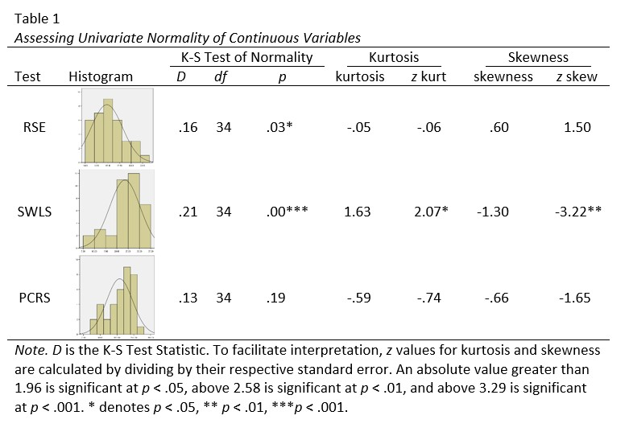
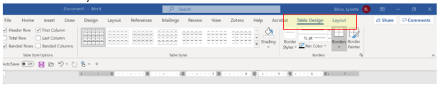
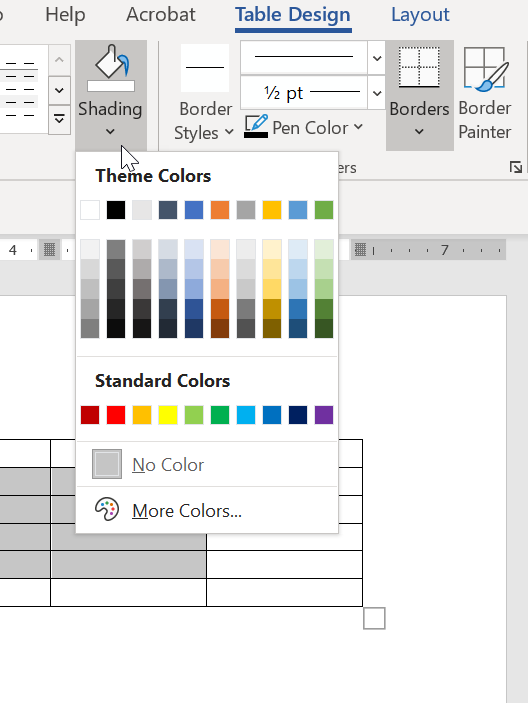
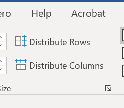
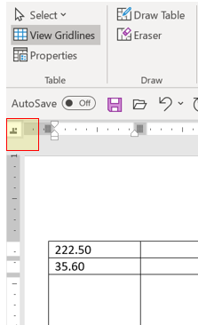

# Table Magic {#Tables}

[Screencasted Lecture Link](https://spu.hosted.panopto.com/Panopto/Pages/Viewer.aspx?pid=5f6035f2-0aff-476b-829c-ac240184c580) 
 
```{r include=FALSE}
knitr::opts_chunk$set(echo = TRUE)
knitr::opts_chunk$set(comment = NA) #keeps out the hashtags in the knits
```

```{r }
options(scipen=999)#eliminates scientific notation
```


Fluency with the skills in this lecturette will be essential as you format tables for papers, journal articles, posters, and your dissertation.  When you use formal table skills (in Word or Excel…and the basics transfer well from one to the other), then the tables are less likely to corrupt and require reformatting when you transfer them from document to document.


## Navigating this Lessonette

There is about 30 minutes of lecture.  If you work through the materials with me it would be plan for an additional hour.

### Learning Objectives

Learning objectives from this lesson include the following:

* Explore the tabs and commands in the table ribbons in word processing packages.
* Utilize basic table skills such as adding/deleting rows and borders and aligning cell content.
* Experiment with advancedtable skills such as splitting/merging cells and redistributing columns.
* Apply these skills to subsequent homework assignments and manuscript submissions.


In this lecturette, I will tour the basic skills, then replicate the above table from scratch.  This table, though…is pretty simple.  We use a number of nested and stacked tables to represent our complex analyses.



## Magic Happens When You...

Place individual elements into separate cells of a table (as opposed to tabs and spacing) tool “holds them place”.

* Item stems will word-wrap.
* Decimals are easy to manage.
* The table borders allow the author to identify formatting choices and make changes without impacting the remainder of the table (when relying on tabs and margins, existing formatting is not always obvious).

### Starting the Table

Start with the insert ribbon and the table icon.


Either "color in" the row x column dimensions or click Insert Table to get a dialogue box where you can enter the number of columns and rows.


### A Few Handy Tools

For **borders and shading**

* To obtain the borders/shading menu, right click on the table or select it from the table menu in the upper toolbar.
* Select “none” to make the table lines invisible.
* In some cases you may want to leave table lines (or some of the grid).
* Hint:  I turn on (and leave on) ALL the borders until I’m finished…then selectively make them invisible.






For **cell alignment**, right click on the cells of interest. The Cell Alignment tool allows you to specify by cell(s), row(s), or column(s) how the text should align.


**Merging cells** allows two or more cells to become one.  This can occur vertically or horizontally.  Drag across the cells you want to merge.  Right click, then select *Merge Cells*.


Need two cells separted?  The **split cells** tools will subdivide a single cell into the desired rows and columns. Place your cursor into the desired cell. Right-click, then select *Split Cells*. 

Columns or rows out-of-whack?  The **Distribute Rows and Distribute Columns** tools are incredibly powerful and can be used to “even-out-the-space” of either. 




Didn't quite plan right? Right-click in the cell to *Insert* or *Delete* rows, columns, or cells.


Alternatively, if you just want to add a row, position your cursor just outside of the row immediately above where you want the row added and ENTER.


### Decimal Magic

Tabs (for alignment in columns) are in teh upper right, below the toolbars.  Clicking through the tabs changes the option.  "Click" until the decimal symbol appears.

Once it shows, highlight the column (or row) for which you want to set a decimal place.

If numbers don't automatically align, try backspacing or CTRL_TAB.



### More Help from Table Properties

The Table Properties window can offer advanced options or rows, columns, cells, and the table as a whole.


```{r }
sessionInfo()
```


