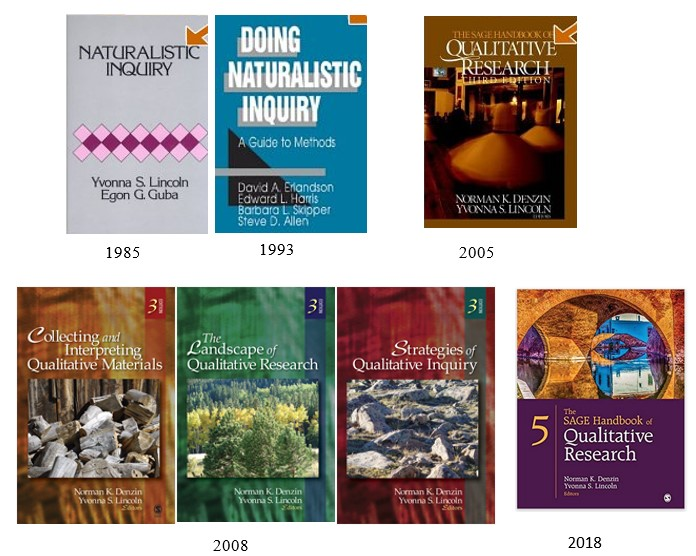
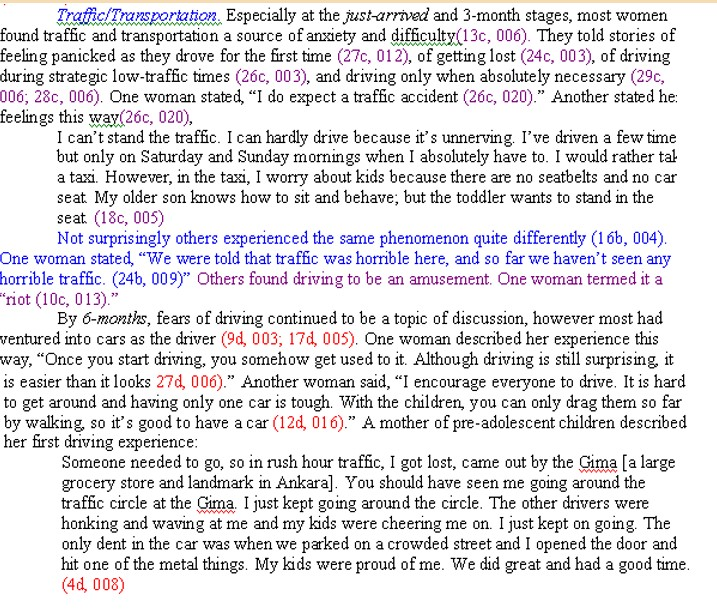
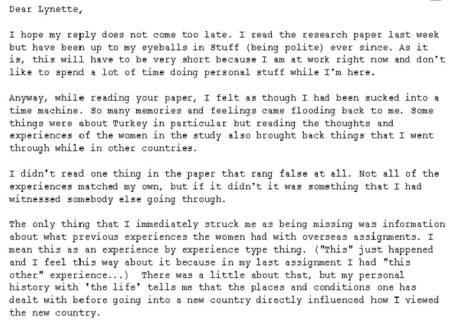

# Quick Qualitative Introduction {#Qualitative}

[Screencasted Lecture Link](https://spu.hosted.panopto.com/Panopto/Pages/Viewer.aspx?pid=fe82fd33-43da-4ad6-afeb-aad2016db360) 
 
```{r include=FALSE}
knitr::opts_chunk$set(echo = TRUE)
knitr::opts_chunk$set(comment = NA) #keeps out the hashtags in the knits
options(scipen=999)#eliminates scientific notation
```

Qualitative research methods is a huge topic. There are a number of different approaches (that span an array of philosophies of science) and so is impossible to address properly in an hour-long review.  In this short time, we will start with a bit of qualitative history that applies directly to pscyhology. I will demonstrate one qualitative method -- *Naturalistic Inquiry* (which was an early method whose ideas are reflected in other approaches) in a study I led a few years ago.

## Navigating this Lesson

There is about 1 hour of lecture.  

### Learning Objectives

Learning objectives from this lecture include the following:

* Contrast key elements of qualitative and quantitative research methods.
* Distinguish between a priori and grounded theory.
* Identify criteria that lead to the trustworthiness of a qualitative study.
 
### Readings & Resources

In preparing this chapter, I drew heavily from the following resource(s). Other resources are cited (when possible, linked) in the text with complete citations in the reference list.

* Jhangiani, R. S., Chiang, I.-C. A., Cuttler, C., & Leighton, D. C. (2019). Research Methods in Psychology. https://doi.org/10.17605/OSF.IO/HF7DQ 
  - Chapter VI: Qualitative research (31)
  - Observational research (32)
* Bikos, L. H.,  Çiftçi, A., Güneri, O. Y., Demir, C. E., Sümer, Z. H., Danielson, S., DeVries, S., & Bilgen, W. (2007). A longitudinal, Naturalistic Inquiry of the adaptation experiences of the female expatriate spouse living in Turkey. Journal of Career Development, 34, 28-58zq.
  - In this study, we used the qualitative method, Naturalistic Inquiry (Lincoln & Guba, 1985; Erlandson, Harris, & Skipper, 1993). As you read, note the theoretical foundation for launching the project. Read heavily the method, making particular note of what makes this study trustworthy. The ms is long. I'm more interested in you making mental (and marginal) notes about design issues and less interested in you knowing the outcomes of the study. Take a quick look at the Results/Discussion. Here, I'm more interested in you taking note of the style of writing and the integration with the literature. In class I'll share all the behind-the-scenes stories.
  

## The Qual v Quant Contrast

When I include a qualitative lecture in the context of a research design class, the qualitative component becomes inevitably contrasted with the quantitative background. As one who conducts (and values) the contributions of qualitative, this is not at all to diminish its contributions.

|**Quantitative**                           |**Qualitative**
|:------------------------------------------|:------------------------------------------|
|Philosophy of science is “positivist” to “post-positivist” |Philosophy of science is somewhere else:  postpositivistic, constructivist-interpretivist, naturalistic, critical-idiological|
|Laboratory, controlled setting.|Natural setting.|
|Use of valid and reliable scales and instruments. |Human instrument.|
|Use of implicit knowledge. |Use of tacit knowledge.|
|Sampling methods are typically random or representative.|Sampling methods are “purposive.”|
|Deductive data analysis: explanation guides the development of the study.|Inductive data analysis: explanation grows out of the data.|
|A priori theory.|Grounded theory.|
|Research design is predetermined. |Research design is emergent.|
|Experimenter determined outcomes.|Negotiated outcomes.|
|Scientific and technical reporting. |Case study reporting mode.|
|Concerned with generalization of results. |Idiographic interpretation of data.|
|Credibility determined by internal and external validity, reliability, objectivity. |Trustworthiness of the results established by other criteria such as an “audit trail.”|

## From Whence we Came

Qualitative research methods have long and historied rootes.  I was originally trained in the Lincoln, Guba, and Denzin tradition of *naturalistic inquiry*.



* Dr. Norman K. Denzin is Distinguished Professor of Communications, College of Communications Scholar, and Research Professor of Communications, Sociology, and Humanities at the University of Illinois, Urbana-Champaign. He has described himself as an ethnographer, an interpretive interactionist, a cultural critic, and an occasional social theorist. 
* Dr. Yvonna S. Lincoln is a Professor in the Department of Educational Administration at Texas A&M University. She has been with the institution since 1991. Prior to that time, Dr. Lincoln held teaching positions at the University of Kansas and Vanderbilt University.
* Dr. Egon G. Guba, retired, Professor Emeritus in Education, University of Indiana-Bloomington.

You can see that these individuals are from education and disciplinary communications. As we get closer to psychology, there have been several important publications that have influenced our processes.  In an editorial in the *Academy of Management Journal*, Gephart [-@gephart_qualitative_2004] provided some guidelines for those conducting qualitative research in Industrial-Organizational psychology. As a one who reviews a number of qualitative methods, I agree with these and have added one additional guidelines:

* "one off” --  embedded in a larger research program?
* Adequate lit review?
* Explicit statement of goals, objectives, research questions?
* Clear & thorough construct definition?
* Sufficiently specified methodology?
* Narrative thread evident in discussion/conclusion?

**Plus** (mine):

* A clear location in philosophy of science that drives the method?

## Critical Qualitative Foundation

### The Qulitative Orientation

* Phenomenological, -emic
  - Seeking to understand the phenomenon from a position on the inside
* Inductive
  - Constructing meaning from heterogeneous data
* Emergent design
  - How comfortable will your dissertation committee be (& IRB) if you don’t precisely specify all of your method?

### Methods of Observation:  Role of the observer

* Covert participant observation
* Concealed observation
* Unconcealed participant observation
* Nonparticipant observation

### Gathering and Analyzing Data

* Informant selection: purposive, stakeholders
* Analytic induction
* Grounded (vs. apriori) theory
* Constant comparison
* Gather/analyze until saturation
* Negative case analysis (i.e., a different utilization of outliers)

### Data Collection

* Field notes and logs
* Memos/reflexive journal
* Documents
* Artifacts
* Triangulation


### Data Analysis

* Unitizing data
* Coding
* Emergent category/designation
* Negative case analysis

## Establishing the Credibility of a Qualitaive Study:  Trustworthiness

Although the history (as documented in some of the Handbooks noted earlier) has moved away from directly comparing qualitative and quantitative approaches, I still find this adapted from Lincoln and Guba's *Naturalistic Inquiry* [-@lincoln_naturalistic_1985] to be useful in framing the differences.

|Criterion   |Conventional Term |Naturalistic (Qualitative) Term) |Naturalistic (Qualitative) Techniques
|:-----------|:-----------------|:-----------------|:---------------------------|
|Truth value |Internal validity |Credibility |Prolonged engagement, Persistent observation, Triangulation, Referential adequacy, Peer debriefing, Member checks, Reflexive journal|
|Applicability|External validity |Transferability |Thick descriptions, Purposive sampling, Reflexive journal|
|Consistency |Reliability |Dependability |Dependability audit, Reflexive journal|
|            |Objectivity |Confirmability |Confirmability audit, Reflexive journal|


## EXAMPLE:  Adjustment of the Female, Expatriate Spouse -- A longitudinal investigation [@bikos_repeated_2007]

### Beginnings of the Project

Below is a sketch of the culture shock model that is often used to prepare individuals for study, work, and relocation abroad. My husband and I were exposed to this model in pre-departure preparation for our expatriation. Curious about it, I began a longitudinal (5 waves across 1 year) examination of the first-year adaptation of female, expatriate spouses, in Ankara, Turkey.


In this figure I have superimposed the struggles that my family faced:


As I describe in the lecture, the study was mixed methods. The participants (*N* = 32) completed measures and interviews at each of the waves.  Our quantitative analyses suggested no predictable change over time.

This was true for mental health, alcohol use, and marital satisfaction.


## Naturalistic Inquiry Methods

* Lincoln and Guba [-@lincoln_naturalistic_1985] and Erlandson, Harris, Skipper, and Allen [-@erlandson_doing_1993] 
  - Research Team
* Americans Team Members (*n* = 4)
  - 1 held doctorate degree
  - 3 held masters degrees in helping professions
  - All were trailing, expatriate spouses
* Turkish Team Members (*n* = 4)
  - 3 held doctorates and had lived abroad for extended periods (nine months or more) of time
  - 1 held masters degree and was anticipating study abroad

## Establishing Trustworthiness

* Individual member checks 
  - 24% of interviews. 
* Persistent observation & prolonged engagement 
  - 131 interviews, averaging 25 interviews per time-in-country stage
* Grand member-check 
  - offered to 32 stakeholders; 47% participated.
* Reflexive journal entries 
  - completed by research team at seven points in the project.
* Audit trail
* Confirmability audit 
  - completed by an external expert in qualitative methods.

### Interviews

* 131 interviews between December 5, 2000 & November 18, 2002 
  - Interviews (and measures) completed within 2 week interval around each 3-month anniversary date
  - 91 after September 11, 2001
* Open-ended and informal 
  - *Transcribed* from notes taken with paper/pencil or laptop 
* Examples items
  - If you wrote a book, what “big stories” would you include? 
  - What things/people/events have helped your stay go more smoothly (more difficult)? 
  - What could your company have done (could do) differently?
  - What changes have you noticed in yourself in the variety of roles and aspects of your life? 
  - After September 11, 2001: How have the terrorist attacks against the U.S. changed the way you think or feel about living in Turkey?

### Data Analysis and Interpretation

* Interview elements unitized into the smallest complete thought. 
  - interviews for each stage ranged from 390 to 818 units 
* Theming parties (2) held at the conclusion of each time-in-country interview stage.
  - large sheets of newsprint, divided into 6 X 8 grids, teams separately categorized the units
  - categorized data for each stage ranged from 30 to 55 themes 
* Salient themes identified by  
  - frequency of cards in each theme 
  - common/overlapping themes between the two theming parties 
  - knowledge of the expatriate literature 
* Case studies (5) completed at the end of each time-in-country stage.
* Grand Case Study Report (60 pages) integrated the five staged reports. Includes in-depth coverage of 13 major themes.

### Reflexive Journal Entry

Below is an example of a reflexive journal entry of one of the members of the team. Here's where research team members record their impressions, speculations, and experiences.  It "brackets" researcher bias by acknowledging it.  It is then part of the audit trail.


### Interviewing Example:  Unitizing

Transcripts of the interviews are *unitized* into complete thoughts. These days, I use Microsoft Excel for the entire analysis process.


### Theming

In this project we probably leaned a little *positivist* in that we had two teams who themed the data separately. These themes are captured in the spreadsheet.  The spreadsheet also captures the participant ID number, the place in the transcript, and the wave (alphabetical).


### The Case Study

The case study captures the source of the data by identifying the participant number, wave letter, and place in the transcript. Because of the numerous participants and waves, we also used color-coded script to help in writing it up.



### Grand Member Check

After the case study was drafted (not final, just drafted), we sent it to *stakeholders* (some of the research participants and others with a "stake in the phenomena") to get their impressions.  We asked, "What sounds right?"  "What did we miss?"  "Is this true to your experience?"  We would have liked to have held these meetings in person, but due to the nature of repatriation, we asked for feedback in e-mail responses.


### Audit Trail and Audit

Finally, we sent all of our materials to an expert in qualitative research methods who was aware of the study, but neither a research participant nor member of the research team.  This individual examined our *audit trail* including interviews, documented processes, citations, and conclusions.  This is an excerpt of their review.


### Evaluating Bikos et al. [-@bikos_longitudinal_2007]

|Strengths                          |Curiosities
|:----------------------------------|:---------------------------------|
|The article clearly identified philosophy of science (constructivist-interpretivist) |In practice, there was a great deal of post-positivist influence|
|Clearly specified qualitative method (*Naturalistic Inquiry*) |Atypically large # participants (8-15 is more common) and phenomenally huge # interviews.
|Clear specification of the credibility criteria and how they were implemented. |Team analysis (NI allows for individual theming as well)|

## How Would I Select a Qualitative Method for my Dissertation?

* Use Gephart’s criteria as a guide.
* Special qualitative issue in Journal of Counseling Psychology (2005 v.52, #2) devoted to most utilized qualitative methods. 
* It’s easier when the steps are clearly specified.
  - Consensual Qualitative Research [@hill_consensual_2005; @hill_consensual_2012].
  - Naturalistic Inquiry [@erlandson_doing_1993; @lincoln_naturalistic_1985].
  - Grounded theory [@fassinger_paradigms_2005].
  - Less clear steps in broadly defined methods like phenomenology, ethnography
* Will your advisor/committee use a group?
  - Group required:  Consensual Qualitative Research
  - No group required:  Naturalistic Inquiry, Grounded Theory
* Should I use mixed methods?
  - I'm a big fan of mixed methods, but you don't have to do it all at once!
  - At least in our program, "one-half" would be sufficient for the dissertation; you could collect both and save the other half for the subsequent publication.


```{r include=FALSE}
sessionInfo()
```


