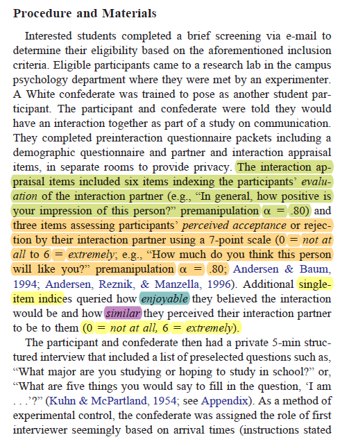
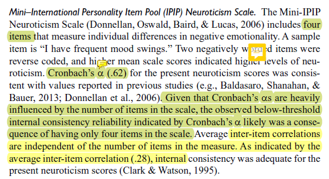

# Psychometrics Crash Course:  A quick and dirty review of the primary elements of reliability and validity {#Psychometrix}

[Screencasted Lecture Link](https://spu.hosted.panopto.com/Panopto/Pages/Viewer.aspx?pid=0a485840-5caa-484b-ba16-ac37017d6b05) 
 
```{r include=FALSE}
knitr::opts_chunk$set(echo = TRUE)
knitr::opts_chunk$set(comment = NA) #keeps out the hashtags in the knits
```

```{r include=FALSE}
options(scipen=999)#eliminates scientific notation
```

This lesson presume that you have not had a psychometrics course. In the particular research methods/statistics sequence I teach, psychometrics is the last in the series. This psychometrics primer is intended to demonstrate how to gather and interpret basic reliability and validity information. A lesson later in the ReCentering Psych Stats OER guides you through scoring your measures and conducting the basic psychometric evaluations (alpha coefficients).

But first, a trivia question.  Why is "reliability" abbreviated $r_{xx}$ and "validity" abbreviated $r_{xy}$?  The answer is at the end of the lesson.

## Navigating this Lesson

There is about 1 hour of lecture.  

### Learning Objectives

Learning objectives from this lesson include the following:

*	Memorize the true-score formula.
* Define reliability and validity (for memory), including
  - Types of reliability
  - Types of validity
* Retrieve and interpret reliability and validity information from published articles.
* Write an APA-style instrument entry.

### Readings & Resources

In preparing this chapter, I drew heavily from the following resource. Other resources are cited (when possible, linked) in the text with complete citations in the reference list.

* Jhangiani, R. S., Chiang, I.-C. A., Cuttler, C., & Leighton, D. C. (2019). *Research Methods in Psychology*. https://doi.org/10.17605/OSF.IO/HF7DQ
  - Chapter IV:  Psychological Measurement
  - Understanding psychological measurement
  - Reliability and validity of measurement
  - Practical strategies for psychological measurement

### Planning for Practice

At the end of the lesson I provide instructions for one of my favorite classroom assignments, the "Penultimate Psychometric Template."  In this, students find write-ups of 12 measures, mapping the parts-n-pieces of the write-ups, and then creating their own recipe/outline for how to draft descriptions of measures in future empirical papers.  

## Classical Test Theory

Classical test theory (CTT) is based on Spearman’s (1904) true-score model:

* an observed score is conceived of as consisting of two components – a true component and an error component 
* $X = T + E$

Where
X = the fallible, observed score, obtained under ideal or perfect conditions of measurement (these conditions never exist)
T = the true score, and
E = random error.

**Measurement** is the assignment of scores to individuals so that the scores represent some characteristic of the individuals [@jhangiani_research_2019]; measurement of psychological constructs is, **psychometrics**.

While measurement does not require any specific instrument or process, there must be some systematic procedure for assigning scores so that they represent the characteristics of interest.

Psychological **constructs** cannot be observed directly – they often represent tendencies to think, feel, or behave in certain ways and they often involve internal processes.

Examples:  intelligence, The Big Five, attitudes

We can define constructs two ways:

**Conceptual definition**: describes the behaviors and internal processes that make up that construct, along with how it relates to other variables.

**Operational definition**:  describes precisely how the construct is to be measured.

* **Self-report**:  participants report their own thoughts, feelings, actions
* **Behavioral measures**: some aspect of participants’ behavior is observed and recorded.  This could range from a highly structured lab task or a more natural setting.
* **Physiological measures**: involve recording any of a wide variety of physiological processes including heart rate/blood pressure, galvanic skin response, hormone levels, electrical activity, and blood flow in the brain.

For any given construct/measures there can be a variety of operational definitions. **Converging operations** occurs when scores based on several different operational definitions are closely related to each other and produce similar patterns of results.  This constitutes good evidence that the construct is being effectively measured.

S. S. Stevens (1946) was among the first to suggest that the type of score assigned to individuals communicates more or less quantitative information about the variable of interest.  He suggested four different levels of measurement.  In the psychometric context it is critical that we know this measurement scale (a synomym).

*R recognizes at least 15 different types of data.  Below I note the structure of the data you are most likely to see/use with each of the measurement scales [@noauthor_rpubs_nodate](RPubs - R Intro Theory of Measurement, n.d.)*.

**Nominal** (in R, factor):  used for categorical variables and the scores are category labels; not considered to be quantitative.

**Ordinal** (in R, integer [whole numbers, no decimal point]): assigning a score so that it represents the rank order of the individuals.  Allows us to know if individuals are the same or different – and if who is higher or lower.  One problem with ordinal scales is that we cannot presume the difference between two levels on an ordinal scale to be the same as the difference between two other levels (the equal interval problem).

**Interval** (in R, integer or numeric):  assigning scores using numerical scales in which intervals have the same interpretation throughout.  In Fahrenheit or Celsius temperature scales, the difference between 30 and 40 degrees represents the same temperature difference as the difference between 80 and 90 degrees (each 10 degree interval has the same kinetic energy of molecules).  One problem with interval scales is the absence of a true zero point.  Therefore we cannot make statements like, “X is twice as large as Y.”

**Ratio** (in R, numeric):  has an equal interval scale plus a true zero point.  Counts (e.g., cigarettes smoked, number of siblings, money) are ratio scales.

## Traditional Estimates of Reliability

* Test retest
* Alternate/equivalent forms
* Split-half
* Internal consistency (alphas or KR-20s)
* Inter-rater (kappa, ICC)

According to CTT, $r_{xx}$ is a test property that derives from observed scores – true scores and measurement error.  It reflects the extent to which differences in respondents’ observed scores are consistent with differences in their true scores.


### Test Retest Reliability

* Concerned with the stability of measurement over time.
*	We give a test today, then repeat it at a sensible interval to demonstrate the stability.
  - How do we determine the sensible interval?
  - It depends on the goals of the test.
  - Intelligence testing:  stable over weeks, months, years
  - State anxiety:  could change in the next hour
* Practice effects can be problematic for test-retest, therefore… 

### Internal Consistency

In multiple item measures of a single construct, items are supposed to all reflect that construct. This means that the individual items should all be correlated with each other.  There are several ways to get at this degree of correlation/consistency.

#### Alternate (Equivalent)-Form Reliability

Coefficient of equivalence. Give two forms of the test to the same group; potentially measures temporal stability and consistency of response to different item samples (or test forms).

#### Split-Half Method

A measure of internal consistency; give test once. Score two equivalent halves of test (e.g., odd items and even items); correct correlation between halves to fit whole test by Spearman-Brown formula.
“half-length test reliability estimate.”

#### Internal consistency

**Coefficient alpha**: Measure of internal consistency for scales with Likert-type scaling (i.e., 1 to 5). Give test once. Score total test.  Apply Cronbach’s Alpha formula.

This is the most common form of reliability.  Synonyms are:  internal consistency, Cronbach’s alpha, alpha.  We will learn to calculate these in multivariate, but then examine them critically in psychometrics.  They are not without controversy; one of the big problems is that more items (~14 items) almost guarantee a satisfactory alpha ( ≥ .80).

**KR-20s**: can provide internal consistency estimates for dichotomously scored items.

#### Interrater Reliabiliy

Measure of consistency of ratings of different observers. Used when the “human” is the measure.
≥2 raters independently score the responses. Reliability is assessed by:

** correlating the scores assigned by one judge, with those assigned by the other
** computing the proportion of agreement corrected for chance (kappa coefficient)

#### On Reliability

* Reliability refers to the results obtained with an assessment instrument and not to the instrument itself.
* An estimate of reliability always refers to a particular type of consistency.
* Reliability is a necessary but not sufficient condition for validity.
* Reliability is primarily statistical.

## Defining Validity

* The ability of a test to measure what it purports to measure. 
* Validity concerns what the test measures and how well it does so.
* The extent of matching, congruence, or “goodness of fit” between the operational definition and concept it is supposed to measure
* An instrument is said to be valid if it taps the concept it claims to measure

Validity is the appropriateness of the interpretation of the results of an assessment procedure for a given group of individuals, not to the procedure itself.

* a matter of degree; it does not exist on an all-or-none basis.
* always specific to some particular use or interpretation.
* a unitary concept.
* involves an overall evaluative judgment.

### Traditional Estimates of Validty

* Face-validity
* Content validity
* Construct validity (the all-encompassing validity)
* Criterion-related validity
  - Concurrent validity
  - Predictive Validity
* Convergent Validity
* Discriminant Validity
* Structural Validity

#### Face Validty:  The Un-Validty

As its name suggests, face validity is concerned with the appearance of an assessment; “How does an assessment look on the 'face of it'?”

* can often be improved by reformulating test items in terms that appear relevant and plausible for the context.
* Face validity should NEVER be regarded as a substitute for objectively determined validity. 
  - Nor can it be assumed that when a (valid and reliable) test has been modified to increase its face validity, that its objective validity and reliability is unaltered. That is, it must be reevaluated. 

#### Content Validity

Content validty asks, "Does the content of the items reflect the domain to be assessed?"

* Procedures for content validation include
  - Subject matter experts
  - Empirical analysis with relevant indicators
* Item-level and total-scale scores with grades or performance indicators
* Correlations with other indicators (e.g., math test correlated with reading achievement to rule-out literacy as prerequisite for success).
* Table of specifications: A two-way chart which indicates the instructionally relevant learning tasks to be measured. 
  - Percentages in the table indicate the relative degree of emphasis that each content area

Let's pretend that we were going to create a table of specifications for this particular lecture, it might look like this.

|Objective                              |Knowledge   |Skills     |Attitudes  |% of test; # items|
|:--------------------------------------|------------|-----------|-----------|------------------|
|Memorize the true-score formula        |10%;  1 item |           |           |10%; 1 item       |
|Define types of reliability            |20%;  2 items|           |           |20%; 2 items      |
|Define types of validity               |20%;  2 items|           |           |20%; 2 items      |
|Retrieve and interpret reliability and validity coefficients from published articles|  |20%; 2 items|  |20%; 2 items| 
|Write an APA-style instrument entry    |            |20%;  1 item|           |20%; 1 big item   | 
|Describe why psychometric evaluation is important | |           |10%;  1 item|10%; 1 item       |
|**Totals**                             |50%;  5 items|40%;  4 items|20%;  1 item|100%; 9 items|

#### Construct Validty

**Constructs** are broad categories, derived from the common features shared by directly observable behavioral variables. They are theoretical entities and not directly observable.  **Construct validity**, then, is the fundamental and all-inclusive validity concept, insofar as it specifies what the test measures.

Construct validity was introduced in 1954 in the first edition of APA’s testing standards. It is:

* the extent to which the test may be said to measure a theoretical construct or trait
* focused on the role of psychological theory in test construction and on the need to formulate hypotheses that can be supported or refuted in the validation process. 
* involves the gradual accumulation of information from a variety of sources that supports its construct validation. 

#### Criterion Related Validity

**Criterion related validity** involves correlating the test scores with a relevant present (concurrent) or future (predictive) outcomes. 

**Concurrent validity** occurs when the criterion is collected approximately the same time as the scores. Examples might include:

* Correlation of BDI (Beck Depression Inventory) score with the diagnosis from a licensed psychologist
* Correlation of performance self-assessment with a supervisor rating

**Predictive validity** occurs when the criterion is collected after a specified time interval. Examples might include:

* Correlation of a screening test with future diagnosis or occurrence of a screened-for event (e.g., suicide, disease, diagnosis)
* Correlation of employment screening test score with supervisor’s performance evaluation 6 months after the hire

#### Convergent and Discriminant Validity

We expect “moderately high” correlations (**convergence**) of our new test and similarly earlier tests (e.g., correlation of a quantitative reasoning test with a subsequent grade in a math course)

* If our correlations are “too high,” then we are creating needless duplication of a test (unless our test is cheaper or shorter). 
* We also need to show that it does NOT correlate significantly with variables from which it should differ (discriminant).
  - low and insignificant correlation of the quantitative reasoning test with scores on a reading comprehension test
* The multitrait-multimethod demonstrates convergent and discriminant validity.The classic image used to illustrate this matrix can be found [here](https://conjointly.com/kb/multitrait-multimethod-matrix/) 
[@trochim_multitrait-multimethod_nodate]

#### "Structural" Validity

**Structural validity** uses exploratory and confirmatory factor analysis to understand the dimensionality of the measure.

* For example, IQ is composed of 2 (or more) factors (e.g., verbal and performance)
* Provides support (or not) for using total or subscale scores.


## Locating and Interpreting Reliability and Validity in Publications

What follows are my personal markups of the measures sections of three manuscripts. Each is well-written and each serves the purpose the research with which it was associated. 

I review these so that you can begin to

* Locate and interpret psychometric information from published articles, and
* Learn how to describe measures/instruments in your own schoalrship.

### From Tran and Lee (2014)

The first example is from Tran and Lee's [-@tran_you_2014] stuy.  This was a brief report and instruments/measures were not presented in an itemized way.

* Appraisal and evaluation were 6-items each and were administered pre and post.
  - The reliability measure of internal consistency (alpha coefficient) was .80 at pre-test; and .89 and .85 at post-test.
  - Because they are 6-items each, with each item summed (or mean), I would suggest it is appropriately used as an interval-scale measure.
  - No other reliability or validity information is given.
  
  
  
* Single-items measure enjoyability, similarity, accuracy, and how-much-longer.
  - There is no reliability or validity information is provided about them.
  - Because they are single-items, they will likely be treated as interval-level, but are probably more appropriately categorized as ordinal.


### From Lui (2020)

These were from a full research report [@lui_racial_2020].  Each measure was presented individually with more conventional summary.

* Experiences with overt racial discrimination were assessed with 9 items.
* Scaling is 4 points.
* Given multiple items, it could be utilized on the interval level.
* Cronbach’s alpha (internal consistency, a measure of reliability) was .90
* No other reliability or validity info is provided.


* Neuroticism was assessed with 4 items.
* No indication of scaling; assume it is Likert; interval scaling.
* Two items were negatively worded so would need to be res-cored.
* Cronbach’s alpha (internal consistency, a measure of reliability) was .62; because this is low they argued that the inter-item correlations (.28) would substantiate their adequacy.



* Hazardous alcohol use was assessed on a 10-item measure.
* 4-point scaling; interval scale of measurement.
* Citations provide some support for validity information.


### Exerpt from Nadal (2011)

* Perceptions of racism with 9 items
* 2 subscales
* Prior reports of internal consistency (.90, .83)
* Prior reports of convergent validity (.24 to .46) 
* Current reports of internal consistency (.878, .673); no justification for the lower alpha.


## Practice Problem

The suggested practice problem for this chapter is to create your own "penultimate psychometric template."  The goal of this project is to expose you (deeply and interactively) with a variety of write-ups.

Please locate 12 write-ups of measures used in research projects.

* Include at least 4 write-ups (but no more than 6) of ONE measure.
* The remaining 8 write-ups can be from different measures or same measures.

This assignment happens in two stages.  First, you will map each of the measures you select (i.e., parallel to diagramming a sentence).  Second, looking across the write-ups of those measures, you will create your own template (i.e., a recipe card) for how you will write up a measures in your own papers.

Here's an example of how I would map the following write-up of the Mental Health Inventory used in Bikos et al. [-@bikos_repeated_2007]

First, the screenshot:


Heading: name of construct

1. Instrument identification:
   * Name of instrument.
   * Abbreviation.
   * Text-citation.
2.	Brief description:
    * Number of items
    * Constructs assessed
    * Intended sample/population
3.	More detailed description
    * Scaling and anchors.
    * Sample items.
4.	Statement about why instrument format worked well with this research project.
5.	Psychometric history
    * Number of psychometric trials with N.
    * Description of factor structure.
    * Mention of support for using a global scale or separate scales.
    * Report of alpha coefficient from previous studies.
6.	Psychometric properties in the published ms.
    * Report of alpha coefficient from current study.


|Assignment Component  
|:---------------------------------------------------------------------------------------------|:----------: |:----------:|
|1. Screen shots, the APA style citation (7th ed), and an outline of 12 measure write-ups are required.|   20   | _____ | 
|2. Your psychometric template. Map out an APA-style/JARS-consistent formula/recipe for writing up a *measures* section in an empirical manuscript.  This sh ould be an ideal-scenario kind of writeup for a full-length manuscript or dissertation.| 15 |    _____|                                                                                                       
|3. Explanation to a grader   |      5  | _____ | 
|**Totals**                                                                                    |    40 |    _____     |

## Answer Key

The answer to the question, "Why is 'reliability' abbreviated $r_{xx}$ and 'validity' abbreviated $r_{xy}$?"

* *r* is the symbol for correlation
* $r_{xx}$ represents the measure (x) correlated with itself (x)
* $r_{xy}$ represents the measure (x) correlated with another (y).

```{r include=FALSE}
sessionInfo()
```


