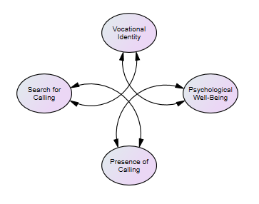
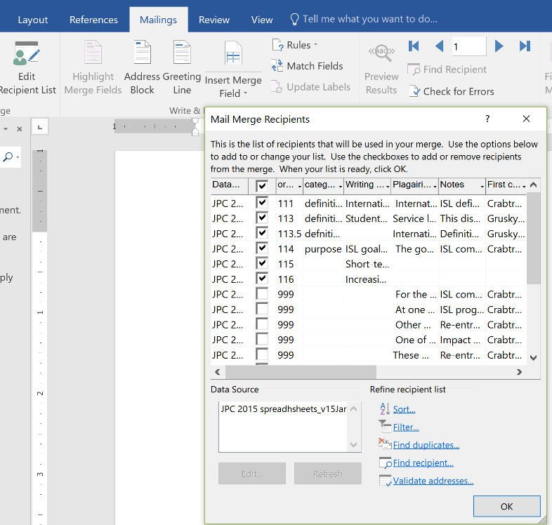

# Writing in Excel {#Excel}

[Screencasted Lecture Link]( HTTPS://SPU.HOSTED.PANOPTO.COM/PANOPTO/PAGES/VIEWER.ASPX?PID=DA5981E8-39FF-4E2D-A940-AAD3013C5A19) 
 
```{r include=FALSE}
knitr::opts_chunk$set(echo = TRUE)
knitr::opts_chunk$set(comment = NA) #keeps out the hashtags in the knits
```

```{r  include=FALSE}
options(scipen=999)#eliminates scientific notation
```

In high school and college the method for writing *term papers* involved taking notes on index cards (note on front, citation on back), sorting them into sections of the paper, sorting each section into its proper order, and writing it up.

Some years ago, I adapted that process to Excel. Getting some positive feedback or it, I wrote up a lecture on it.  Even with improved reference management systems (like Excel) and R programs like *papaja* (for writing APA style manuscripts), I continue to use Excel for notetaking and organizing my thoughts. As you will see in this lesson, it also helps me separate the "plaigarized" material so that I do not unintentionally use it.

Although the  Excel spreadsheet is easy to create, the template I use in the lecture is in the [Github book site](https://github.com/lhbikos/ReC_Topics).

## Navigating this Lessonette

There is about 35 minutes of lecture.  If you work through the materials with me it would be plan for an additional hour.

### Learning Objectives

Learning objectives from this lesson include the following:

* Capture notes from primary source materials (along with the APA style citation) in Excel.
* Prevent plagiarism by clearly noting original material.
* Use the worksheets to organize sections of the paper.
* Use the sorting features of Excel to origanize the materials to facilitate easier writing.
* Use the Directory Merge tools to dump the written paper into Microsoft Word.

## Where to Start

### Bottom Up

Starting from the bottom up means identifying the primary variables in my study and begin researching each of them.  I start “bottom up” when:

* I know the general topics that I want to investigate, 
* but I don’t know the literature well (or as well as I’d like), 
* and I need to develop a strong narrative thread

For example, if I know I want to explore the relations between the following variables, I will begin with a “bottom up” approach, 

* Archiving information about each construct
* Documenting the ways that the variables relate to each other


### Top Down

Starting from the top down occurs when I know the precise model I want to investigate and the relations I'm predicting. I will frequently draw the model so that I can keep it in front of me as I am researching and writing

For example, if I am going to write a research proposal testing the following model, I will likely begin with top down approach.  


After the introductory paragraph(s), my paper will focus on the importance of the DV, psychological wellbeing.

Building backwards, I would then talk about the relationship between vocational identity and psychological well-being.


1. Vocational identity contributes to psychological well-being in college students
2. The effects of calling on these variables are not well understood
   -Positive effects have been documented
   - There may be a dark side to calling – for those who seek and do not find
3. Therefore, the purpose of our study is to investigate the mediating role of vocational identity on the relation between search for calling and psychological well-being.
  - Within this model, we propose that presence of calling moderates the relation between search for calling, such that, those who search for calling and find it, have stronger vocational identity, and, in turn, higher psychological well-being.
  - And, those who search for calling but do not find it, have lower vocational identity, and lower psychological well-being.

### Mostly I Start in the Middle

That is, I often know that the variables I"m interested in relate to each other, but I want to use the literature to further solidify the paths I will specify in my research mode.



## In Any Case, I Use Excel

I use Excel to organize my notes:

* In empirical papers for introduction and discussion (not method or results)
* For qualitative results
* For book chapters, literature review, theoretical papers

There are numerous benefits to this approach.  I believe that it:

* Facilitates group writing
* Creates an archive/cannon/library of our most used resources
* Clearly identifies plagiarized material and allows us to understand how/where we have integrated and adapted the material
* Makes tracking primary and secondary references *so much easier*
* Easy to order/re-order through revisions

The process of writing in Excel includes:

* Note-taking from primary sources to include
  –	Direct copy plagiarized material from the source
  –	Taking notes on why we wanted it
  –	Proper reference documentation at first use
* Iteratively working on the outline
* Refining categories/sections/headings
* Ordering the notes
* Writing the first drafts of the ms DIRECTLY into excel
*Transferring to the word processing software


### The Structure of my Spreadsheet

Below is a screenshot of how I set up the worksheets in my spreadsheet.


Instructions

* Co-authors leave each other notes on the game-plan

Outline

* Developing the outline is iterative/dynamic and, especially when beginning from *bottom up* or *somewhere in the middle*, is updated and revised frequently


Tabs for each Section

* Correspond with outline numbers
* Contain the following columns
 – Order
 – Categories
 – Writing for ms
 – Plagiarized copy
 – Notes
 – First cite
 – Subsequent cites
 – Full citation
 – Page(s)
 – By
 
References

* Near the end of the project, assemble a full reference list

## Let's Tour

The first tour is quick and hypothetical. In it, I transer the written document from Excel to Word (this is the *supplement* reerred to in the screencast). 

1. Open up a new/blank word document (one for each worksheet of material).
2. Click on the “Mailings” tab and select 
3. “Start Mail Merge” and (optionally) “Step by step mail merge wizard”
4. Select “Directory”  THIS IS THE MOST CRITICAL STEP
5. “Select Recipients. 
   - Use “Browse” to locate the spreadsheet (if the spreadsheet is on a SP [or other cloud] folder and you can’t select it from a networked drive, you may first need to download it to your computer).
   - In Word, select the worksheet whose data you want to import.  It should be sorted properly (first).
6. Click “Edit Recipient List.”  You may wish to turn “off” the 999s.
7. Select “Insert Merge Field.”  I chose, “Writing for ms.”  I added 2 spaces after the element.
8. Select “Finish & Merge.” 
   - “Edit individual documents”
   - “All”

The text will be organized as one big paragraph, will likely need formatting updates, and may have spelling errors (that  you didn’t make.).

At present, I only know how to merge 1 worksheet at a time into separate documents (then those should be copied together).



The second tour includes a series of screencasts that are authentically a new project from the very first step.  The RVT (and I, separately) have several projects coming that involved calling/vocation.  I’ve dabbled in the calling literature, but don’t know it thoroughly.  I’m using the spreadsheets to begin to 

* Capture the info
* Organize it in my head (and in excel worksheets)
* And then craft it into arguments for a handful of empirical manuscripts
These screencasts will document that process from start, to, I hope a published manuscript (or at least one that’s submitted.

Ideas included

* Starting with the empty excel spreadsheet
* Assuming *no knowledge* (or very little) of the literature, therefore
 – Categories are broad and non-directional; just capturing info
 – A priori, I can guess I want categories of: definitions, outcomes, measures, norms
* These won’t all make it into papers; I’m just getting my footing
* Reviewing the literature/marking-it-up before notetaking
 - Research team members often keep common "Reading Room" folders in the cloud
* As soon as I get my footing, I can assign some of these articles to team members who can also collect the data into the spreadsheets.

**8 months, 1 presentation, 2 white papers, and 1 journal article later...

What worked well:

* One core spreadsheet gave was the source for 4 projects
  - We learned to “save as” a copy of the original raw notes because those “gross groupings” were a fantastic well for substantial revisions and related projects
* When we received editorial feedback and I thought it would be a “quick revision,” I still found it easier to return to the spreadsheets, supplement-and-reorder my notes, write in excel and transfer back into word.

What didn’t go as well:

* Likely because of the deadlines, the substantial requests for revision, and a full year, I didn’t use the team as much as I would have liked
* We didn’t follow “all the rules”
  - Didn’t capture a lot of page #s
  - Didn’t have detailed outlines (or update outlines with revisions)

Would I do it again? Some years later -- yes, I still write in Excel (even with the presence of other tools like Zotero). 

## FAQs

* (For students in our doctoral program) Am I required to Write in Excel for my mentored research project (MRP)?
 – YES, if you are in the Bikos RVT.
 – NO, if you are anyone else.

* What’s the difference between Editing in Excel Online and Editing in Full Excel.
  – Excel ONLINE allows multiple editors at once, BUT
  - You have to be working on different worksheets
  - You don’t have some of the full benefits of excel (I find it difficult to sort and so some other functions that I really like))
  - You don’t need to hit SAVE. Everything you type is automatically saved.  So be careful, we’ve unintentionally deleted stuff and didn’t realize it. OUCH.
* Using the full EXCEL package gives you full EXCEL functionality, there are nuances:
  - If one person is working in full excel, it locks everyone out from everything except viewing.  That is, no one else can work IN ANY CAPACITY on the document at the same time.
  - It looks like you’ve “downloaded” it, but you have not.  When you hit SAVE, it saves back to SP.  If you intentionally or unintentionally disconnect from Internet, it updates once you are reconnected.
  - You must hit SAVE in order for your changes to be saved.
* I prefer to work in full Excel and it’s only rarely a problem that teammates have my same schedule and want to work at the same time.  When they do, we just coordinate.


```{r include=FALSE}
sessionInfo()
```

# References
