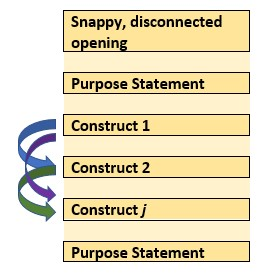

--- 
lang: "en"
title: "ReCentering Psych Stats:  Topics in Research Methods"
author: "Lynette H Bikos, PhD, ABPP"
knit: "bookdown::render_book"
site:  bookdown::bookdown_site
documentclass: book
bibliography: STATSnMETH.bib
citation-style: apa-single-spaced.csl
link-citations: true

#url: 'http\://whateveritis
#github-repo: whatever it is

description: 'This is an open-access, book-in-progress. My goal in offering it is to re-center the materials used in training statistics and research methods in graduate and post-graduate psychology programs.'
#cover-image: "ReCenter_bookcover.jpg"

output:
  bookdown::gitbook:
    dev: svglite
    css: css/style.css
    includes: 
        #in_header: [google-analytics-otl.html]
    toc_depth: 4
    split-by: section
    split_bib: true
    number_sections: true
    #pandoc_args: [ "--csl", "apa-single-spaced.csl" ]
    config:
      toc:
        scroll_highlight: yes
        collapse: section
        before: |
          <li><a href="./"><strong>ReCentering Psych Stats: Multivariate Modeling</strong><br>by Lynette H Bikos, PhD, ABPP</a></li>
        after: |
          #<li><a href="https:link" target="_blank">Open access book-in-progress</br>
          <li><a rel="license" href="http://creativecommons.org/licenses/by-nc-sa/4.0/"></a></li>
            <li><a href="https://bookdown.org" target="_blank">Built with Bookdown</a></li>
      download: [pdf]
      view: https://github.com/ontheline/otl-bookdown/blob/master/%s
      search: yes
      sharing:
        facebook: yes
        github: yes
        twitter: yes

  #bookdown::pdf_book:
    #citation_package: default
    #pandoc_args: [ "--csl", "apa-single-spaced.csl" ]

  bookdown::word_document2:
    default

  bookdown::markdown_document2:
    default
---

# BOOK COVER {-}


# PREFACE {-}

**If you are viewing this document, you should know that this is a book-in-progress.  Early drafts are released for the purpose teaching my classes and gaining formative feedback from a host of stakeholders.  The document was last updated on `r format (Sys.Date(), '%d %b %Y')`**

[Screencasted Lecture Link](https://spu.hosted.panopto.com/Panopto/Pages/Viewer.aspx?id=c932455e-ef06-444a-bdca-acf7012d759a)

To *center* a variable in regression means to set its value at zero and interpret all other values in relation to this reference point. Regarding race and gender, researchers often center male and White at zero. Further, it is typical that research vignettes in statistics textbooks are similarly seated in a White, Western (frequently U.S.), heteronormative, framework. The purpose of this project is to create a set of open educational resources (OER) appropriate for doctoral and post-doctoral training that contribute to a socially responsive pedagogy -- that is, it contributes to justice, equity, diversity, and inclusion. 

Statistics training in doctoral programs are frequently taught with fee-for-use programs (e.g., SPSS/AMOS, SAS, MPlus) that may not be readily available to the post-doctoral professional. In recent years, there has been an increase and improvement in R packages (e.g., *psych*, *lavaan*) used for in analyses common to psychological research. Correspondingly, many graduate programs are transitioning to statistics training in R (free and open source).  This is a challenge for post-doctoral psychologists who were trained with other software. This OER will offer statistics training with R and be freely available (specifically in a GitHub respository and posted through GitHub Pages) under a Creative Commons Attribution - Non Commercial - Share Alike license [CC BY-NC-SA 4.0]. 

Training models for doctoral programs in HSP are commonly scholar-practitioner, scientist-practitioner, or clinical-scientist.  An emerging model, the *scientist-practitioner-advocacy* training model incorporates social justice advocacy so that graduates are equipped to recognize and address the sociocultural context of oppression and unjust distribution of resources and opportunities [@mallinckrodt_scientist-practitioner-advocate_2014]. In statistics textbooks, the use of research vignettes engages the learner around a tangible scenario for identifying independent variables, dependent variables, covariates, and potential mechanisms of change. Many students recall examples in Field's  [-@field_discovering_2012] popular statistics text:  Viagra to teach one-way ANOVA, beer goggles for two-way ANOVA, and bushtucker for repeated measures.  What if the research vignettes were more socially responsive? 

In this OER, research vignettes will be from recently published articles where: 

* the author’s identity is from a group where scholarship is historically marginalized (e.g., BIPOC, LGBTQ+, LMIC[low-middle income countries]), 
* the research is responsive to issues of justice, equity, inclusion, diversity, 
* the lesson’s statistic is used in the article, and 
* there is sufficient information in the article to simulate the data for the chapter example(s) and practice problem(s); or it is publicly available.  

In training for multicultural competence, the saying, "A fish doesn't know that it's wet" is often used to convey the notion that we are often unaware of our own cultural characteristics. In recent months and years, there has been an increased awakening to the institutional and systemic racism that our systems are perpetuating. Queuing from the water metaphor, I am hopeful that a text that is recentered in the ways I have described can contribute to *changing the water* in higher education and in the profession of psychology.

## Copyright with Open Access {-}
<a rel="license" href="http://creativecommons.org/licenses/by-nc-sa/4.0/"></a>

This book is published under a a <a rel="license" href="http://creativecommons.org/licenses/by-nc-sa/4.0/">Creative Commons Attribution-NonCommercial-ShareAlike 4.0 International License</a>. This means that this book can be reused, remixed, retained, revised and redistributed (including commercially) as long as appropriate credit is given to the authors. If you remix, or modify the original version of this open textbook, you must redistribute all versions of this open textbook under the same license - CC BY-SA.


A [GitHub open-source repository](https://github.com/lhbikos/ReC_MultivariateModeling) contains all of the text and source code for the book, including data and images. 

# ACKNOWLEDGEMENTS {-}

As a doctoral student at the University of Kansas (1992-2005), I learned that "a foreign language" was required for graduation. *Please note that as one who studies the intersections of global, vocational, and sustainable psychology, I regret that I do not have language skills beyond English.* This could have been met with credit from high school my rural, mid-Missouri high school did not offer such classes. This requirement would have typically been met with courses taken during an undergraduate program -- but my non-teaching degree in the University of Missouri's School of Education was exempt from this. The requirement could have also been met with a computer language (fortran, C++) -- I did not have any of those either. There was a tiny footnote on my doctoral degree plan that indicated that a 2-credit course, "SPSS for Windows" would substitute for the language requirement.  Given that it was taught by my one of my favorite professors, I readily signed up. As it turns out, Samuel B. Green, PhD, was using the course to draft chapters in the textbook [@green_using_2014] that has been so helpful for so many. Unfortunately, Drs. Green (1947 - 2018) and Salkind (2947 - 2017) are no longer with us. I have worn out numerous versions of their text. Another favorite text of mine was Dr. Barbara Byrne's [-@byrne_structural_2016], "Structural Equation Modeling with AMOS." I loved the way she worked through each problem and paired it with a published journal article, so that the user could see how the statistical evaluation fit within the larger project/article. I took my tea-stained text with me to a workshop she taught at APA and was proud of the signature she added to it (a little catfur might have fallen out).  Dr. Byrne created SEM texts for a number of statistical programs (e.g., LISREL, EQS, MPlus). As I was learning R, I wrote Dr. Byrne, asking if she had an edition teaching SEM/CFA with R. She promptly wrote back, saying that she did not have the bandwidth to learn a new statistics package.  We lost Dr. Byrne in December 2020. I am so grateful to these role models for their contributions to my statistical training.  I am also grateful for the doctoral students who have taken my courses and are continuing to provide input for how to improve the materials.

The inspiration for training materials that re*center statistics and research methods came from the [Academics for Black Survival and Wellness Initiative](https://www.academics4blacklives.com/). This project, co-founded by Della V. Mosley, Ph.D., and Pearis L. Bellamy, M.S., made clear the necessity and urgency for change in higher education and the profession of psychology. 

At very practical levels, I am indebted to SPU's Library, and more specifically, SPU's Education, Technology, and Media Department.  Assistant Dean for Instructional Design and Emerging Technologies, R. John Robertson, MSc, MCS, has offered unlimited consultation, support, and connection. Senior Instructional Designer in Graphics & Illustrations, Dominic Wilkinson, designed the logo and bookcover.  Psychology and Scholarly Communications Librarian, Kristin Hoffman, MLIS, has provided consultation on topics ranging from OERS to citations. I am alo indebted to Associate Vice President, Teaching and Learning at Kwantlen Polytechnic University, Rajiv Jhangiani, PhD. Dr. Jhangiani's text [-@jhangiani_research_2019] was the first OER I ever used and I was grateful for his encouraging conversation.

Financial support for this OER has been provided from:

* The *Call to Action on Equity, Inclusion, Diversity, Justice, and Social Responsivity
Request* grant from the Association of Psychology Postdoctoral and Internship Centers (2021-2022). 
* The *Diversity Seed Grant** from the Office of Inclusive Excellence and Advisory Council for Diversity and Reconciliation (ACDR) at Seattle Pacific University. 
* The *ETM Open Textbook & OER Development Funding* program from the Office of Education, Technology, & Media at Seattle Pacific University. 

<!--chapter:end:index.Rmd-->

---
output:
  word_document: default
  html_document: default
---
# Introduction {#ReCintro}

[Screencasted Lecture Link](https://spu.hosted.panopto.com/Panopto/Pages/Viewer.aspx?pid=cc9b7c0d-e5c3-4e4e-a469-acf7013ee761)

## What to expect in each chapter

This textbook is intended as *applied,* in that a primary goal is to help the scientist-practitioner-advocate use a variety of statistics in research problems and *writing them up* for a program evaluation, dissertation, or journal article. In support of that goal, I try to provide just enough conceptual information so that the researcher can select the appropriate statistic (i.e., distinguishing between when ANOVA is appropriate and when regression is appropriate) and assign variables to their proper role (e.g., covariate, moderator, mediator).

This conceptual approach does include occasional, step-by-step, *hand-calculations* (only we calculate them arithmetically in R) to provide a *visceral feeling* of what is happening within the statistical algorithm that may be invisible to the researcher.  Additionally, the conceptual review includes a review of the assumptions about the characteristics of the data and research design that are required for the statistic. Statistics can be daunting, so I have worked hard to establish a *workflow* through each analysis. When possible, I include a flowchart that is referenced frequently in each chapter and assists the the researcher keep track of their place in the many steps and choices that accompany even the simplest of analyses.

As with many statistics texts, each chapter includes a *research vignette.* Somewhat unique to this resource is that the vignettes are selected from recently published articles. Each vignette is chosen with the intent to meet as many of the following criteria as possible:

* the statistic that is the focus of the chapter was properly used in the article,
* the author’s identity is from a group where scholarship is historically marginalized (e.g., BIPOC, LGBTQ+, LMIC [low middle income countries]),
* the research has a justice, equity, inclusion, diversity, and social responsivity focus and will contribute positively to a social justice pedagogy, and 
* the data is available in a repository or there is sufficient  information in the article to simulate the data for the chapter example(s) and practice problem(s).  

In each chapter we employ *R* packages that will efficiently calculate the statistic and the dashboard of metrics (e.g., effect sizes, confidence intervals) that are typically reported in psychological science.

## Strategies for Accessing and Using this OER

There are a number of ways you can access this resource. You may wish to try several strategies and then select which works best for you.  I demonstrate these in the screencast that accompanies this chapter.

1. Simply follow along in the .html formatted document that is available on via GitHub Pages, and then
   * open a fresh .rmd file of your own, copying (or retyping) the script  and running it 
2. Locate the original documents at the [GitHub repository](https://github.com/lhbikos/ReC_MultivModel) . You can
   * open them to simply take note of the "behind the scenes" script
   * copy/download individual documents that are of interest to you
   * fork a copy of the entire project to your own GitHub site and further download it (in its entirety) to your personal workspace. The [GitHub Desktop app](https://desktop.github.com/) makes this easy!
3. Listen to the accompanying lectures (I think sound best when the speed is 1.75). The lectures are being recorded in Panopto and should include the closed captioning.
4. Provide feedback to me!  If you fork a copy to your own GitHub repository, you can 
   * open up an editing tool and mark up the document with your edits,
   * start a discussion by leaving comments/questions, and then
   * sending them back to me by committing and saving.  I get an e-mail notiying me of this action.  I can then review (accepting or rejecting) them and, if a discussion is appropriate, reply back to you.

## If You are New to R

R can be oveRwhelming. Jumping right into advanced statistics might not be the easiest way to start. However, in these chapters, I provide complete code for every step of the process, starting with uploading the data. To help explain what R script is doing, I sometimes write it in the chapter text; sometimes leave hastagged-comments in the chunks; and, particularly in the accompanying screencasted lectures, try to take time to narrate what the R script is doing.  

I've found that, somewhere on the internet, there's almost always a solution to what I'm trying to do. I am frequently stuck and stumped and have spent hours searching the internet for even the tiniest of things.  When you watch my videos, you may notice that in my R studio, there is a "scRiptuRe" file. I takes notes on the solutions and scripts here -- using keywords that are meaningful to me so that when I need to repeat the task, I can hopefully search my own prior solutions and find a fix or a hint.

### Base R

The base program is free and is available here:  https://www.r-project.org/  

Because R is already on my machine (and because the instructions are sufficient), I will not walk through the instllation, but I will point out a few things.

* Follow the instructions for your operating system (Mac, Windows, Linux)
* The "cran" (I think "cranium") is the *Comprehensive R Archive Network.*  In order for R to run on your computer, you have to choose a location.  Because proximity is somewhat related to processing speed, select one that is geographically "close to you." 
* You will see the results of this download on your desktop (or elsewhere if you chose to not have it appear there) but you won't ever use R through this platform.

### R Studio

*R Studio* is the desktop application I work in R.  It's a separate download. Choose the free, desktop, option that is appropriate for your operating system:   https://www.rstudio.com/products/RStudio/

* Upper right window:  Includes several tabs; we frequently monitor the
  + Environment: it lists the *objects* that are available to you (e.g., dataframes)
* Lower right window: has a number of helpful tabs.
  + Files:  Displays the file structure in your computer's environment.  Make it a practice to (a) organize your work in small folders and (b) navigating to that small folder that is holding your project when you are working on it.
  + Packages:  Lists the packages that have been installed.  If you navigate to it, you can see if it is "on."  You can also access information about the package (e.g., available functions, examples of script used with the package) in this menu.  This information opens in the Help window.
  + Viewer and Plots are helpful, later, when we can simultaneously look at our output and still work on our script.
* Primary window
  + R Studio runs in the background(in the console).  Very occasionally, I can find useful troubleshooting information here.
  + More commonly, I open my R Markdown document so that it takes the whole screen and I work directly, right here.
* *R Markdown* is the way that many analysts write *script*, conduct analyses, and even write up results.  These are saved as .rmd files.
  + In R Studio, open an R Markdown document through File/New File/R Markdown
  + Specify the details of your document (title, author, desired ouput)
  + In a separate step, SAVE this document (File/Save] into a NEW FILE FOLDER that will contain anything else you need for your project (e.g., the data).
  + *Packages* are at the heart of working in R.  Installing and activating packages require writing script.

### R Hygiene

Many initial problems in R can be solved with good R hygiene. Here are some suggestions for basic practices.  It can be tempting to "skip this."  However, in the first few weeks of class, these are the solutions I am presenting to my students.

#### Everything is documented in the .rmd file

Although others do it differently, everything is in my .rmd file. That is, for uploading data and opening packages I write the code in my .rmd file.  Why?  Because when I read about what I did hours or years later, I have a permanent record of very critical things like (a) where my data is located, (b) what version I was using, and (c) what package was associated with the functions.

#### File organization

File organization is a critical key to this:

* Create a project file folder.
* Put the data file in it.
* Open an R Markdown file.
* Save it in the same file folder.
* When your data and .rmd files are in the same folder (not your desktop, but a shared folder), they can be connected.

#### Chunks

The R Markdown document is an incredible tool for integrating text, tables, and analyses.  This entire OER is written in R Markdown.  A central feature of this is "chunks."

The easiest way to insert a chunk is to use the INSERT/R command at the top of this editor box.  You can also insert a chunk with the keyboard shortcut:  CTRL/ALT/i

"Chunks" start and end with with those three tic marks and will show up in a shaded box, like this:

```{r title for the chunk contents}
#hashtags let me write comments to remind myself what I did
#here I am simply demonstrating arithmetic (but I would normally be running code)
2021 - 1966
```

Each chunk must open and close.  If one or more of your tic marks get deleted, your chunk won't be read as such and your script will not run.  The only thing in the chunks should be script for running R; you can hashtag-out script so it won't run.

Although unnecessary, you can add a brief title for the chunk in the opening row, after the "r."  These create something of a table of contents of all the chunks -- making it easier to find what you did.  You can access them in the "Chunks" tab at the bottom left of R Studio. If you wish to knit a document, you cannot have identical chunk titles.

You can put almost anything you want in the space outside of tics.  Syntax for simple formatting in the text areas (e.g,. using italics, making headings, bold, etc.) is found here:  https://rmarkdown.rstudio.com/authoring_basics.html


#### Packages

As scientist-practitioners (and not coders), we will rely on *packages* to do our work for us. At first you may feel overwhelmed about the large number of packages that are available. Soon, though, you will become accustomed to the ones most applicable to our work (e.g., psych, tidyverse, lavaan, apaTables).

Researchers treat packages differently. In these lectures, I list all the packages we will use in an opening chunk that asks R to check to see if the package is installed, and if not, installs it.  

```{r checking for packages}
if(!require(psych)){install.packages("psych")}
```

To make a package operable, you need to open it through the library.  This process must be repeated each time you restart R. I don't open the package (through the "library(package_name)") command until it is time to use it.  Especially for new users, I think it's important to connect the functions with the specific packages.

```{r opening psych, package, message=FALSE, warning=FALSE}
#install.packages ("psych")
library (psych)
```

If you type in your own "install.packages" code, hashtag it out once it's been installed.  It is problematic to continue to re-run this code .

#### Knitting

An incredible feature of R Markdown is its capacity to *knit* to HTML, powerpoint, or word. If you access the .rmd files for this OER, you can use annotate or revise them to suit your purposes.  If you redistribute them, though, please honor the Creative Commons Attribution-NonCommercial-ShareAlike 4.0 International License with a citation.

### tRoubleshooting in R maRkdown

Hiccups are normal.  Here are some ideas that I have found useful in getting unstuck.

* In an R script, you must have everything in order -- Every. Single. Time. 
  + All the packages have to be in your library and activated; if you restart R, you need to reload each package.
  + If you open an .rmd file and want a boxplot, you cannot just scroll down to that script.  You need to run any *prerequisite* script (like loading the package, importing data, putting the data in the global environment, etc.)
  + Do you feel lost?  clear your global environment (broom) and start at the top of the R script. Frequent, fresh starts are good.
* Your .rmd file and your data need to be stored in the same file folder.  These should be separate for separate projects, no matter how small.
* Type any warnings you get into a search engine.  Odds are, you'll get some decent hints in a manner of seconds.  Especially at first, these are common errors:
  + The package isn't loaded (if you restarted R, you need to reload your packages)
  + The .rmd file has been saved yet, or isn't saved in the same folder as the data
  + Errors of punctuation or spelling
* Restart R (it's quick -- not like restarting your computer)
* If you receive an error indicating that a function isn't working or recognized, and you have loaded the package, type the name of the package in front of the function with two colons (e.g., psych::describe(df). If multiple packages are loaded with functions that have the same name, R can get confused.

### stRategies for success

* Engage with R, but don't let it overwhelm you.
  + The *mechanical is also the conceptual*. Especially when it is *simpler*, do try to retype the script into your own .rmd file and run it. Track down the errors you are making and fix them.
  + If this stresses you out, move to simply copying the code into the .rmd file and running it.  If you continue to have errors, you may have violated one of the best practices above (Is the package loaded? Are the data and .rmd files in the same place? Is all the prerequisite script run?).
  + Still overwhelmed?  Keep moving forward by downloading a copy of the .rmd file that accompanies any given chapter and just "run it along" with the lecture. Spend your mental power trying to understand what each piece does. Then select a practice problem that is appropriate for your next level of growth. 
* Copy script that works elsewhere and replace it with your datafile, variables, etc.  
* The leaRning curve is steep, but not impossible.  Gladwell[-@gladwell_outliers_2008] reminds us that it takes about 10,000 hours to get GREAT at something (2,000 to get reasonably competent). Practice. Practice. Practice.
* Updates to R, R Studio, and the packages are NECESSARY, but can also be problematic.  It could very well be that updates cause programs/script to fail (e.g., "X has been deprecated for version X.XX").  Moreover, this very well could have happened between my distribution of these resources and your attempt to use it.  My personal practice is to update R, R Studio, and the packages a week or two before each academic term.
* Embrace your downward dog.  Also, walk away, then come back.
  

### Resources for getting staRted

R for Data Science:  https://r4ds.had.co.nz/

R Cookbook:  http://shop.oreilly.com/product/9780596809164.do

R Markdown homepage with tutorials:  https://rmarkdown.rstudio.com/index.html

R has cheatsheets for everything, here's one for R Markdown:  https://www.rstudio.com/wp-content/uploads/2015/02/rmarkdown-cheatsheet.pdf 

R Markdown Reference guide:  https://www.rstudio.com/wp-content/uploads/2015/03/rmarkdown-reference.pdf

Using R Markdown for writing reproducible scientific papers:  https://libscie.github.io/rmarkdown-workshop/handout.html 

LaTeX equation editor:  https://www.codecogs.com/latex/eqneditor.php


<!--chapter:end:01-Introduction.Rmd-->


# The APA Style Manuscript {#APAstyle}

[Screencasted Lecture Link](https://spu.hosted.panopto.com/Panopto/Pages/Viewer.aspx?pid=8ca9d96d-0ff6-4068-a570-ac290189a4d4) 
 
```{r setup, include=FALSE}
knitr::opts_chunk$set(echo = TRUE)
knitr::opts_chunk$set(comment = NA) #keeps out the hashtags in the knits
```

```{r eliminates scientific notation}
options(scipen=999)#eliminates scientific notation
```

This lesson focuses on APA style. While a significant portion of the material focuses on the mechanics of APA style, I also consider:

* APA style as epistemology – and its relationship with power, privilege, and racism.
*	JARS:  Journal Article Reporting Standards
  - Section by section
  - Consideration of writing as a developmental process that occurs throughout grad school and into the profession
*	Stylistic issues
  - Hallmarks of APA style
*	Reducing bias
 

## Navigating this Lesson

There is about # hour and ## minutes of lecture.  

The R markdown file used to create this lecture as well as all of the figures are available at the [OER's GitHub site](https://github.com/lhbikos/ReC_Topics).

### Learning Objectives

Learning objectives from this lecture include the following:

*	Identify the cultural characteristics of APA style. 
*	Identify two ways that Thompson (2004) has suggested that APA style perpetuates Whiteness and patriarchy in the academy. 
*	List the components of an abstract. 
*	Describe why JARS matters. 
*	Begin memorizing the minutia of APA Style for writing empirical manuscripts/journal articles (no particular order). 


### Readings & Resources

In preparing this chapter, I drew heavily from the following resource(s). Other resources are cited (when possible, linked) in the text with complete citations in the reference list.

* American Psychological Association. (2020). *Publication manual of the American Psychological Association: The official guide to APA style. (Seventh edition.).* American Psychological Association.
  - I’m guessing you’ll use this more days than not, for the rest of your education.
* Tran, A. G. T. T., & Lee, R. M. (2014). You speak English well! Asian Americans’ reactions to an exceptionalizing stereotype. *Journal of Counseling Psychology, 61*(3), 484–490. https://doi.org/10.1037/cou0000034
  -  I use this article in several analyses in the ANOVA series as well as in this lesson when I compare/contrast it to the requirements of APA Style.  This article was pubbed in 2014; but I will compare it to the 7th edition (2019) standards.
* Cooper, H. (2020). *Reporting quantitative research in psychology: How to meet APA style journal article reporting standards (Second edition, revised.).* American Psychological Association. https://alliance-primo.hosted.exlibrisgroup.com/permalink/f/rpqmv/CP71332049420001451
  - The e-text version of this may be available at your library. This resource offers section-by-section instruction of the reporting standards and provides numerous examples of writing APA empirical manuscripts.
* Madigan, R., Johnson, S., & Linton, P. (1995). The language of psychology: APA style as epistemology. American Psychologist, 50(6), 428–436. https://doi.org/10.1037/0003-066X.50.6.428  
  - Madigan et al. (1995) argued that as we learn APA style we are inculcating the professional values of our discipline (and we do this without awareness).
*  Thompson, A. (2004). Gentlemanly Orthodoxy: Critical Race Feminism, Whiteness Theory, and the APA Manual. *Educational Theory, 54*(1), 27–57. https://doi.org/10.1111/j.0013-2004.2004.00002.x
  - Critiquing the 5th edition of the style manual (we’re now on the 7th) Thompson (2004) pointed out how aspects of APA style contribute to preserving Whiteness.
* Appelbaum, M., Cooper, H., Kline, R. B., Mayo-Wilson, E., Nezu, A. M., & Rao, S. M. (2018). Journal article reporting standards for quantitative research in psychology: The APA Publications and Communications Board task force report. *American Psychologist, 73*(1), 3–25. https://doi.org/10.1037/amp0000191
  - Yet another copy of the most current JARS.  You can also find them in the style manual and on their own website:  https://apastyle.apa.org/jars/glossary 
* *White Supremacy Culture.* (n.d.). DRworksBook. Retrieved August 8, 2020, from https://www.dismantlingracism.org/white-supremacy-culture.html
  - Identifies characteristics of White Supremacy Culture in organizations (often used to describe academia).
  

## APA Style as Epistemology (or Worse)

A 1995 article [@madigan_language_1995] in the American Psychologist compared APA style to that of other disciplines (history, literary criticism) and argued that APA Style is its own writing genre characterized by (among other things):

*	A story schema:  introduction, method, results, discussion
  –	Seems so linear; but this is rarely the case (research is messy)
*	A depersonalized language of disagreement that focuses on the empirical process and away from investigators as individuals (e.g., “The primary criticism is that the threshold-setting procedures used in previous experiments are not adequate to ensure that…”).  The goal is a collaborative, cumulative endeavor based on research data.
*	Hedged conclusions:  balancing a need to have substantive conclusions that do not extend beyond the data.  We use the words, “tend,” “suggest,” and “may.”  See Table1.
*	A system of headings/subheadings (rather than narrative transitions)
*	Paraphrasing rather than directly quoting other works.
  –	Giving authors more flexibility in representing others’ perspectives.
*	Multiple authors (perhaps contributing to “more subdued prose”).
*	Heavy use of citations introduction and discussion so that the research is placed within an ongoing stream of empirical studies.
*	Language that “does not call attention to itself.”  It can be described as:  self-effacing and low-profile.

The style manual has grown from its 7-page writers guide in the Psychological Bulletin (1929) to 427 in the 7th edition (2019), today.  Madigan et al. [-@madigan_language_1995] suggests that the process of mastering APA style, one is enculturated into psychology.  That is, we learn APA style – we inculcate empiricist values (i.e., “unarticulated practices that reflect fundamental attitudes and values of psychologists” (p. 428).  As such, APA style is epistemological.

Nearly a decade later, Thompson [-@thompson_gentlemanly_2004] examined APA style through the lens of critical race feminism and Whiteness Theory. Thompson argued that the expectations regarding clarity precision, appropriateness, sensitivity, and objectivity likely contribute to the academy’s investments in Whiteness and patriarchy.  While her focus was on APA Style, she suspected that her critique would generalize to other style guides (e.g., Chicago, MLA).

Thompson’s [-@thompson_gentlemanly_2004] article focused around the gender/sexuality and race values codified by the APA manual (at the time of her article it was the 5th edition).  She conducted an analysis of its *power and property investments* and organized her arguments in five themes:

**Property Rights**:  PWIs have treated refereed scholarship (but not indigenous or community knowledge) as intellectual property, demarcated with a certain class.  That is, individuals “own knowledge.” Evidence includes:

* Using last names as a shorthand reference for work (e.g., "Dik & Duffy’s 2012 CVQ").
* Tendency to cite own work rather than say, “When I previously said…”
* The style manual indicates that principal authorship and order of authorship credit should reflect the relative contributions of persons involved (7th ed, APA 1.22)  and that relative status should not determine authorship order.  Thompson argued that power dynamics (especially around race and gender) likely interfere with this principle.
*	The 7th edition has reduced citations of articles with three and more articles to “First author et al., YEAR” for all citations.  
*	Regarding, ownership of knowledge – does it belong to the researcher or the community from which it came? Community knowledge can be studied but not cited.  And what about institutions.  What if knowledge came from the Black Church?  How does one cite that?

**Precedent and pedigree**:  In the social sciences, we are expected to cite and give credit to relevant earlier works.  Knowledge is seen as cumulative. Citations are essential.

* No “unhedged statement” (p. 45) is made without a citation; and in introductory sections, citations are often included with claims that seem obvious!  This establishes the requisite lineage.
* Self-citations, expected citations (of the gurus), citations of colleagues exist IN TENSION with a citation economy (page limits, afterall).
* The requirement that scholars locate their project in the context of the existing peer-reviewed literature serves to keep out ideas/projects that would be challenging to the existing power structure.

**Proceduralism**:  APA authors learn to address an audience unmarked (as if they were white, male, heterosexual) by gender or race as a “sign of professionalism” (p. 48).

* Standardized Format:  a four section structure:  Introduction, Method, Results Discussion; it could be that the experiences of marginalized and oppressed groups cannot be captured by this scientific narrative structure.
* Standardized Style:  prizing scientific appearance and elegance.  Thompson (2004) follows the guidelines regarding the use of the “slash” (/) and how it is impossible to standardize to the degree that it works for all groups.
  - The “First author et al., (year)” citation contributes to both gender- and color-blindness.  ON the one hand is it “fair.”  On the other hand, it obscures the person of the author.
  - APA’s prohibition against footnotes minimizes “the good stuff” (the most juicy arguments are always in the footnotes).

**Protocol**:  Propriety or protocol represents conduct that signifies one’s understanding of prevailing relations of power, authority and legitimacy.

* The style manual (7th ed, Chapter 5, e.g., 5.2) acknowledges the importance of sensitivity and the avoidance of pejoratives to reference groups of people.  Thompson indicates that this is “admirable” it fails to address unequal power relations.  Further, distinctions between what is insensitive and pejorative may be invisible to those in positions of privilege.


**The gentleman’s agreement**:  APA style is characterized “language that conveys professionalism and formality” (7th ed, 4.7, 4.8) and “differences should be presented in a professional and noncombative manner” (7th ed, 4.7).

* Thompson [-@thompson_gentlemanly_2004] is concerned that while this is offered with the hope of pluralism and the creation of safe spaces, it causes controversies to be ignored or dismissed and may bolster complicity in racism.

## As We Dive into the Specifics

Please keep the perspectives of these authors in mind.

Let’s also look at the characteristics of White Supremacy Culture in organizations [@noauthor_white_nodate].  As we tour through the components of APA style, what resonates with this list?  Refer to the .pdf handout or website for more definitions, descriptions, examples, and antidotes.

*	Perfectionism
  - Perfectionistic culture
  - Worship of the written word
  - Only one right way
  - Either/or thinking
*	Concentration of power
  - Power hoarding
*Paternalism
  - Defensiveness
*	Right to comfort
  - Fear of open conflict
*	Individualism
  - I’m the only one
*	Progress is more/bigger
  - Objectivity
  - Quantity over quality
  - Sense of urgency

## The JARS:  The Core of APA Style

The JARS [Journal Article Reporting Standards; @appelbaum_journal_2018] were first introduced in a 2008 feature in the American Psychologist [@noauthor_reporting_2008] and were included in the 6th edition of the style manual.  The updated JARS, published in 2018, expanded the types of quantitative research (JARS-Quant) and included standards for reporting qualitative (JARS-Qual) and mixed methods (JARS-Mixed).  Chapter 3 of the 7th edition is devoted to JARS.  It contains numerous tables, definitions/explanations, and a flowchart.

The JARS are an attempt to represent what is common across approaches.  There is a recognition that specialties/sub-specialties use different terminology.  The terms, therefore, should be treated as placeholders and be updated to reflect the various research traditions.  

In each of the sections below, I list both the APA style recommendations and JARS elements – which are somewhat annoyingly separate, adjacent, and overlapping.

In the next section I used text-citations to also refer to the section numbers of the 7th edition of the APA style manual. Additionally, because this OER is publicly available (i.e., not just used in my classroom), I have not copied the JARS elements into this document. They are freely available [here](https://apastyle.apa.org/jars/quantitative)

### Title, Authorship, Author Note (APA 2.3)

QUIZLET:
A manuscript title should

a.	Use abbreviations whenever possible
b.	Contain at least 30 words 
c.	Be fully explanatory when standing alone
d.	Begin with the words, A Study of

The title page of a manuscript includes the

a.	Author’s name
b.	Author’s institutional affiliation’
c.	Running head
d.	Short title
e.	All of the above

#### Title (APA 2.4)

*	Concise statement of main topic of the research, 
*	Identify the variables or theoretical issues under investigation (and the relationship between t Addhem), 
*	Focused and succinct (no prescribed word or character limit per the style manual; but a journal might have one).
*	Avoid empty words/phrases like “A study of,” “An investigation of”
   
*The lecture further reviews JARS elements.*

#### Authorship/Byline (APA 2.5) & Affiliation (APA 2.6)

*	Primary contributors; 
*	Institutional affiliation AT THE TIME of the study, no more than 2 institutional affiliations (and they both need to have contributed equally)
*	Very specific style guidelines (with superscript notations) for connecting authors and their affiliations
*	In the order of contribution – lots of ethical, practical, and sensitive considerations about who gets to be an author and in what order.

**Sticky Issues about Authorship**

*	Faculty as first authors
*	Ongoing projects with years of investment sponsored by faculty
*	Who gets “the call”?
*	Order between equal contributors (e.g., Singer & Willett)
*	In equal contributions it’s ok (not ideal) to mention in the author note
*	GOAL:  name on a project, less concerned about author order
*	Generally, graduate projects include the faculty sponsor as an author (last at SPFC conference; likely elsewhere at professional conferences or publication)
*	Author-order rubrics can be useful to guide the decision

#### Author Note (APA 2.7)

Place the author note at the bottom half of title page.  There are more specific instructions in style manual. Generally author note has four paragraphs:

*	ORCID iDs https://orcid.org 
* Changes in affiliation subsequent to the time of the study, “[Author’s name] is now at [new affiliation].”  Can also be used if an author is deceased.
* Disclosures and acknowledgements (i.e., study registration, open practices and data sharing, related reports, conflicts of interest, financial or other assistance).
* Contact information for corresponding author.  Requires full name, complete mailing address, and e-mail.  Prescribed format:  Correspondence concerning this article should be addressed to [author’s name’], [complete mailing address]. Email: author@institution.edu

*The lecture further reviews JARS elements.*

#### Running Head (APA 2.8)

*	Abbreviated title printed at the top of the pages of a ms or pubbed article to identify it for the readers
*	Max of 50 characters (counting letters, punctuation, spaces between words).  If the title is already 50 characters or fewer, the full title can be sued.  Avoid abbreviations in the running head, although the ampersand can be swapped (& for “and”).
*	Appears flush left in all uppercase letters at the top of the title and subsequent pages

#### Manuscript Page Headers/Page Numbers (APA 8.03)

*	Number consecutively, beginning with the title
*	Identify each page with the running head along with the page number
*	To facilitate a blinded review, do not include your name in these
*	Use the automatic functions of the word-processer to generate page headers and page numbers 

### Abstract (APA 2.8, 3.3)

QUIZLET:
An abstract should

a.	Appear on the same page above the title and introduction
b.	Be single-spaced and set with larger margins
c.	Begin on page 2
d.	Be no longer than 3% of the text

Abstract lengths vary from journal to journal; the typical range is from ___ to___ words.

For real…a good abstract is:

*	Concise and specific
*	Nonevaluative
*	Coherent and readable
*	Loaded with keywords
*	May be a single paragraph (no indentation of first line) or structured (still no indentation, but labels inserted for the prescribed sections). 

#### Recipe for an Abstract

*	Identify the problem under investigation (1 sentence)
*	Identify the participants and salient characteristics 
*	Identify the experimental method, including the apparatus, data gathering procedures, complete test names, etc.
*	Identify findings (including statistical significance levels)
*	Identify conclusions and implications/applications.
*	Avoid *boilerplate* sentences.
  –	At the end of an abstract, I often read, "Findings and implications will be discussed."  This is boilerplate because "everyone says it."  It's also empty and a waste of words because it tells us NOTHING about the study.
*	The style manual includes outlines for a variety of types of manuscripts.

*The lecture further reviews JARS elements.*

#### Keywords

Keywords include single words, phrases, or acronyms that describe the most important aspects of the paper.  The purpose is indexing in databases (it’s what we search on in database like PsychInfo).  

### Introduction (APA 2.11)

QUIZLET: 
The introduction section of a research report should:

a.	Include a thorough historical review of the literature
b.	Define all of the terms that would be unintelligible to a reader with no previous exposure to the field
c.	Present the specific problem to be explored and described in the research strategy
d.	Be clearly labeled.

What question should the introduction section of a research report attempt to answer?
a.	What are the theoretical implications of the current research?
b.	What is the point of the study?
c.	What is the logical link between the problem and the research strategy?
d.	All of the above are correct.
e.	Only a and c of the above are correct.

Before you write, consider this:

*	Why is this problem important?
*	How does this study link to previous work? 
*	What are the primary/secondary hypotheses/objectives? What are their links to theory?
*	How do the hypotheses and research design relate to each other?
*	What are the theoretical and practical implications?

Three parts to the Introduction

*	Brief introduction, 1-2 paragraphs
*	Review of relevant scholarship, 1-2 pages
*	Purpose, rational, hypotheses, 1-2 paragraph’s at the section’s close.

#### The Brief Introduction

A good introduction paragraph answers the following questions in 1-2 paragraphs

*	What is the point of the study?
*	How do the hypothesis and experimental design relate to the problem?
*	What are the theoretical implications of the study and how does the study relate to previous work in the area?
*	What are the theoretical propositions tested and how were they derived?

In the middle…above ALL

*	Demonstrate that the problem is IMPORTANT
*	Narrative thread.
*	Always refer to the THEORETICAL BACKGROUND
*	Narrative thread. 
*	Closing paragraph a statement of purpose and rationale of project.
*	Narrative thread.

The closing paragraph(s) of the Introduction

*	What variables did I plan to manipulate?
*	What results did I expect and why did I expect them? (the logic of this should also be made clear)
*	What is my rationale for each hypothesis?

*The lecture further reviews JARS elements.*

#### Bikos' Developmental Perspective on Learning to Write the Empirical Manuscript

Over the years I have been learning writing skills of my own and, in my roles as instructor and peer reviewer, providing feedback to others. Below is an oversimplified model of what I think I'm observing as students and scholars learn to write empirical manuscripts (in the specific APA style).

Figure 1.  The first stage of writing.


Figure 2.  The second stage of writing.


Figure 3.  The third stage of writing.



Figure 4.  The fourth stage of writing.


#### Perennial Notes from Research-Project Faculty Graders

*	Start with your problem statement
  –	What is your DV and why does the reader care?
*	Theory must drive your model/manuscript.
  –	“A list of variables does not a theory-driven model make.”
*	Active headers are your friends
  –	Not helpful:  “Gender & RSB”
  –	More helpful:  “RSB vary across Genders”

### Method (APA 2.06; Chapter 3)

*	Describes in detail how the study was conducted.
*	Includes conceptual and operational definitions of variables.
*	How much info is enough? Readers must be able to…
  –	Evaluate the appropriateness of the method
  –	Judge the reliability and validity of your results
  –	Replicate the study

Many of the JARS elements have even more detail in the text that follows the table.  In your first few papers, make sure to review and imitate.

*The lecture further reviews JARS elements.*

Regarding these tables – flowchart and tables in style manual, Appelbaum (2018) article, or [website](https://apastyle.apa.org/jars/jars-quant-decision-flowchart.pdf).

### Results & Discussion (Chapter 3)

*The lecture references the JARS elements in detail.*

Section 6.43 of the APA style manual details the basic form for statistical output (“statistical strings”); 6.44 provides statistical abbreviations and symbols.

### Headings (APA 2.7)

The 7th edition of the style manual updated the levels of headings. The change is to the L3 heading – making it a little easier for Word processing programs.

There are now 5 levels of headings. A useful table that illustrates them can be found [here](https://apastyle.apa.org/style-grammar-guidelines/paper-format/headings).

Headings follow a top-down progression. 

*	Each section (i.e., Title [on first page], Method, Results, Discussion) starts with an L2 heading.
*	Do not include an “Introduction” heading – the first paragraphs of a paper are automatically expected to be introductory in nature.
Here’s the heading structure in the paper (a “brief report”) we are investigating:

**You Speak English Well!  Asian American’s Reactions to an Exceptionalizing Stereotype Microaggressions Against Asian Americans** (L1, centered, bold, title case)

**Method** (L1, centered, bold, title case)

**Sample** (L2, flush left, bold, title case)
**Procedure and Materials** (L2, flush left, bold, title case)
**Analysis and Manipulation Check** (L2, flush left, bold, title case)

**Results** (L1, centered, bold, title case)

**Discussion** (L1, centered, bold, title case)

**Conclusion** (L1, centered, bold, title case)

### Reference List

The reference list should start on a new page with “References” in bold and centered (an L1 heading – like the title).

The general format of the reference is:   Author (Date). Title. Source.  The 7th edition has made significant improvements in making this format consistent throughout the many types of references.  Plus, Chapter 9 in the 7th edition has a number of tools for problematic reference entries.

One substantial change in the 7th edition is the immediate use of “et al.” after the first author’s name there are three or more authors.  In contrast, up to 20 authors can be included in the entry in the reference list.

Use a hanging indent and format this with the paragraph-formatting function of your word processor’s ruler.  This means that the first line of each reference is flush left and subsequent lines are indented by 0.5 inches:

The text-citations and reference lists must be 100% consistent.  If you have consistently (and properly) used your reference management system, this will happen by magic.  Even so, one of the last things I do is a text-ref/ref-list cross check.  I open 2 copies of the manuscript and put them side-by-side on the monitor.  Starting with the text (and in track changes), each time I come to a reference, I put an X in front of it on the ref list.  I go through the entire document.  If there are items in the ref list missing, I note it (then add it).  If there are additional references in the ref list that I haven’t checked, I do a quick search to see if they are really missing, and if so, I delete them.  For dissertation proposals and defenses, we ask first and second year students to do this for us – it familiarizes them with RVT topics, the dissertation process, and the literature.

Because of Zotero, Mendeley, RefWorks, EndNote, and other reference management systems (as well as the good tools in the style manual), I won’t say more about text-citations and reference lists. 

### Stylistic Issues (APA Chapter 4 on *Writing Style and Grammar*)

APA (4.0) is committed to a literary style characterized by continuity (logical consistency of expression throughout a written work), flow (smooth cadence of words and sentences), conciseness (say only what you need to say), and clarity. I encourage the authors to read Chapter 4 of the style manual for examples of how to increase the effectiveness with which they write.  

*	Transitional words between sentences and phrases (or sentences) between paragraphs and sections assist with continuity and flow
 –	Time:  then, next, after, while, since
 –	Cause-effect:  therefore, consequently, as a result
 –	Addition links:  in addition, moreover, furthermore, similarly
 –	Contrast links:  but, conversely, nevertheless, however, although
 –	Think twice about using adverbs (certainly, consequently, importantly, interestingly) as transition words.
*	Active headings/subheadings contribute to continuity and flow.
*	Don’t add any more words than necessary.  Say *only* what needs to be said:
 –	No “fluff” (avoid:  very, really)
 –	Maintain a professional tone (avoid cliché’s, rhymes, alliteration, metaphors, slang – remember a global audience)
*	Clarity is improved with a varied sentence length; long sentences can be confusing.
*	APA style permits both active (subject, verb, object: “students completed surveys) and passive (object of verb is presented first: “surveys were completed by students”) voice.  The active voice contributes to direct, clear, and concise statements.  

More style-congruent advice:
*	Avoid abstract stacking.
*	Avoid organizing by an author(s)’ name(s). 
 –	Organize by ideas – Unless it is important, citations should be at the end of a sentence.  Ask yourself why you are starting a sentence with an author’s name – Is he or she the point of your sentence?  Could be but most likely not.
*	Use quotations sparingly:  short ones, infrequently.
*	Precision, continuity, clarity, efficiency (stop with the long sentences)
*	Active voice (“It” is banned as first word in paragraphs and sentences).
*	Manuscript must be written in first person. 
 –	Avoid this: "Hypotheses for the present study included…"
 –	Do this instead:  "In our study, we hypothesized…"
*	Past tense or present perfect tense for the literature review, method, and results sections; present tense for the discussion section.

### Reducing Bias (APA Chapter 5)

Chapter 5, “Bias-Free Language Guidelines” is new to the 7th edition.  A big message is that this is-and-will-continue-to-be-evolving.

Here are some of the highlights

*	Describe relevant characteristics; it is likely unnecessary to collect and/or report on all personal characteristics for the topic being explored.
*	Don’t shy away/hide/gloss over actual differences in the target population from the general population. Describe them clearly and professionally.
*	There are specific guidelines for level of specificity in labels/language for various topics (e.g., disability, age, gender identity, race/ethnicity/nationality, sexual orientation, SES).  Look them up.
*	A few guiding principles (but there are so many more…read the chapter):
 –	Call people what they call themselves (especially in qualitative or participant-informed research designs).  Also recognize that no group is monolithic so there may be within-group differences about this.
 –	Accept that language changes with time – stay open minded.
 –	There is debate about person-first language (“a child with autism”) and identity-first language (“an autistic child”). Get consultation and listen to the research participants.
 –	“White,” “cis-gendered,” “heterosexual,” and “U.S.” is often the standard against which others are judged.  This centers Whiteness.  Avoid these false hierarchies.  When these comparisons are made, placing the socially dominant group on the left side of a graph or at the top of a table may imply these groups are the universal standard.

A (very) few specific details:
*	On identification of race:
 –	“African American” is discouraged as an umbrella term for people of African ancestry worldwide because it obscures other ethnicities or national origins (e.g, Jamaica).  In these cases use Black (with a capital “B”).
 –	“Caucasian” is discouraged as an umbrella term for White or European because it originated as a way of classifying White people as a superior race.  Use White (with a capital “W”).
 –	“Native American” and “Native North American” seem to be preferred in North America.
 –	“Latin@” is now widely accepted for Latino and Latina; as is “Latino/a.” “Latinx” can also be used as a gender-neutral or nonbinary term inclusive of all genders.  
*	Avoid writing about “minorities.”  Terms like “people of color” or “underrepresented groups” are preferred.  Do not assume that members of any of these groups are “underprivileged.”  Terms like “economically marginalized” or “economically exploited” may be preferred.
*	Use “sexual orientation” not “sexual preference,” “sexual identity,” or “sexual orientation identity.”  The term “sexual and gender minorities” refers to multiple sexual and/or gender minority groups or write about “sexual orientation and gender diversity.”  
 –	LGBT is considered outdated, but LGBTQ, LGBTQ+, LGBTQIA, AND LGBTQIA+ may be used to refer to multiple groups (but be careful and specific; if you are researching transgender people…then talk about transgender people).
*	“They” is now acceptable to use in the singular.  There are a number of circumstances when this is recommended.  A few include:
 –	When it is the person’s preferred pronoun.
 –	When the pronoun is unknown.
 –	In place of “he or she,” “s/he,” and “(s)he.”  
 
### Closing Thoughts
 
1.	Fluency in APA style is a long journey.  One of my own strategies in an APA Cheat Sheet (presently 38 pages long).

  a.	I wrote it to help with reviewing/editing/grading (and also for my own writing), so I can search on words/phrases that I’m likely to  say.
  b.	I can add/update it.
  c.	Each element in my cheatsheet has the section number (for papers I review as well as my own self-doubt when I wonder, later).

2.	Having now toured the 7th ed, what are your thoughts about its relation to power, privilege, racism/anti-racism, and White supremacy culture?  

Repeated are the characteristics of White supremacy culture.  I have italized those that strike me as being reflected in APA Style.

* Perfectionism
  - *Perfectionistic culture*
  - *Worship of the written word*
  - *Only one right way*
  - Either/or thinking
*	Concentration of power
  - *Power hoarding*
*Paternalism*
  - Defensiveness
*	Right to comfort
  - *Fear of open conflict*
*	Individualism
  - I’m the only one
*	Progress is more/bigger
  - Objectivity
  - Quantity over quality
  - Sense of urgency


 ## References

```{r sessionInfo APAstyle}
sessionInfo()
```


<!--chapter:end:02-APAstyle.Rmd-->

