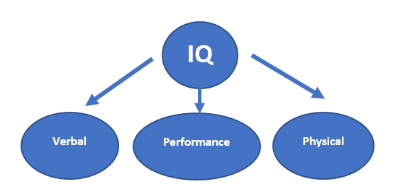
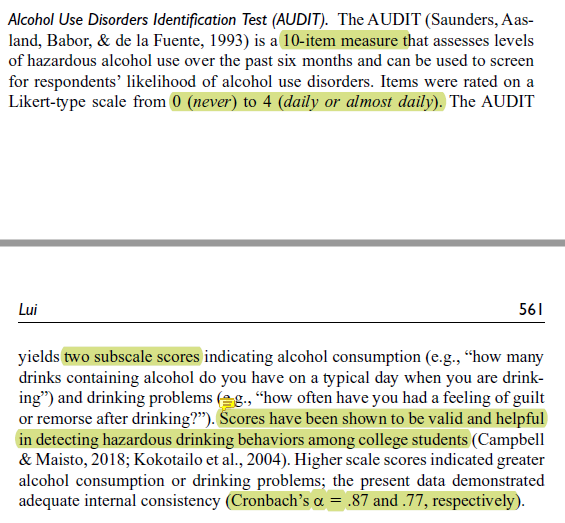
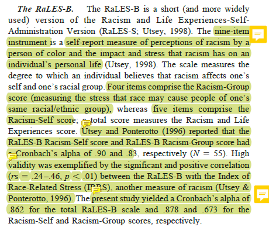
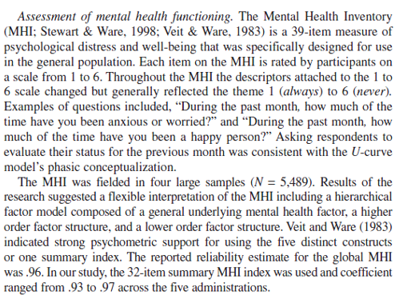
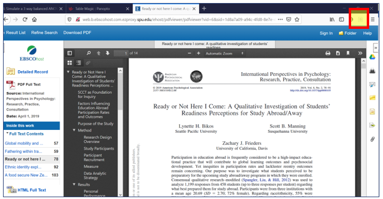
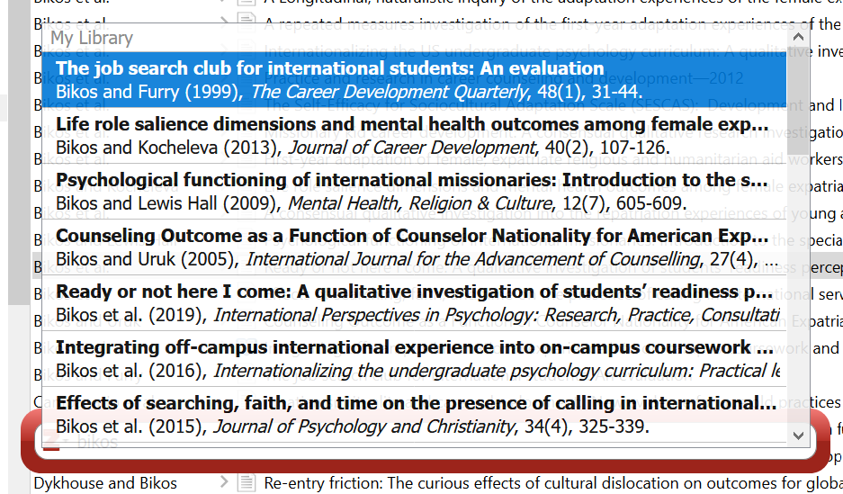
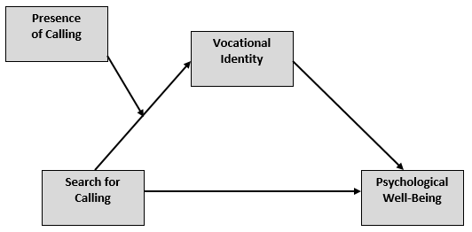

--- 
lang: "en"
title: "ReCentering Psych Stats:  Topics in Research Methods"
author: "Lynette H Bikos, PhD, ABPP"
knit: "bookdown::render_book"
site:  bookdown::bookdown_site
documentclass: book
bibliography: STATSnMETH.bib
citation-style: apa-single-spaced.csl
link-citations: true

#url: 'http\://whateveritis
#github-repo: whatever it is

description: 'This is an open-access, book-in-progress. My goal in offering it is to re-center the materials used in training statistics and research methods in graduate and post-graduate psychology programs.'
#cover-image: "ReCenter_bookcover.jpg"

output:
  bookdown::gitbook:
    dev: svglite
    css: css/style.css
    includes: 
        #in_header: [google-analytics-otl.html]
    toc_depth: 4
    split-by: section
    split_bib: true
    number_sections: true
    #pandoc_args: [ "--csl", "apa-single-spaced.csl" ]
    config:
      toc:
        scroll_highlight: yes
        collapse: section
        before: |
          <li><a href="./"><strong>ReCentering Psych Stats: Topics in Research Methods</strong><br>by Lynette H Bikos, PhD, ABPP</a></li>
        after: |
          #<li><a href="https:link" target="_blank">Open access book-in-progress</br>
          <li><a rel="license" href="http://creativecommons.org/licenses/by-nc-sa/4.0/"></a></li>
            <li><a href="https://bookdown.org" target="_blank">Built with Bookdown</a></li>
      download: [pdf]
      view: https://github.com/ontheline/otl-bookdown/blob/master/%s
      search: yes
      sharing:
        facebook: yes
        github: yes
        twitter: yes

  #bookdown::pdf_book:
    #citation_package: default
    #pandoc_args: [ "--csl", "apa-single-spaced.csl" ]

  bookdown::word_document2:
    default

  bookdown::markdown_document2:
    default
---

# BOOK COVER {-}


# PREFACE {-}

**If you are viewing this document, you should know that this is a book-in-progress.  Early drafts are released for the purpose teaching my classes and gaining formative feedback from a host of stakeholders.  The document was last updated on `r format (Sys.Date(), '%d %b %Y')`**

**There are lectures accompanying each lesson. At present, these screencast of these lectures are from prior lecture notes and not directly from this OER. While the content should be parallel, you might find it to be somewhat discordant.  I do plan to relecture these using the formatting of the OER; I just can't get to it this year. Please accept my apologies.**

[Screencasted Lecture Link](https://spu.hosted.panopto.com/Panopto/Pages/Viewer.aspx?id=c932455e-ef06-444a-bdca-acf7012d759a)

To *center* a variable in regression means to set its value at zero and interpret all other values in relation to this reference point. Regarding race and gender, researchers often center male and White at zero. Further, it is typical that research vignettes in statistics textbooks are similarly seated in a White, Western (frequently U.S.), heteronormative, framework. The purpose of this project is to create a set of open educational resources (OER) appropriate for doctoral and post-doctoral training that contribute to a socially responsive pedagogy -- that is, it contributes to justice, equity, diversity, and inclusion. 

Statistics training in doctoral programs are frequently taught with fee-for-use programs (e.g., SPSS/AMOS, SAS, MPlus) that may not be readily available to the post-doctoral professional. In recent years, there has been an increase and improvement in R packages (e.g., *psych*, *lavaan*) used for in analyses common to psychological research. Correspondingly, many graduate programs are transitioning to statistics training in R (free and open source).  This is a challenge for post-doctoral psychologists who were trained with other software. This OER will offer statistics training with R and be freely available (specifically in a GitHub respository and posted through GitHub Pages) under a Creative Commons Attribution - Non Commercial - Share Alike license [CC BY-NC-SA 4.0]. 

Training models for doctoral programs in HSP are commonly scholar-practitioner, scientist-practitioner, or clinical-scientist.  An emerging model, the *scientist-practitioner-advocacy* training model incorporates social justice advocacy so that graduates are equipped to recognize and address the sociocultural context of oppression and unjust distribution of resources and opportunities [@mallinckrodt_scientist-practitioner-advocate_2014]. In statistics textbooks, the use of research vignettes engages the learner around a tangible scenario for identifying independent variables, dependent variables, covariates, and potential mechanisms of change. Many students recall examples in Field's  [-@field_discovering_2012] popular statistics text:  Viagra to teach one-way ANOVA, beer goggles for two-way ANOVA, and bushtucker for repeated measures.  What if the research vignettes were more socially responsive? 

In this OER, research vignettes will be from recently published articles where: 

* the author’s identity is from a group where scholarship is historically marginalized (e.g., BIPOC, LGBTQ+, LMIC[low-middle income countries]), 
* the research is responsive to issues of justice, equity, inclusion, diversity, 
* the lesson’s statistic is used in the article, and 
* there is sufficient information in the article to simulate the data for the chapter example(s) and practice problem(s); or it is publicly available.  

In training for multicultural competence, the saying, "A fish doesn't know that it's wet" is often used to convey the notion that we are often unaware of our own cultural characteristics. In recent months and years, there has been an increased awakening to the institutional and systemic racism that our systems are perpetuating. Queuing from the water metaphor, I am hopeful that a text that is recentered in the ways I have described can contribute to *changing the water* in higher education and in the profession of psychology.

## Copyright with Open Access {-}
<a rel="license" href="http://creativecommons.org/licenses/by-nc-sa/4.0/"></a>

This book is published under a a <a rel="license" href="http://creativecommons.org/licenses/by-nc-sa/4.0/">Creative Commons Attribution-NonCommercial-ShareAlike 4.0 International License</a>. This means that this book can be reused, remixed, retained, revised and redistributed (including commercially) as long as appropriate credit is given to the authors. If you remix, or modify the original version of this open textbook, you must redistribute all versions of this open textbook under the same license - CC BY-SA.


A [GitHub open-source repository](https://github.com/lhbikos/ReC_Topics) contains all of the text and source code for the book, including data and images. 

# ACKNOWLEDGEMENTS {-}

As a doctoral student at the University of Kansas (1992-2005), I learned that "a foreign language" was required for graduation. *Please note that as one who studies the intersections of global, vocational, and sustainable psychology, I regret that I do not have language skills beyond English.* This could have been met with credit from high school my rural, mid-Missouri high school did not offer such classes. This requirement would have typically been met with courses taken during an undergraduate program -- but my non-teaching degree in the University of Missouri's School of Education was exempt from this. The requirement could have also been met with a computer language (fortran, C++) -- I did not have any of those either. There was a tiny footnote on my doctoral degree plan that indicated that a 2-credit course, "SPSS for Windows" would substitute for the language requirement.  Given that it was taught by my one of my favorite professors, I readily signed up. As it turns out, Samuel B. Green, PhD, was using the course to draft chapters in the textbook [@green_using_2014] that has been so helpful for so many. Unfortunately, Drs. Green (1947 - 2018) and Salkind (2947 - 2017) are no longer with us. I have worn out numerous versions of their text. Another favorite text of mine was Dr. Barbara Byrne's [-@byrne_structural_2016], "Structural Equation Modeling with AMOS." I loved the way she worked through each problem and paired it with a published journal article, so that the user could see how the statistical evaluation fit within the larger project/article. I took my tea-stained text with me to a workshop she taught at APA and was proud of the signature she added to it (a little catfur might have fallen out).  Dr. Byrne created SEM texts for a number of statistical programs (e.g., LISREL, EQS, MPlus). As I was learning R, I wrote Dr. Byrne, asking if she had an edition teaching SEM/CFA with R. She promptly wrote back, saying that she did not have the bandwidth to learn a new statistics package.  We lost Dr. Byrne in December 2020. I am so grateful to these role models for their contributions to my statistical training.  I am also grateful for the doctoral students who have taken my courses and are continuing to provide input for how to improve the materials.

The inspiration for training materials that re*center statistics and research methods came from the [Academics for Black Survival and Wellness Initiative](https://www.academics4blacklives.com/). This project, co-founded by Della V. Mosley, Ph.D., and Pearis L. Bellamy, M.S., made clear the necessity and urgency for change in higher education and the profession of psychology. 

At very practical levels, I am indebted to SPU's Library, and more specifically, SPU's Education, Technology, and Media Department.  Assistant Dean for Instructional Design and Emerging Technologies, R. John Robertson, MSc, MCS, has offered unlimited consultation, support, and connection. Senior Instructional Designer in Graphics & Illustrations, Dominic Wilkinson, designed the logo and bookcover.  Psychology and Scholarly Communications Librarian, Kristin Hoffman, MLIS, has provided consultation on topics ranging from OERS to citations. I am alo indebted to Associate Vice President, Teaching and Learning at Kwantlen Polytechnic University, Rajiv Jhangiani, PhD. Dr. Jhangiani's text [-@jhangiani_research_2019] was the first OER I ever used and I was grateful for his encouraging conversation.

Financial support for this OER has been provided from:

* The *Call to Action on Equity, Inclusion, Diversity, Justice, and Social Responsivity
Request* grant from the Association of Psychology Postdoctoral and Internship Centers (2021-2022). 
* The *Diversity Seed Grant** from the Office of Inclusive Excellence and Advisory Council for Diversity and Reconciliation (ACDR) at Seattle Pacific University. 
* The *ETM Open Textbook & OER Development Funding* program from the Office of Education, Technology, & Media at Seattle Pacific University. 

<!--chapter:end:index.Rmd-->

---
output:
  word_document: default
  html_document: default
---
# Introduction {#ReCintro}

[Screencasted Lecture Link](https://spu.hosted.panopto.com/Panopto/Pages/Viewer.aspx?pid=cc9b7c0d-e5c3-4e4e-a469-acf7013ee761)

## What to expect in each chapter

This textbook is intended as *applied,* in that a primary goal is to help the scientist-practitioner-advocate use a variety of statistics in research problems and *writing them up* for a program evaluation, dissertation, or journal article. In support of that goal, I try to provide just enough conceptual information so that the researcher can select the appropriate statistic (i.e., distinguishing between when ANOVA is appropriate and when regression is appropriate) and assign variables to their proper role (e.g., covariate, moderator, mediator).

This conceptual approach does include occasional, step-by-step, *hand-calculations* (only we calculate them arithmetically in R) to provide a *visceral feeling* of what is happening within the statistical algorithm that may be invisible to the researcher.  Additionally, the conceptual review includes a review of the assumptions about the characteristics of the data and research design that are required for the statistic. Statistics can be daunting, so I have worked hard to establish a *workflow* through each analysis. When possible, I include a flowchart that is referenced frequently in each chapter and assists the the researcher keep track of their place in the many steps and choices that accompany even the simplest of analyses.

As with many statistics texts, each chapter includes a *research vignette.* Somewhat unique to this resource is that the vignettes are selected from recently published articles. Each vignette is chosen with the intent to meet as many of the following criteria as possible:

* the statistic that is the focus of the chapter was properly used in the article,
* the author’s identity is from a group where scholarship is historically marginalized (e.g., BIPOC, LGBTQ+, LMIC [low middle income countries]),
* the research has a justice, equity, inclusion, diversity, and social responsivity focus and will contribute positively to a social justice pedagogy, and 
* the data is available in a repository or there is sufficient  information in the article to simulate the data for the chapter example(s) and practice problem(s).  

In each chapter we employ *R* packages that will efficiently calculate the statistic and the dashboard of metrics (e.g., effect sizes, confidence intervals) that are typically reported in psychological science.

## Strategies for Accessing and Using this OER

There are a number of ways you can access this resource. You may wish to try several strategies and then select which works best for you.  I demonstrate these in the screencast that accompanies this chapter.

1. Simply follow along in the .html formatted document that is available on via GitHub Pages, and then
   * open a fresh .rmd file of your own, copying (or retyping) the script  and running it 
2. Locate the original documents at the [GitHub repository](https://github.com/lhbikos/ReC_Topics) . You can
   * open them to simply take note of the "behind the scenes" script
   * copy/download individual documents that are of interest to you
   * fork a copy of the entire project to your own GitHub site and further download it (in its entirety) to your personal workspace. The [GitHub Desktop app](https://desktop.github.com/) makes this easy!
3. Listen to the accompanying lectures (I think sound best when the speed is 1.75). The lectures are being recorded in Panopto and should include the closed captioning.
4. Provide feedback to me!  If you fork a copy to your own GitHub repository, you can 
   * open up an editing tool and mark up the document with your edits,
   * start a discussion by leaving comments/questions, and then
   * sending them back to me by committing and saving.  I get an e-mail notiying me of this action.  I can then review (accepting or rejecting) them and, if a discussion is appropriate, reply back to you.

## If You are New to R

R can be oveRwhelming. Jumping right into advanced statistics might not be the easiest way to start. However, in these chapters, I provide complete code for every step of the process, starting with uploading the data. To help explain what R script is doing, I sometimes write it in the chapter text; sometimes leave hastagged-comments in the chunks; and, particularly in the accompanying screencasted lectures, try to take time to narrate what the R script is doing.  

I've found that, somewhere on the internet, there's almost always a solution to what I'm trying to do. I am frequently stuck and stumped and have spent hours searching the internet for even the tiniest of things.  When you watch my videos, you may notice that in my R studio, there is a "scRiptuRe" file. I takes notes on the solutions and scripts here -- using keywords that are meaningful to me so that when I need to repeat the task, I can hopefully search my own prior solutions and find a fix or a hint.

### Base R

The base program is free and is available here:  https://www.r-project.org/  

Because R is already on my machine (and because the instructions are sufficient), I will not walk through the instllation, but I will point out a few things.

* Follow the instructions for your operating system (Mac, Windows, Linux)
* The "cran" (I think "cranium") is the *Comprehensive R Archive Network.*  In order for R to run on your computer, you have to choose a location.  Because proximity is somewhat related to processing speed, select one that is geographically "close to you." 
* You will see the results of this download on your desktop (or elsewhere if you chose to not have it appear there) but you won't ever use R through this platform.

### R Studio

*R Studio* is the desktop application I work in R.  It's a separate download. Choose the free, desktop, option that is appropriate for your operating system:   https://www.rstudio.com/products/RStudio/

* Upper right window:  Includes several tabs; we frequently monitor the
  + Environment: it lists the *objects* that are available to you (e.g., dataframes)
* Lower right window: has a number of helpful tabs.
  + Files:  Displays the file structure in your computer's environment.  Make it a practice to (a) organize your work in small folders and (b) navigating to that small folder that is holding your project when you are working on it.
  + Packages:  Lists the packages that have been installed.  If you navigate to it, you can see if it is "on."  You can also access information about the package (e.g., available functions, examples of script used with the package) in this menu.  This information opens in the Help window.
  + Viewer and Plots are helpful, later, when we can simultaneously look at our output and still work on our script.
* Primary window
  + R Studio runs in the background(in the console).  Very occasionally, I can find useful troubleshooting information here.
  + More commonly, I open my R Markdown document so that it takes the whole screen and I work directly, right here.
* *R Markdown* is the way that many analysts write *script*, conduct analyses, and even write up results.  These are saved as .rmd files.
  + In R Studio, open an R Markdown document through File/New File/R Markdown
  + Specify the details of your document (title, author, desired ouput)
  + In a separate step, SAVE this document (File/Save] into a NEW FILE FOLDER that will contain anything else you need for your project (e.g., the data).
  + *Packages* are at the heart of working in R.  Installing and activating packages require writing script.

### R Hygiene

Many initial problems in R can be solved with good R hygiene. Here are some suggestions for basic practices.  It can be tempting to "skip this."  However, in the first few weeks of class, these are the solutions I am presenting to my students.

#### Everything is documented in the .rmd file

Although others do it differently, everything is in my .rmd file. That is, for uploading data and opening packages I write the code in my .rmd file.  Why?  Because when I read about what I did hours or years later, I have a permanent record of very critical things like (a) where my data is located, (b) what version I was using, and (c) what package was associated with the functions.

#### File organization

File organization is a critical key to this:

* Create a project file folder.
* Put the data file in it.
* Open an R Markdown file.
* Save it in the same file folder.
* When your data and .rmd files are in the same folder (not your desktop, but a shared folder), they can be connected.

#### Chunks

The R Markdown document is an incredible tool for integrating text, tables, and analyses.  This entire OER is written in R Markdown.  A central feature of this is "chunks."

The easiest way to insert a chunk is to use the INSERT/R command at the top of this editor box.  You can also insert a chunk with the keyboard shortcut:  CTRL/ALT/i

"Chunks" start and end with with those three tic marks and will show up in a shaded box, like this:

```{r title for the chunk contents}
#hashtags let me write comments to remind myself what I did
#here I am simply demonstrating arithmetic (but I would normally be running code)
2021 - 1966
```

Each chunk must open and close.  If one or more of your tic marks get deleted, your chunk won't be read as such and your script will not run.  The only thing in the chunks should be script for running R; you can hashtag-out script so it won't run.

Although unnecessary, you can add a brief title for the chunk in the opening row, after the "r."  These create something of a table of contents of all the chunks -- making it easier to find what you did.  You can access them in the "Chunks" tab at the bottom left of R Studio. If you wish to knit a document, you cannot have identical chunk titles.

You can put almost anything you want in the space outside of tics.  Syntax for simple formatting in the text areas (e.g,. using italics, making headings, bold, etc.) is found here:  https://rmarkdown.rstudio.com/authoring_basics.html


#### Packages

As scientist-practitioners (and not coders), we will rely on *packages* to do our work for us. At first you may feel overwhelmed about the large number of packages that are available. Soon, though, you will become accustomed to the ones most applicable to our work (e.g., psych, tidyverse, lavaan, apaTables).

Researchers treat packages differently. In these lectures, I list all the packages we will use in an opening chunk that asks R to check to see if the package is installed, and if not, installs it.  

```{r checking for packages}
if(!require(psych)){install.packages("psych")}
```

To make a package operable, you need to open it through the library.  This process must be repeated each time you restart R. I don't open the package (through the "library(package_name)") command until it is time to use it.  Especially for new users, I think it's important to connect the functions with the specific packages.

```{r opening psych, package, message=FALSE, warning=FALSE}
#install.packages ("psych")
library (psych)
```

If you type in your own "install.packages" code, hashtag it out once it's been installed.  It is problematic to continue to re-run this code .

#### Knitting

An incredible feature of R Markdown is its capacity to *knit* to HTML, powerpoint, or word. If you access the .rmd files for this OER, you can use annotate or revise them to suit your purposes.  If you redistribute them, though, please honor the Creative Commons Attribution-NonCommercial-ShareAlike 4.0 International License with a citation.

### tRoubleshooting in R maRkdown

Hiccups are normal.  Here are some ideas that I have found useful in getting unstuck.

* In an R script, you must have everything in order -- Every. Single. Time. 
  + All the packages have to be in your library and activated; if you restart R, you need to reload each package.
  + If you open an .rmd file and want a boxplot, you cannot just scroll down to that script.  You need to run any *prerequisite* script (like loading the package, importing data, putting the data in the global environment, etc.)
  + Do you feel lost?  clear your global environment (broom) and start at the top of the R script. Frequent, fresh starts are good.
* Your .rmd file and your data need to be stored in the same file folder.  These should be separate for separate projects, no matter how small.
* Type any warnings you get into a search engine.  Odds are, you'll get some decent hints in a manner of seconds.  Especially at first, these are common errors:
  + The package isn't loaded (if you restarted R, you need to reload your packages)
  + The .rmd file has been saved yet, or isn't saved in the same folder as the data
  + Errors of punctuation or spelling
* Restart R (it's quick -- not like restarting your computer)
* If you receive an error indicating that a function isn't working or recognized, and you have loaded the package, type the name of the package in front of the function with two colons (e.g., psych::describe(df). If multiple packages are loaded with functions that have the same name, R can get confused.

### stRategies for success

* Engage with R, but don't let it overwhelm you.
  + The *mechanical is also the conceptual*. Especially when it is *simpler*, do try to retype the script into your own .rmd file and run it. Track down the errors you are making and fix them.
  + If this stresses you out, move to simply copying the code into the .rmd file and running it.  If you continue to have errors, you may have violated one of the best practices above (Is the package loaded? Are the data and .rmd files in the same place? Is all the prerequisite script run?).
  + Still overwhelmed?  Keep moving forward by downloading a copy of the .rmd file that accompanies any given chapter and just "run it along" with the lecture. Spend your mental power trying to understand what each piece does. Then select a practice problem that is appropriate for your next level of growth. 
* Copy script that works elsewhere and replace it with your datafile, variables, etc.  
* The leaRning curve is steep, but not impossible.  Gladwell[-@gladwell_outliers_2008] reminds us that it takes about 10,000 hours to get GREAT at something (2,000 to get reasonably competent). Practice. Practice. Practice.
* Updates to R, R Studio, and the packages are NECESSARY, but can also be problematic.  It could very well be that updates cause programs/script to fail (e.g., "X has been deprecated for version X.XX").  Moreover, this very well could have happened between my distribution of these resources and your attempt to use it.  My personal practice is to update R, R Studio, and the packages a week or two before each academic term.
* Embrace your downward dog.  Also, walk away, then come back.
  

### Resources for getting staRted

R for Data Science:  https://r4ds.had.co.nz/

R Cookbook:  http://shop.oreilly.com/product/9780596809164.do

R Markdown homepage with tutorials:  https://rmarkdown.rstudio.com/index.html

R has cheatsheets for everything, here's one for R Markdown:  https://www.rstudio.com/wp-content/uploads/2015/02/rmarkdown-cheatsheet.pdf 

R Markdown Reference guide:  https://www.rstudio.com/wp-content/uploads/2015/03/rmarkdown-reference.pdf

Using R Markdown for writing reproducible scientific papers:  https://libscie.github.io/rmarkdown-workshop/handout.html 

LaTeX equation editor:  https://www.codecogs.com/latex/eqneditor.php


<!--chapter:end:01-Introduction.Rmd-->

# Training Models in Professional Psychology {#TrainMod}

[Screencasted Lecture Link](HTTPS://SPU.HOSTED.PANOPTO.COM/PANOPTO/PAGES/VIEWER.ASPX?PID=CC70F027-CDA5-4D3B-B000-AC33000B49B5) 
 
```{r  include=FALSE}
knitr::opts_chunk$set(echo = TRUE)
knitr::opts_chunk$set(comment = NA) #keeps out the hashtags in the knits
```

```{r include=FALSE}
options(scipen=999)#eliminates scientific notation
```

This lesson compares and contrasts training models in professional psychology. To that end, I review:

* The push and pull of science and practice 
* Training models (and accreditation)
  - Scientist-practitioner
  - Scholar practitioner
  - Clinical scientist
  - Local clinical scientist
* Programmatic differences as a function of training model
* The future of models – and one in particular
* The *Research & Dissertation Guidelines* in the doctoral psychology programs at SPU. 

## Navigating this Lesson

There is about 1 hour and 10 minutes of lecture.  

### Learning Objectives

Learning objectives from this lecture include the following:

* Identify the key differences between training models.
* Distinguish one training model from another based on expected outcomes.  
* Identify the “place” of the Local Clinical Science model, relative to other models.
* Describe the training model for your particular graduate program.
* What citations would you cite to defend any description or comparison?

### Readings & Resources

In preparing this chapter, I drew heavily from the following resource(s). Other resources are cited (when possible, linked) in the text with complete citations in the reference list.

* Bell, D. J., & Hausman, E. M. (2014). Training Models in Professional Psychology Doctoral Programs (Chapter 3). In W. B. Johnson & N. Kaslow (Eds.), The Oxford Handbook of Education and Training in Professional Psychology.
  - Much of our first class will be spent talking about training models in graduate psychology. This chapter is an excellent review of the origin of training models, their defining characteristics, and how they strengthen as well as challenge our training programs.  The authors have both been long-involved in the issue of training models and accreditation.


## The Push and Pull of Science and Practice

Meehl's [-@meehl_clinical_1954, p. 4] catharsis regarding the dissociated state of science and practice is below.  We'll turn it into *Reader's Theater* by following Stricker's [-@stricker_are_1997] recommendation to substitute *scientist* for the statistical metnod and *practitioner* or the clinical method. If you were in my classroom I would ask or volunteers to be the NARRATOR, the advocate for the *scientist* (italics) and advocate forthe **practitioner** (bold).

The (statistical method) scientist is often called **operational, communicable, verifiable, public, objective, reliable, behavioral, testable, rigorous, scientific, precise, careful, trustworthy, experimental, quantitative, down-to-earth, hardheaded, empirical, mathematical, and sound.** Those who dislike the method scientist consider them to be *mechanical, atomistic, additive, cut and dried, artificial, unreal, arbitrary, incomplete, dead, pedantic, fractionated, trivial, forced, static, superficial, rigid, sterile, academic, oversimplified, pseudoscientific, and blind.* The (clinical method) practitioner, on the other hand, is labeled by their proponents as *dynamic, global, meaningful, holistic, subtle, sympathetic, configural, patterned, organized, rich, deep, genuine, sensitive, sophisticated, real, living, concrete, natural, true to life, and understanding*. The critics of the (clinical method) practitioner are likely to view them as **mystical, transcendent, metaphysical, super-mundane, vague, hazy, subjective, unscientific, unreliable, crude, private, unverifiable, qualitative, primitive, prescientific, sloppy, uncontrolled, careless, verbalistic, intuitive, and muddleheaded**. 


## Training Models & Accreditation

APA accredited programs must (but most all grad psych programs do):

* define and articulate their own training philosophies,
* demonstrate that the outcomes of the training are consistent with the model
* do so because of the need for (and value of) public accountability

All currently accredited doctoral programs in clinical have a "pure" model affiliation or some variation thereof. 

Most common models:

* clinical scientist, 
* scientist-practitioner, 
* with updated proposal for scientist-practitioner-advocate (Mallinckrodt et al., 2014)
* practitioner-scholar models 

### Scientist~Practitioner (SP) Model

The scientist~practitioner model is also known as the Boulder Model.  It originated in 1949 with formal articulation in 1950 [@conference_on_graduate_education_in_clinical_psychology_training_1950].  It is characterized by the following:  

* Primary goal: equal provision of extensive training in psychological research and the applications of that research to eventual practice—that is, to the creation of the SP psychologist (Cherry et al., 2000).
* Began in clinical psychology; prominent training model in school, counseling, and I/O psych programs
* Model re-articulated at the National Conference on SP Education and Training for the Professional Practice of Psychology, Gainesville, FL, 1990 (Belar & Perry, 1992).
* Major theme:  SP ≠ summation; SP ≠ continuum; SP = integration. New symbols:  not S-P, but SXP or S~P
* Major theme: "The graduate of this training model is capable of functioning as an investigator and as a practitioner, and may function as either or both, consistent with the highest standards in psychology.”
* Training components of the SP model (Belar & Perry, 1992):
  - Didactic scientific
  - Didactic practice core
  - Experiential scientific
  - Professional practice experiential
  - Integration of Education & Training
  - System components (faculty, setting, evaluation procedures)
* In spite of this idealism, many argue that the S~P model is really an S model (e.g., Stricker & Trierweiler, 2006).  Just what evidence is there or this?

A mixed methods study [@ridley_scientistpractitioner_2015] surveyed training directors in counseling psychology programs.  Training directors indicated the degree to which each of nine program components fell in the continuum of science-to-practice.  Table 6 in the manuscript shows the results (and is worth a look).  Overall the programs leaned heavily toward "science" with four of the criteria being rated as "heavily science."  These included

* Statistics and resaerch methodology
* Psychology core course
* Resaerch experiences
* Dissertation experiences

Only *practica courses* were rated as heavily practice.  The remaining criteria fell between the two.  These included:

* Criteria for student evaluations.
* Counseling psychology core courses
* Our program overall
* Diagnostic/assessment courses.

### Scholar-Practitioner (SCH-P) Model

The scholar-practitioner model is also known as the Vail model. It originated in 1973 when the National Institute for Mental Health and the American Psychological Association met in Vail, Colorado. It is characterized by the following:

* Primary goal:  the preparation for "delivery of human services in a manner that is effective and responsive to individual needs, societal needs, and diversity" [@mcholland_national_1992, p. 159].
* Operationalized as the capacity to conduct disciplined inquiry (rather than producing controlled lab or field research)
* Ivey and Leppaluoto [-@ivey_changes_1975] summarized the major emphases of this model; the original summary is found in Korman [-@korman_national_1974]:
  - Awareness of values; not promotion of “right values”
  - Attention to human diversity and culture 
  - Scientist practitioner:  professional training as a legitimate alternative. 
  - Individual v program training (e.g., continuing education [CE])
  - Specifically, the conferands concluded that when primary training emphasis is on the production of new knowledge, the Ph.D. is appropriate; when primary emphasis is on professional services, evaluation, and improving services, the Psy.D. is appropriate.

### Clinical Scientist Model

The clinical science model was created by the Academy of Psychological Clinical Science in 1974.  It is characterized by the following: 

* Primary goal: to provide training in the production of scientific research on clinical problems and its application to those problems (Academy of Psychological Clinical Science, 1997). 
* "Clinical science" is defined as a psychological science directed at the promotion of adaptive functioning; at the assessment, understanding, amelioration, and prevention of human problems in behavior, affect, cognition or health; and at the application of knowledge in ways consistent with scientific evidence. The Academy's emphasis on the term "science" underscores its commitment to empirical approaches to evaluating the validity and utility of testable hypotheses and to advancing knowledge by this method.

A flavor of this model can be found in a McFall's [-@mcfall_manifesto_1991] [Manifesto for a Science of Clinical Psychology](http://www.psychologicalscience.org/observer/0102/apcs_manifesto.html)http://apsychoserver.psych.arizona.edu/JJBAReprints/PSYC621/McFall_Manifesto_1991.pdf). McFcall declared that "Scientific clinical psychology is the only legitimate and acceptable form of clinical psychology" should be a "Cardinal Principle."  To that end:

* First Corollary: Psychological services should not be administered to the public (except under strict experimental control) until they have satisfied these four   -   - The exact nature of the service must be described clearly.
  - The claimed benefits of the service must be stated explicitly.
  - These claimed benefits must be validated scientifically 
  - Possible negative side effects that might outweigh any benefits must be ruled out empirically.
*  Second Corollary: The primary and overriding objective of doctoral training programs in clinical psychology must be to produce the most competent clinical scientists possible.
  - Change is constant;[PCSAS](https://www.pcsas.org/) offers an accreditation program that competes with APA's. 

### Local Clinical Scientist Model (LCS)

The local clinical scientist model emerged in a series of writing [@stricker_are_1997; @stricker_local_1995; @stricker_local_2006; @trierweiler_research_2010; @trierweiler_scientific_1998]. It is characterized by the following:

* Elaborates, extends, optimizes, makes real the Boulder scientist-practitioner model
* A scientific approach and inquiring attitude of curiosity, skepticism, hypothesis testing and reframing within the local setting
* Breaking it down:
  - *clinical scientist* reflects our commitment to psychology as both a scientific discipline and a healthcare profession. 
  - *local* refers to the particular application of general science, within local cultures, including the idiographic aspects of persons, families, and communities, in specific space-time and relational contexts


### And What Does It Mean?

Norcross et al.[-@norcross_doctoral_2020] evaluated 20-year trends of counseling psychology programs in terms of program, student, and faculty comparisons – and also compared it to clinical psychology. The tables in the Norcross et al. manuscript are worth reviewing.  Generally results demonstrated:

* there are more applicants to research-oriented programs
* a fewer percentage of students are to research-oriented programs
* there is more funding in research oriented programs
* there are non-significant differences for gender
* there is a lower percent of students of color in practice-oriented programs
* there is a shorter time required to complete practice oriented programs
* GREs are higher in research oriented programs

Regarding differences between counseling psychology and clinical psychology programs, Norcross et al.[-@norcross_doctoral_2020] reported that there were non-significant differences in the number of incoming students each year, but that there was greater numbers of applications received and, thereore, a smaller proportion of students accepted in clinical psychology programs. There was not a statistically significant diference in the percentage of students receiving full tuition waivers and assistantships. Regarding student characteristics, clinical psychology programs had somewhat higher GRE scores and students were more likely to enter having completed a bachelor's degree.  Regarding counseling psychology programs, more students had completed a master's level degree.  There were more female students in clinical psychology programs; there were more ethnic minority students and international students in counseling psychology programs.

Regarding theoretical orientation, counseling psychology programs were more likely to be psychodynamic/psychoanalytic, family systems/systems, and existential/humanistic. Clinical psychology programs were more likely to be applied behavioral analysis/radical behavioral and cognitive/cognitive-behavioral.Clinical psychology programs reported a stronger research-practice emphasis. 

Cherry et al. [-@cherry_examination_2000] examined outcomes related to training model.  Perhaps not surprisingly, research and publication productivity was highest among programs with a clinical scientist training model, followed by the scientist-practitioner training model, followed by the scholar-practitioner model. Service delivery was the the opposite order.  Regarding post-doctoral employment settings, graduates from clinical psychology programs often held employment in academic settings.  Graduates of scholar-practitioner programs most often held employment in community mental health centers and other/multiple settings.  Graduates from scientist-practitioner programs had more of a diverse profile in post-doctoral employment.


### What Lies Ahead?

Mallinckrodt et al. [-@mallinckrodt_scientist-practitioner-advocate_2014] has proposed a scientist-practitioner-advocate training model for doctoral training in professional psychology, "designed to more effectively meet the needs of clients whose presenting problems are rooted in a sociocultural context of oppression and unjust distribution of resources and opportunities." This model has been represented with three intersecting circles:

* where science and practice overlap, science informs practice and practice generates research ideas,
* where practice and advocacy overlap, there is advocacy for clients, empowering them to advocate for themselves,
* where advocacy and science overlap, there is action resaerch and research as advocacy,
* at the center where all three overlap is a practicum in social justice advocacy.

The scientist-practitioner-advocate model prioritizes four outcomes:

* Developing an understanding how the context of social problems impacts the lives of individuals;
* Demonstrating skills in the methods of social action research and be able to use empirical skills as tools for advocacy and to promote social change;
* Developing effective interventions targeted at the level of institutions or systems influencing public policy decisions and evaluating the effectiveness of these interventions; and
* Learning to work with individual clients to help them make informed choices about the cost and benefits of engaging in advocacy for themselves.

The [University of Tennessee Counseling Psychology Program](https://psychology.utk.edu/grad/spa_model.php ) and provides a practical example of how it has been operationalized in their program.

Accredited programs are required to provide details about their training models in their program materials. These are often foundin doctoral handbooks, research and dissertation guidelines, and clinical trainng guidelines.


## Suggestions for Practice

If you are in a graduate training program in psychology (or considering the possibility of further trainng and education):

1. Does your program have a specified and articulated model?  
   - If yes, what is it? How does it compare to the descriptions in this lesson?
   - If no, based on what you know about the program how would you describe it?
2. Interview at least two faculty. How do they identify and describe the trainng model of the program?
   - Do the programmatic characteristics and outcomes align with those reported in Norcross et al. [-@norcross_doctoral_2020] and Cherry et al [-@cherry_examination_2000]? 


```{r include=FALSE}
sessionInfo()
```


<!--chapter:end:02-TrainingModels.Rmd-->


# Epistemology and Philosophy of Science {#PHoS}

[Screencasted Lecture Link](HTTPS://SPU.HOSTED.PANOPTO.COM/PANOPTO/PAGES/VIEWER.ASPX?PID=E521F3D0-BE61-4099-A108-AC40003B45E2) 
 
```{r  include=FALSE}
knitr::opts_chunk$set(echo = TRUE)
knitr::opts_chunk$set(comment = NA) #keeps out the hashtags in the knits
```

```{r include=FALSE}
options(scipen=999)#eliminates scientific notation
```

This lesson provides a high level review of epistemology (including the contribution of race-based epistemologies) and philosophy of science and considers the differences in these paradigms.

## Navigating this Lesson

There is about 45 minutes of lecture.  


### Learning Objectives

Learning objectives from this lecture include the following:

* Identify, define, and provide examples of the standard ways of knowing. * Describe how a race-based epistemology (e.g., Black feminist epistemology) could add value to a research study.
* Distinguish between emic and etic.
* Define critical research concepts:  components of science, methodology, research design, parsimony, plausible rival hypotheses, statistical inference.
* Define four primary philosophies of science, being able to identify the epistemology, axiology, rhetorical structure, and methodology for each.

### Readings & Resources

In preparing this chapter, I drew heavily from the following resource(s). Other resources are cited (when possible, linked) in the text with complete citations in the reference list.

* Jhangiani, R. S., Chiang, I.-C. A., Cuttler, C., & Leighton, D. C. (2019). *Research Methods in Psychology*. https://doi.org/10.17605/OSF.IO/HF7DQ
  - Chapter 1:  Methods of Knowing
  - Chapter 2:  Understanding Science
  - Chapter 3:  Goals of Science
  - These quick chapters are framing for some of the deeper concepts.
* Rajack-Talley, T. A., Smith, S. E., Best, L., Della, L. J., D’Silva, M. U., Potter, D. A., & Carthan, Q. (2017). Epistemological inclusiveness in researching the African American community. *International Journal of Social Research Methodology: Theory & Practice, 20*(4), 411–423. https://doi.org/10.1080/13645579.2016.1187460
  -  This is an incredible article describing how a multi-ethnic, multi-disciplinary team engaged race-based epistemology to improve their NIH study.
* Gephart, Jr., R. P. (2013). Doing research with words: Qualitative methodologies and industrial/organizational psychology. In J. M. Cortina & R. S. Landis (Eds.), Modern Research Methods for the Study of Behavior in Organizations (pp. 266–318). Taylor & Francis Group. http://ebookcentral.proquest.com/lib/spu/detail.action?docID=1154313
  - More recent than the Ponterotto article and written for an I/O audience.  Excellent review of philosophies of science.  Gephart and Ponterotto (below) “chop up” philosophies of science a bit differently.
* Ponterotto, J. G. (2005). Qualitative research in counseling psychology: A primer on research paradigms and philosophy of science. Journal of Counseling Psychology, 52, 126-136. 
  - Although the primary purpose of the ms is to introduce a special JCP section on Qualitative Methodology, Ponterotto does an excellent job of defining research paradigms and then contrasting the primary approaches. 


## Core Themes in Research Methodology

**But first a bicycling vignette**

What would you think of allowing cyclists to have the option of treating stop signs as yield signs?    What are your first impressions?  Think for a minute what you know about riding a bicycle, where you know it from, and then what you would think about “freeing up” the stop-sign rule to let cyclists pass through (without a full stop) if it were safe to do so.


### Ways of Knowing

**Epistemology**: the branch of philosophy that studies the nature of knowledge, its presuppositions and foundations, and its extent and validity.

One epistemological interest is in determining how we know what we know.

Jhangiani [-@jhangiani_research_2019] and colleages listed five sources of knowledge. There are benefits and liabilities to each of these:

* *Intuiton*:  relying on emotions and instincts; believing what feels true.
  - Because instincts are driven by cognitive and motivational biases, they can be wrong.
  - When weighing alternatives and thinking of all the different possibilities can be paralyzing, some intuitive decisions are superior to those based on analyses.
* *Authority*:  accepting new ideas because an authority figure states it is true (parents, media, doctors, religious officials, the government, your professor 😊).
  - If authorities are wrong or corrupt, following without questioning is problematic.
  - If authorities are correct, following is time-saving and more efficient.
* *Rationalism*: using logic and reasoning to acquire new knowledge.  Premises are stated and logical rules are followed to arrive at sound conclusion.
  - If the premises are wrong or there is an error in logic, then the conclusion is invalid.
  - If the premises are correct and logical rules are followed appropriately – it works!
* *Empiricism*:  acquiring knowledge through observation and experience.  
  - We are limited in what we can experience (e.g., the world as flat) and observe and our senses deceive us; our prior experiences can alter perception.
  - Empiricism is at the heart of the scientific method.
* *The Scientific Method*:  A process of systematically collecting and evaluating evidence to test ideas and answer questions.  Scientists engage systematic empiricism to make careful observations under various controlled conditions in order to test their ideas; they use rationalism to arrive at valid conclusions.
  - The most likely method to arrive at valid conclusions/knowledge
  - It’s costly – time, resources.  And cannot be applied to all questions – only empirical ones.

Jhangiani et al.'s [-@jhangiani_research_2019] five categories have a long history:

Cohen and Nagel's [-@cohen_introduction_1934] *Sources of Knowledge* included:

* Personal Observation and Experience
* Intuition
* Belief and tradition
* Authority
* Science

**Back to the bicycling vignette**

There’s more to this story.

As of October 1st, 2020, cyclists in Washington State have been able to treat stop signs (not stoplights, railway crossings, or stop signal displayed by school busses) as yield signs (Dahl, 2020, 2020).  The two articles from the Bellingham Herald walk us through some of the ways of knowing that led the Washington legislature to its widely passing margins (77 to 20 House; 44 to 1 Senate; [@fucoloro_bipartisan_2020]).  

Let’s think through the ways of knowing to understand the components that brought about this new law.

*Intuition*:  Depending on your own emotions and instincts, you may have widely-varying impressions.  Mine?  YES!  That will make my life easier – and other drivers won’t be angry when I lose momentum in the slowing and stopping.  On the other hand, drivers may get really mad if they think I’m breaking the law.

*Experience*:  It’s my experience that I’m more efficient (faster, smoother) if I can “slow-through” a stop-sign; particularly on right turns.  This in turn, would make it faster for drivers.

*Authority*: Idaho passed a similar in 1982 (dubbed the “Idaho stop”), Delaware in 2017 (the “Delaware Yield), Oregon in 2019.

*Empiricism*:  Many cycling accidents happen in intersections.  Traveling quickly through an intersection minimizes risk.  Thus, momentum matters.  Dahl [-@dahl_heres_2020]gathered his own data.  After a complete stop, it took 5.4 seconds to clear the intersection; entering at 5mph took only 3.8 seconds.  This is 30% of time spent in one of the most probable places for cyclist/driver collisions.

*The Scientific Method*:  

* A year after the Idaho law went into effect, bicycle injuries dropped 14%.
* A UC Berkeley transportation researcher (Jason Meggs) found that cyling was 30% to 60% safer in Boise (home of the Idaho Stop law) than in Sacramento and 150 to 252 times safer than in Bakersfield California.

Things to ponder:  How would you have voted?  Are there arguments for fairness/equity/equality in this argument (e.g., bicycles should have to follow same rules as cars)?

### A Faith-Based Model

For a faith-based, Methodist, take, John Wesley built on the Anglican faith tradition by adding a fourth emphases (experience), to create what is now termed the Wesleyan Quadrilateral [@noauthor_glossary_nodate].

* *Scripture*: defined as the primary source and standard for Christian doctrine
* *Tradition*: experience and the witness of development of growth of the faith through the past centuries and in many nations and cultures
* *Experience*:  the individual’s understanding and appropriating of the faith in the light of his or her own life.
* *Reason*: discernment and cogent thought.

These traditions are clearly White, Western, and male.  There are, of course, other ways do ask the question How do we know?  As well as different answers to the question.

### Race-Based Epistemologies

Rajack-Talley et al. [-@rajack-talley_epistemological_2017] address this in a paper describing how they were intentional to include researchers with different epistemologies (“race-based epistemologies”) in an NIH-funded study of three Black communities in Kentucky.

The NIH-study [@della_modeling_2016] was a multi-staged, mixed methods, NIH-funded study examining individual, community, and cultural-level determinants of increasing fruit and vegetable consumption in Black residents in two low-income cities in Kentucky (Louisville, Hopkinsville).

Proponents of race-based epistemologies argue:

* If the life experiences of African descent are integral to the analysis of research, then there should be some degree of an Afro-centric, Black, or race-based epistemological framework 
* This includes the adoption of the *emic* approach that recognizes there are distinct historical and cultural experiences of African people; the emic approach includes the community’s understandings and interpretations of their conditions and experiences
* “Outsiders” who are researching the other are wise to maintain a critical relationship to the research topic (and population) through self-reflexivity (self-reflection by the researchers and acknowledgement that there are differences between the researcher and those being studied).

One distinction is the difference in insider and outsider perspectives:
* **etic**: 
  - standing far enough away, on the outside,
  - with the purpose of observing similarities/differences from other cultures;
  - the primary interest is in testing hypotheses, identifying common/universal aspects of human behavior that transcend cultural differences.
  - assumes all cultures can be observed as generalizable phenomena with comparable features and universalistic measures
* **emic**:
  - standing on the inside
  - with the purpose of identifying culture-specific elements or human behavior that are not comparable across cultures
  - measures are relative
  - argues that meaningful distinctions can only be made by people within the cultures
  - assumes that the best way to understand a culture is from the perspectives and values of those being observed

**Black feminist epistemology** (as cited in [@hill_collins_black_2000]) as an example of a race-based epistemology

* Concrete experiences are treated as a criterion of meaning
* Dialogues are used in assessing knowledge claims
* An ethic of caring is developed
* An ethic of personal accountability is accepted

## Defining Research (And [Some Of]) Its Key Concepts

*Science* is generally characterized by three components [@jhangiani_research_2019]:

* **Systematic empiricism**:  planning, making, recording, analyzing observations of the natural world
* **Empirical questions**: concerning the way the world *is* not the way the world *ought to be*. 
* **Public knowledge**: the data contributes to public knowledge; publication in academia (sharing knowledge and self-correcting); open science movement.

The purpose of research is to draw valid inferences about the relationships between variables [@kazdin_research_2017]

**Methodology**

* the diverse principles, procedures, and practices that govern research.
* those practices that help to arrange the circumstances so as to minimize ambiguity in reaching the inferences.
* more than a compilation of specific practices, procedures, and strategies.
* a way of thinking

**Research Design**. The plan or arrangement used to examine the question of interest (*research design is subordinate to the concept of methodology*).

**Parsimony**. This concept is sometimes referred to the principle of economy, the principle of unnecessary plurality, the principle of simplicity, and Occam’s razor).

* Parsimony directs us to select the simplest version or account of the data among the alternatives that are available.
* Parsimony means that plurality should not be posited without necessity (Occam’s razor)
* Parsimony asks, "Must we introduce new concepts to explain the data? What about new variables?"

**Plausible Rival Hypotheses**

* An interpretation of the results of an investigation on the basis of some other influence than the one the investigator has studied or wishes to discuss. 
* Are there other interpretations that are plausible to explain the findings?

**Statistical inference**

* related to experimentation because of the extensive reliance on statistical tests in research to draw conclusions from the data. 
* statistical controls help to reduce the plausibility of rival interpretations of the results.
* agreed-upon decision rules

At the completion of a study the explanation one wishes to provide ought to be the most plausible interpretation. This is achieved not by arguing persuasively, but rather by designing the study in such a way that other explanations do not seem very plausible or parsimonious [@kazdin_research_2017].

## Philosophy of Science as it Relates to Research Methodology

**Philosophy of Science**

* Considers the logical and epistemological underpinnings of the scientific method in general.
* Historically, experimentation has been closely tied to philosophical thought. The very notion of hypothesis derives from philosophy.
* (among other things) reveals fundamental limitations in the logical underpinnings of observational and experimental methods.

Two great articles that were written about qualitative methods, provide an accessible and concise review of philosophy of science as it connects to research in clinical [@ponterotto_qualitative_2005] and industrial-organizational [@cortina_doing_2013] psychology. Much of this chapter is based on these articles. 

**Paradigm**

* A set of interrelated assumptions about the social world which provides a philosophical and conceptual framework for the organized study of that world.
* The paradigm sets the context for an investigator’s study.

**Positivism** is the research paradigm that will guide most of our work in this class. 

* A form of philosophical realism adhering closely to the hypothetico-deductive model.
* Primary goal: explanation that leads to prediction and control of phenomena.
* The received view (the one everyone is working under)
* There is one, true, knowable reality.

**Postpositivism**

* Acknowledge an objective reality that is only imperfectly apprehendable; thus we can never fully capture a “true” reality (although it exists).
* While positivists stress “theory verification,” postpositivists engage in “theory falsification.”

**Positivism & Postpositivism shared variance**

* Explanation that leads to prediction and control.
* Emphasis of cause-effect linkages.
* An objective, detached, researcher role.
* Operation from nomothetic (application to people generally)  and etic (universal laws and behaviors that transcend nations and cultures and apply to all humans) perspectives.
* Primary foundation/anchor for quantitative research.

**Constructivism – Interpretivism**

* Relativist position assumes multiple, apprehendable, and equally valid realities.
* Reality is constructed.
* Hermeneutical approach – researcher/participant dialogue
* Meaning is hidden and must be brought to the surface through deep reflection. 
* Goals are idiographic (applying to the individual) and emic (constructs or behaviors that are unique to an individual, sociocultural context, that are not generalizable).
* Emphasis on understanding the Erlebnis (lived experience)

**Critical-Ideological**

* Serves to disrupt and challenge the status quo
* Paradigm is one of emancipation and transformation
* The researchers’ proactive values are central to the task, purpose, and methods of research
* Critical theory is traced to the 1920s at the Institute of Social Research at the University of Frankfurt.  In Nazi-controlled Germany, the scholars fled to California to be “shocked by American culture…by the contradictions between progressive American rhetoric of egalitarianism and the reality of racial and class discrimination.”
* There is no single critical theory; a criticalist use his/her work as a form of cultural or social criticism.

### Paradigmatic Impact on Onology, Epistemology, Axiology, Rhetorical Structure, and Methodology

**Ontology**: the nature and reality of being. Answers the questions, “What is the form and nature of reality? What can be known about reality?

* *Positivists*: There is one true reality that is apprehendable, identifiable, measurable (i.e., naïve realism).
* *Post positivists*: There is one true reality, but it can only be apprehended and measured imperfectly (i.e., critical realism).
* *Constructivists—interpretivists*: There are multiple, constructed realities (i.e., relativism). Reality is subjective and influenced by the context of the situation, namely the individual’s experience and perceptions, the social environment, and the interaction between the individual and the researcher.
* *Criticalists*:  Reality is constructed within a social-historical context.  The criticalist focuses on power-relations.  They will assume that marginalized clients are likely have different levels of access and will present research data to pressure those in power to change.

**Epistemology**: the relationship between the “knower” (research participant) and the “would be knower” (researcher).

* *Positivists*: emphasize dualism (i.e., researcher and the research participant and topic are assumed to be independent of one another) and objectivism (i.e., by following rigorous, standard procedures, the participant and topic can be studied by the researcher without bias). 
* *Post positivists*: advocate a modified dualism/objectivism. The researcher may have some influence on that being researched, but the objectivity and researcher-subject independence remain important guidelines for the research process.
* *Constructivists-interpretivists*: advocate a transactional and subjectivist stance that maintains that reality is socially constructed, and therefore, the dynamic interaction between researcher and participant is central to capturing and describing the lived experience of the participant. 
* *Criticalists*:  concern with dialogic (gaining research insight through interaction) and dialectic (transforming research participants toward empowerment and emancipation).  Collaboration with the research participants includes the goal of helping them gain insights that contribute toward their own liberation.

**Axiology**: the role of researcher values in the scientific process.

* *Positivists/post positivists*: There is no place for values in the research process. The psychology researcher should remain emotionally detached from the investigative inquiry. Values, hopes, expectations, feelings have no place in scientific inquiry. Standardized, systematic investigative methods allowed elimination and/or strict control over any influence the researcher may have on the process.
* *Constructivists-interpretivists*: Maintain that the researcher’s values and lived experience cannot be divorced from the research process. The researcher should acknowledge, describe, and “bracket” his/her values, but not eliminate them.
* *Criticalists*:  Explicitly hope and expect that their value biases influence the research process and outcome.   A preset goal of the research is to empower participants to transform the status quo and emancipate themselves from ongoing oppression.

**Rhetorical Structure**: the language used to present the procedures and results of research to one’s intended audience. Rhetoric flows closely from one’s epistemological and axiological stance.

* *Positivist/Post positivists*: Rhetoric is precise and “scientific,” presented in an objective manner.
* *Constructivist-interpretivists/Criticalists*:  Final research report is in first person and often personalized. The researcher’s own experience, expectations, biases, and values are detailed comprehensively.

**Methodology**: the process and procedures of the research.

* *Positivists/Post positivists*: attempt to simulate, as closely as possible, strict scientific methods and procedures where variables are carefully controlled or manipulated and where the researcher’s emotional or expectant stance on the problem under the study is irrelevant. Heavy reliance on true experiments and analog methods; quasi-experimental methods when no alternative is available.
* *Constructivist-interpretivists/Criticalists*: embrace naturalistic designs in which the researcher is ensconced in the community and day-to-day life of their research participants. Research methods include in-depth face-to-face interviewing and participant observation.

**One of Ponterotto’s (2005) finest moments!**
It is important that counseling researchers understand and clearly explicate their operating paradigm in the reporting of studies…it is essential that researchers, as well as journal editorial board members and grant reviewers “locate” research studies within a specific research paradigm. (p. 132).

### Things I'm Thinking About

* Why is it important to include race-based epistemologies?
  - Mistrust comes from factual and perceived instances of exploitation and discrimination in a history of medical abuse, racism, failure to provide information/fully-informed-consent, racial stigmas, poor recruitment [@rajack-talley_epistemological_2017]
  - “Although these recommendations can be seen as ‘simply good field research,’ they are particularly important in researching the African American community because of the group’s history and because more recent data collection has been used to negatively depict this racial group” ([@rajack-talley_epistemological_2017] p. 413).
  - The Rajack-Talley et al. [-@rajack-talley_epistemological_2017] manuscript demonstrates how a multi-ethnic and multi-disciplinary team worked together to develop approaches that contributed to success in a complex NIH-funded research project from participation, engagement, and interpretation of results.  Techniques included self-reflexivity, transect walks, conducting interviews in participants’ homes or familiar places with Black team members, collecting data in community locations including other trusted members of the community (e.g., family, friend, pastor, barber). 
  - Finally, let me recommend a very cool (38-minute) [episode of Hidden Brain](https://www.npr.org/2020/07/27/895858974/creativity-and-diversity-how-exposure-to-different-people-affects-our-thinking) where Shankar Vedantam talks with researchers about the benefits of diversity on outcomes – including scientific research:   


```{r include=FALSE }
sessionInfo()
```


<!--chapter:end:03-PHoS.Rmd-->

# Experimental Design {#Experimental}

[Screencasted Lecture Link](https://spu.hosted.panopto.com/Panopto/Pages/Viewer.aspx?pid=8b4b668f-3ec7-4c20-93de-ac4a01874ff4) 
 
```{r include=FALSE}
knitr::opts_chunk$set(echo = TRUE)
knitr::opts_chunk$set(comment = NA) #keeps out the hashtags in the knits
```

```{r include=FALSE}
options(scipen=999)#eliminates scientific notation
```

This lesson focuses on ...
 

## Navigating this Lesson

There is about 1 hour of lecture.  

### Learning Objectives

Learning objectives from this lecture include the following:

* Starting with a simple post-test only design, identify limitations and remedies that lead, incrementally, to more robust conclusions with regard to ruling out confounds and plausible rival hypotheses.
* Define internal, external, construct, and statistical conclusion validity and well as each of their subtypes.
* In the context of research design vignettes, specify the threats to validity and identify potential remedies.  
* Discuss the tension between internal and external validity (and its connection to efficacy and effectiveness research).  Support the discussion with citations.
 

### Readings & Resources

In preparing this chapter, I drew heavily from the following resource(s). Other resources are cited (when possible, linked) in the text with complete citations in the reference list.

* Jhangiani, R. S., Chiang, I.-C. A., Cuttler, C., & Leighton, D. C. (2019). Research Methods in Psychology. https://doi.org/10.17605/OSF.IO/HF7DQ 
  -  Chapter V:  Experiment basics (23), Experimental design (24), Experimentation and validity (25), practical considerations (26)
  - Chaper VIII:  One group designs (38), Non-equivalent group designs (39)
* Brewer, M. B. (2000). Research design and issues of validity. In H. T. Reis & C. M. Judd (Eds.), Handbook of research methods in social and personality psychology. Cambridge University Press.
  - A favorite chapter on validity.  Both accessible and rigorous.
  

## In the Beginning There Was...

*“The backbone of psychology, rightly so, rests on randomized-studies, analyzed by analysis of variance”* [@kenny_enhancing_2019]

Because I give these lectures in our analysis of variance class, this chapter is:

* located in positivist and post-positivist philosophies of science
* presumes there is the aspirational goal of inferring causality

It is impossible to discuss causality or ANOVA without discussion of validity.  In [-@campbell_factors_1957], Campbell introduced the concepts of internal and external validity.  Campbell and  Stanley [-@campbell_experimental_1963-1] expanded these ideas.  More than a decade later, Cook and Campbell [-@cook_quasi-experimentation_1979] introduced construct and conclusion  (aka “statistical conclusion” or “statistical conclusive”) validity.  In 2002, those discussions were extended in Shadish, Cook, and Campbell's [-@shadish_experimental_2002] text, Experimental and quasi-experimental designs for generalized causal inference.

This path of articles often focuses on methods associated with the research design.  In his [-@kenny_enhancing_2019] article on enhancing validity in psychological research, Kenny argued for sophisticated statistical approaches (e.g., structural equation modeling, dyadic analysis, mediation) that also support causal inference.  However, the focus of our class is the research design and the use of the ANOVA family of statistics.

As we talk through today’s topics, we’ll use the Tran and Lee [-@tran_you_2014] experimental manipulation of the exceptionalizing stereotype with a sample of Asian  and Asiam American individuals.  In this experiment, Asian American participants (all < 26 y.o., having arrived in the U.S. by age 12) were assigned to three different conditions where a White confederate delivered one of three messages:

* “Nice talking to you.  You speak English well” – low racial loading
* “Nice talking to you.  You speak English well for an Asian” – high racial loading
* “Nice talking to you” -- control

There were multiple outcome evaluations in the study:

**Pre & post-interaction (before and after hearing the microaggression)**

* Evaluation:  “How positive is your impression of this person?”
* Perceived acceptance:  “How much do you think this person will like you?”
* Enjoyable: “How enjoyable do you believe the interaction will be?”
* Similar: “How similar do you think your interaction partner will be?”

**Post-interaction only (after hearing the microaggression)**

* Accurate:  how accurate the participant believed the White confederate’s impression was
* Additional talk time: how much longer they would continue the interaction


|Group       |Assignment          |Pre-test observation     |Manipulation     |Post-test observation
|:-----------|--------------------|-------------------------|-----------------|-------------------------|
|Low racial loading| Random | Evaluation, Perceived Acceptance, Enjoyable, Similar | Yes: "Nice talking to you. You speak English well." |Evaluation, Perceived acceptance, Enjoyable, Similar, Accuracy, Additional talk time|
|High racial loading| Random | Evaluation, Perceived Acceptance, Enjoyable, Similar | Yes: "Nice talking to you. You speak English well for an Asian." |Evaluation, perceived acceptance, Enjoyable, Similar, Accuracy, Additional talk time|
|Control| Random | Evaluation, Perceived Acceptance, Enjoyable, Similar | Yes: "Nice talking to you." |Evaluation, perceived acceptance, Enjoyable, Similar, Accuracy, Additional talk time|

Tran and Lee's [-@tran_you_2014] study **is an experiment**.  However, we’ll *imagine* different research designs and use them to illustrate threats to the validity of the conclusions.

## Quasi-Experimental Designs

### One-group posttest only design:  

A treatment is implemented (or an IV is manipulated) and a dependent variable (DV) is measured once after the treatment is implemented.

**Hypothetical scenario**

|Group       |Assignment          |Pre-test observation     |Manipulation     |Post-test observation
|:-----------|--------------------|-------------------------|-----------------|-------------------------|
|Low racial loading| Not applicable | None | Yes: "Nice talking to you. You speak English well." |Accuracy, Additional talk time|

This the weakest type of quasi-experimental design.

* Without a control group, we cannot tell if the degree of additional talk time would be different if the racial loading had been different.
* Without a pre-test (and measures conducive to the pretest) we cannot know if the Asian American participants’ reactions change as a function of the microaggression

How does this change if we add a pretest?

### One-group pretest-posttest design:

The DV is measured once before the treatment/intervention/manipulation is implemented and once after the treatment/intervention/manipulation.

|Group       |Assignment          |Pre-test observation     |Manipulation     |Post-test observation
|:-----------|--------------------|-------------------------|-----------------|-------------------------|
|Low racial loading| Not applicable | Evaluation, Perceived Acceptance, Enjoyable, Similar | Yes: "Nice talking to you. You speak English well." |Evaluation, Perceived Acceptance, Enjoyable, Similar|

Now we can at least estimate if there has been change in the score from pre- to post-test.  We cannot conclude this with any certainty – because we do not know if this would have changed as a function of the treatment/intervention/manipulation.

Our inability to draw causal inferences has to do with threats to internal validity.

## Threats to Internal Validity

### Defining Internal Validity

* The veracity of the claim of a cause-effect relationship.
* Are changes in the DV produced by variations in the IV? 
  - X --> Y
* Primary concern:  provide evidence of causal linkages.
* Advanced cognitive organizer (or a spoiler alert):  a genuine RCT with zero attrition solves most problems associated with internal validity.

### Threats to Internal Validity as a Function of One-Sample Designs

**History**: any event occurring in or outside of the experiment (other than the IV) that may account for the results.

* Tran and Lee [-@tran_you_2014]:  A pre-test defines a period of time and a control group controls for any historical interference (e.g., national levels of racism connected to COVID-19)
* In other research: 911 occurred in the midst of my longitudinal study on expats (no control group)
* Commonly occurs in: one-group designs (post-only, or pre-post)
* Remedy: no-treatment control group with the same schedule

**Maturation**: changing over time; only a problem if the design cannot distinguish the effects of maturational changes from the intervention.

* Tran and Lee [-@tran_you_2014]:  Similarly, a pre-test defines a period of time and a control group controls for any developmental change/growth
* In other research: expats in my longitudinal study increase their Turkish language skills (just b/c they live in Turkey)
* Commonly occurs in: one-group designs (post-only, or pre-post)
* Remedy: no-treatment control group with the same schedule

**Testing**: influence of testing that may impact subsequent performance (i.e., pre-test influences post-test).

* Tran and Lee [-@tran_you_2014]:  Even though there was “filler,” it is possible that pre-test items cued the participants to the topic of micro-aggressions; comparison groups would help detect this
* In other research: expats in my longitudinal study show increase in sociocultural adaptation – because over the 5 waves, they are cued to its importance
* Commonly occurs in: designs with a pre-test
* Remedy: no-treatment control group with the same schedule would allow its measurement; a Solomon 4-square (where a treatment and non-treatment group does not get a pre-test would provide even greater control).

|Group       |Assignment          |Pre-test observation     |Manipulation     |Post-test observation
|:-----------|--------------------|-------------------------|-----------------|-------------------------|
|High racial loading|Random |Evaluation, Perceived Acceptance, Enjoyable, Similar |Yes: "Nice talking to you. You speak English well for an Asian." |Evaluation, Perceived acceptance, Enjoyable, Similar, Accuracy, Additional talk time|
|Control|Random |Evaluation, Perceived Acceptance, Enjoyable, Similar |Yes: "Nice talking to you." |Evaluation, perceived acceptance, Enjoyable, Similar, Accuracy, Additional talk time| 
|High racial loading|Random |none |Yes: "Nice talking to you. You speak English well for an Asian." |Evaluation, Perceived acceptance, Enjoyable, Similar, Accuracy, Additional talk time|
|Control|Random |none | Yes: "Nice talking to you." |Evaluation, perceived acceptance, Enjoyable, Similar, Accuracy, Additional talk time| 

**Instrumentation**: changes in the measuring instrument or measurement procedures over time.

* Tran and Lee [-@tran_you_2014]: NA.
* In other research:  Research team members are categorizing counselor “utterances” (e.g., open-ended questions, closed-ended questions, reframes, restatements, challenges) and the meanings/definitions of these shift over time.
* Commonly occurs in:  Designs with human raters
* Remedy: standardized measures, automated scoring devices, manipulation checks, strict standardized procedures, assessing inter-rater reliability

**Statistical Regression toward the mean**: the tendency for extreme scores on any measure to revert (or regress) toward the mean of a distribution at re-administration.

* Tran and Lee [-@tran_you_2014]: If there had been an immediate national news story related to racism toward Asian Americans related to COVID-19 and the study occurred in that day (but then the post-test would have needed to be spaced further out).
* In other research:  Parental stress is extremely high when the parent enrolls in a parenting class and it is less high at the next measurement
* Commonly occurs in: Designs where research participants are enrolled when they present for services
* Remedy:  random assignment to treatment; no-treatment control groups 

**Spontaneous remission**: the tendency for medical and psychological problems to improve over time without any form of treatment

* Tran and Lee [-@tran_you_2014]:  difficult to imagine
* In other research:  the presence of depression symptoms that are not present six months later
* Commonly occurs in: Designs where research participants are enrolled when they are patients who present for services
* Remedy:  random assignment to treatment & no-treatment control groups


## Experimental Designs

Research can achieve the state of experimental when

* The analysis seeks to determine whether changes in the independent variable (IV, a factor or predictor variable with two or more conditions/levels) lead to change in the dependent variable (DV, outcome variable);
* To rule out potential confounds and plausible rival hypotheses, there is maximum control over extraneous variables/noise; this control might be achieved through
  - Inclusion/exclusion criteria,
  - Manualized protocols,
  - Standardization of context/setting.
* The IV/factor is systematically manipulated;  comparing two groups of people who differ on the IV is not an experiment (see Jhangiani et al.'s [-@jhangiani_research_2019] chapter on non-equivalent group designs); 
* Random assignment to the conditions.  This is the gold standard; without random assignment there is no experiment.
  - A random clinical trial involves random assignment to treatment and control conditions,
  - Causality is often better established when the control condition offers a placebo (a believed-to-be inert condition that looks like the treatment condition).  Placebos often work!  Just for fun (optional) see WNYC's Radiolab story on [Placebo](https://www.wnycstudios.org/podcasts/radiolab/episodes/91539-placebo) and Hidden Brain's episode, All the World's a Stage -- [Including the Doctor's Office](https://www.npr.org/2020/05/11/853753307/all-the-worlds-a-stage-including-the-doctor-s-office)
* For ethical and practical reasons (i.e., the researchers believe the treatment is effective and wish it to be given to many), there can be a **wait-list control condition**.

Within this broad category of a variety of designs consider the following:

### Between-Subject Experiments

Each person is randomly assigned and tested in only one condition. This would have been the case for Tran and Lee [-@tran_you_2014], had there not been a pre-test observation.  

|Group       |Assignment          |Manipulation     |Post-test observation
|:-----------|--------------------|-----------------|-------------------------|
|Low racial loading|Random |Yes: "Nice talking to you. You speak English well." |Evaluation, Perceived acceptance, Enjoyable, Similar, Accuracy, Additional talk time|
|High racial loading|Random |Yes: "Nice talking to you. You speak English well for an Asian." |Evaluation, perceived acceptance, Enjoyable, Similar, Accuracy, Additional talk time|
|Control| Random |Yes: "Nice talking to you." |Evaluation, perceived acceptance, Enjoyable, Similar, Accuracy, Additional talk time|

Random assignment protocols can be achieved in a variety of programs including R and [randomizer.org](https://www.randomizer.org/). 

Random assignment is often determined one participant at a time (i.e., **simple random assignment** where each person has an equal chance of being randomly assigned to any of the groups).  When there is strict need for **balanced designs** (equal cell/group sizes), a **block randomization** protocol can be specified (i.e., all conditions occur once in the sequence before any of them is repeated; then they all occur again before any is repeated).  Within each of these “blocks” the conditions occur in a random order.

For example, if Tran and Lee had used a block randomization, the first nine assignments might have looked like this:

|Participant |Condition |
|:-----------|:--------:|
|1|Low|
|2|High|
|3|Control|
|4|High|
|5|Low|
|6|Control|
|7|Control|
|8|Low|
|9|High|

**Matched groups** is an variant of simple random assignment. Here, participants are ranked on some variable the researcher wishes to control.  If Tran and Lee believed that internalized racism would impact the outcomes, the participants could take a pre-test of internalized racism.  Participants could be placed in rank order of score.  The highest three would be randomly assigned to the three conditions; then the next highest three and so forth.

### Within-Subject Experiments

In a **within-subjects experiment** each participant is tested under all conditions.  We can imagine the Tran and Lee [-@tran_you_2014] circumstance – perhaps the participant shows up to Psych 101 experiments 3 weeks in a row and, each time, is somehow exposed to the high racial loading, low-racial loading, and control conditions (we’d need to be a little creative so it wouldn’t be obvious).  

An advantage of any within-subjects/repeated measures experiment is that it provides maximum control of extraneous participant variables (e.g., the participants all have the same SES, IQ, contextual variables).

**Order effects** are a big consideration in within-subjects experiments.   Order effects occur when participants’ responses are affected by the order of conditions.  Still,

* **Carryover effects** could occur, in that the effect of the first experienced condition might impact outcomes in the next condition (e.g., the Tran and Lee participant experiences the high racial loading first and is more cautious at follow up; or withdraws from the study).
* **Practice effects** occur when there is improved performance over time – owing to practice.
* **Fatigue effects** occur when there is deteriorating performance from tiredness or boredom. 
* **Context or contrast effects** occur when knowledge or experiences in a prior trial provide a contrast/context for responses in the next trial.

In Tran and Lee (as with many repeated measures experimental designs), we would want to counterbalance the order such that the order is randomly determined.  In complete counterbalancing, an equal number of participants complete each possible of order of conditions.

Counterbalancing has two primary effects:

* Controls the order of conditions so that it is no longer a confounding variable
* If there are carryover effects, it is possible to detect them (e.g., analyzing the data separately for each order to see whether it had an effect).

Hypothetical Tran and Lee [-@tran_you_2014], within-subjects, counterbalanced

|ID |Pre-test |Manip #1 |Measures#2 |Manip #2 |Measures#3 |Manip #3 |Measures #4|
|:--|---------|---------|-----------|---------|-----------|---------|-----------|
|1  |yes      |High     |yes        |Low      |yes        |Control  |yes        |
|2  |yes      |Low      |yes        |Control  |yes        |High     |yes        |
|3  |yes      |Control  |yes        |High     |yes        |Low      |yes        |

When I teach ANOVA, we progress through a series of ANOVA designs that correspond with the following research designs:

|Research Design                     |Corresponding ANOVA                       |
|:-----------------------------------|------------------------------------------|
|Post-only (or single time point) group design |One-way ANOVA|
|Increasing control over an extraneous variable by including it as a covariate |ANCOVA (analysis of covariance)|
|Factorial design (between subjects) |Factorial (between-subjects) ANOVA |
|Pre-post group design |One-way repeated measures ANOVA |
|Pre/post factorial design (the classic RCT model) |Mixed design ANOVA|

## The Validity Family

Earlier in the lecture, we reviewed six common **threats to internal validity** that were common to research designs that lacked pretty basic things:  pre-test, random assignment, comparison groups.  However, validity threats apply to all research designs. 

* **Internal validity**: whether the evidence of a study supports the existence of a causal relationship among its variables. KEYWORD:  CAUSALITY
* **External validity**: whether the proposed relationship generalizes beyond characteristics of the study in which it was found. KEYWORD: GENERALIZATION
* **Construct validity**: whether the interpretation of the causal relationship is accurate. KEYWORD: MEANING
(Statistical conclusion validity: whether the facets of the quantitative evaluation were appropriate.
* **Test/psychometric validity**: whether or not a particular measurement or observation measures what it purports to measure (much, much, more in psychometrics).

### Defining "Internal Validity"

#### Threats to Internal Validity

The purpose of an **experiment** is to show that two variables are statistically related and to do so in a way that supports the conclusion that the independent variable caused any observed differences in the dependent variable.

You’ve likely heard **correlation does not imply causation** – thus in order to **infer causality** (we never ever ever “prove”), we must design our study in such a way that we rule out **plausible rival hypotheses**.  When we do, our study is high in **internal validity**.  That is, the way the research was conducted supports the conclusion that the IV caused observable differences in the DV.

Kazdin's [-@kazdin_research_2017] text identified a number of factors (outside of experimental design) that threaten internal validity:

**Selection Bias**: systematic differences in groups based upon the selection or assignment of subjects to experimental conditions.

* Remedy: random selection from the population; random assignment to groups; using difference tests on key variables (preliminary analyses)

**Diffusion or Imitation of Treatment**: the intervention given to one group may be provided accidentally to all or some subjects in the control group as well.	
*Remedy: manipulation checks 

**Special Treatment or Reactions of Controls**: in an investigation where the intervention, treatment, or program is administered to the experimental group, the no-treatment control group may also be accorded special attention, and thus react in unexpected ways. 

**The Third Variable Problem**: two variables are correlated with each other because both are correlates of a third factor, even when there is no direct or indirect causal relationship between the first two [@reis_research_2000].

* Here, the relationship between X and C is not causal
* Because X and C are correlated, the changes in Y could be misattributed to X when they are actually caused by C
* Thus, there is spurious correlation between X --> Y


Therefore, we should ask, “Do we have hidden variables?”	

* Remedy: random assignment; also when covariates are identified, test for moderating or mediating effects


 

**Attrition or Experimental Mortality**: subjects dropping out of the experiment over time, particularly when there is a *differential* loss of subjects between groups. 	

*Remedy:  know your pop/lit, start huge, do everything you can to keep your participants (within ethical limitations) 

Boggs et al. [-@boggs_outcomes_2005] examined outcomes of Parent-Child Interaction Therapy (PCIT) participants on the basis of their completion status (i.e., if they dropped out of treatment) one and three years later.

The narration of the article makes clear the problem of attrition in (a) the original study, (b) the follow-up study, and (c) treatment in general (hence they wanted to study the effect of attrition)!

So what to do about attrition:

* Everything you can afford (and do not involve coercion) 0to minimize it
  * Incentives
  * Increasing incentives for longitudinal
  * Pay participants (consider something equivalent to minimum wage)
* Address it in the statistical analysis.  
 
West et al. [-@reis_causal_2000](pp. 50-51) had a complete data set (simulated) where half of the participants were assigned to control and treatment conditions.  The estimated *true* difference was .5.  The data was further simulated to assign some of the cases to be missing. Knowing the *true* difference, the researchers analyzed the data with three different approaches to managing the missingness.

* Typical analysis
  - Toss out all participants in treatment group who do not receive treatment. This results in a biased estimate of causal effect; direction of bias is unknown.  Using the typical analysis, the difference was estimated to be 1.045.
* Intention to treat analysis
  - Compare mean response of all participants assigned to treatment condition (regardless of whether they received treatment) with mean response of those in control condition.  The intent-to-treat difference was estimated to be .34.
* CACE (complier average causal effect) analysis
  - Create an unbiased estimate of treatment effect for those who receive treatment. It is a complicated statistic – but the estimate is .5.

If you have access to the West et al. [-@reis_causal_2000] chapter, it is worth looking at the table where this is demonstrated. In other lessons in the OER I offer additional approaches (i.e., multiple imputation, available item analysis) to managing missing data.

It happened to us!

Below are graphs from Scott Campanario’s doctoral dissertation [@campanario_ignatian_2018; @campanario_ignatian_2020] – a random clinical trial evaluating three versions of SPU’s Online Field Guide.

Control – adjust to college only activities
Traditional – Control + traditional career planning activities
Calling – Traditional + Control + Ignatian discernment activities


Attrition from pre (T1) to post (T2) as high.  The graph on the left uses listwise/pairwise deletion (lose the whole case) if pre or post was missing.  We expected that randomization would cause the three TA starting spots to be closer – but they were not!  

Why not?  We aren’t exactly sure, but it’s likely that the students who persisted in the calling condition (the most demanding), were those who started higher on the outcome in the first place (career decision-making self-efficacy and purpose).

When we used multiple imputation to preserve case with missingness, it brought the means of the pre-test closer together and reflected our hypotheses (and likely the true state of the data) better.  JUST TO BE CLEAR – you can never really know the bias introduced by missingness – but this is a story emphasizing why it is important to minimize it.

** *One more Threat to Internal Validity* **

**Combination of Selection & Other Threats**: selection of groups that are already formed prior to the experiment might lead to a combined confound of selection and some other threat to internal validity. The experience of one of the groups in the study (e.g., history, maturation) may differ systematically from the other group. The *differential influence* of this threat among groups is referred to as an interaction with selection.   

* Remedy: random assignment to treatment groups 

### A Bit about the Remedies

**Random selection**: Drawing subjects from a population in such a way that each member of the population has an equal probability of being drawn.

**Random assignment**: Allocating or assigning subjects to groups in such a way that the probability of each subject appearing in any of the groups is equal. This is usually accomplished by determining the group to which each subject is assigned by a table of random numbers (or now, on R or randomizer.org).

* Comparison of Tx and control groups is only legitimate when the Tx and Control groups are equivalent in terms of all important background characteristics at pre-test. 
* Random assignment normally absolves concerns about this assumption.

### Strategies or Equating Non-Equivalent Groups

1.	Identify all important covariates; attempt to discern hidden variables.
2.	Measure each of these covariates with *perfect reliability* (or statistically adjust for imperfection).
3.	Specify a correct linear relationship b/t the pretest variables and outcome variable.
4.	Demonstrate that pretest maturation rates do not differ in the Tx and Control groups. (Group * Pretest interactions are bad).
5.	When each of these strategies has been successfully completed, the researcher has *strong ignorability* (this is good; but achieving it is “extraordinarily difficult and fraught with uncertainty”). 

To offer a change from the lecture/chapter format, match the definition to the type (term) of control group.

|A Matching Exercise (answers provided at the end of the lesson)                  |
|:-----------------------|--------------------------------------------------------|
|Term                    |Definition                                              |
|a. Control Group        |___A group that does not (ever) receive the experimental condition or intervention.|
|b. Patched-up Control Group |___A control condition designed to ensure that groups are equal with respect to potentially important but conceptually and procedurally irrelevant variables. Groups are equalized with regard to a particular variable(s)|
|c. Yoked-control Group |___Experimental condition/intervention that is not provided during the period that experimental subjects receive the intervention|
|d. Wait-list Control Group |___A group that is not randomly composed from the pool of subjects in the study. While its intent is to address some issues of internal validty, its composition is derived from issues of convenience.|
|e. No-treatment Control Group |___Experimental condition or intervention is not provided during the period that experimental subjects receive the intervention. After this period, subjects in this group receive the intervention.|

## Defining External Validity

The *generalizability* of the causal findings; can the same cause-effect relationship be obtained across different subjects, settings, methods. Three questions:

* **Robustness**:  Can it be replicated in the face of variations of subject populations and settings (Milgram’s 1963 move from Yale lab to a “seedy office”)
* **Ecological validity**: Is it representative of what happens in everyday life? Findings obtained with college students are interesting, but have no ecological validity until they have been demonstrated to occur in more representative circumstances.
* **Relevance**:  Does it matter? Akin to ecological validity – is the finding related to events or phenomena that actually occur in the world? Are the results useful or applicable to solving problems and improving quality of life?

### Threats to External Validty

**Sample characteristics**: The extent to which results be generalized to other persons who vary in age, race, ethnic background, education, etc.

**Stimulus characteristics**: The extent to which results can be extended across stimulus characteristics (i.e., features of the study) of the experiment.

**Contextual Characteristics**:

* *Reactivity of experimental arrangements*: the influence of the subjects’ awareness that they are participating in an investigation.
* *Multiple-treatment interference*: Drawing conclusions about a given treatment when it is evaluated in the context of other treatments.
* *Novelty effects*: effects of an intervention may, in part, depend upon their innovativeness or novelty.

**Assessment Characteristics**:

* *Reactivity of assessment*: simply because subjects are aware that they are being assessed, they may alter their performance.
* *Test sensitization*: in designs where pre and posttest measures are completed, the pretest may sensitize the participants so that they are affected differently by the intervention (i.e., pretest sensitization).
* *Time of measurement and treatment effects*: the possibility that the effects of the experiment are demonstrated at the time of the testing, but might not generalize to a later point of time.

#### Re-Enter Parsimony and Plausibility

* **Plausibility**: an interpretation of the results of an investigation on the basis of some other influence than the one the investigator has studied or wishes to discuss.
* **Parsimony**: directs us to select the simplest version or account of the data among the alternatives that are available.

## Balancing Internal and External Validity

As a general rule, design features that make an experiment more sensitive as a test of the independent and dependent variables tend to limit the generality of the findings. Conversely, features of an experiment that enhance generality of the results tend to increase variability and to decrease the sensitivity of the experimental test ([-@kazdin_research_2017], p. 79)

Writing in the *American Psychologist* in the 1980s, Mook's [-@mook_defense_1983] statement emphasizes the importance of careful research design:  "I am afraid there is no alternative to thinking through, case by case, (a) what conclusion we want to draw and (b) whether the specifics of our sample or setting will prevent us from drawing it." (386)

### The Bubble Hypothesis

Gelso [-@gelso_research_1979] used "bubble hypothesis" as analogy for balancing internal and external validity. Gelso described the difficulty which arises when someone attempts to place a decal on a window and a bubble appears. When the bubble is depressed in one area, it arises somewhere else. The metaphor back to internal and external validity includes:

* Inevitable trade-offs exist at all stages of research.
* Knowledge is most powerfully advanced through the use of a variety of methods.
* Rigor vs. relevance
  - Rigor:  internal validity
  - Relevance: external validity
  
Key points in the balancing of internal and external validity have been made by the following scholars:

1.	As a priority internal validity is usually regarded as more important than, or at least logically prior in importance to external validity [@kazdin_research_2017].
2.	Some of the best and most helpful research begins with understanding the phenomena of interest, and studies with that focus may have very little external validity [@mook_defense_1983].
3.	Rarely can internal, external, (and construct) validity be properly addressed within the context of a single research design…they require systematic, programmatic research studies that address a particular research question across different operations and research settings [@reis_research_2000]. 

## Defining Construct Validity

* The extent to which a causal relationship could be generalized from the particular methods and operations of a specific study to the theoretical constructs and processes they are purported to represent.
* Construct1 --> Operations --> Construct2
* Specific operations/measures are merely partial representations of the theoretical constructs of interests (Brewer, 2000).

### Threats to Construct Validity

**Unknown range problem**: the failure to specify precisely what levels of the IV are expected to be causally significant; and over what range of outcomes

* Unknown range of stimulus variation
*	Unknown range of measurement 

Because of these problems, it is difficult to determine whether a failure to confirm a predicted relationship is a failure of theory or a failure of operation.

**Attention and contact with the clients**: the intervention may have exerted its influence because of the attention provided rather than because of special characteristics unique to the intervention.

**Single Operations and Narrow Stimulus Sampling**: occurs when one cannot discern the construct of interest (i.e., treatment or types of description of treatment) from the conditions of its delivery (i.e., therapist or case vignette).

**Experimenter Expectancies**: the threat that expectancies, beliefs, and desires about the results on the part of the experimenter influences how the subjects perform; unintentional expectancy effects.

**Cues of the Experimental Situation**: seemingly ancillary factors associated with the intervention that may contribute to the results; “demand characteristics of the experimental situation.”

## Statistical Conclusion Validity

Defined as: those facets of the quantitative evaluation that influence the conclusions we reach about the experimental condition and its effect.

### Threats to Statistical Conclusion Validity

**Low Statistical Power**: the failure to reject the null hypothesis when it is false.

**Variability in the Procedures**: if variability is minimized, the likelihood of detecting a true difference between the treatments or treatment conditions and control conditions is increased.

**Subject Heterogeneity**: the greater the heterogeneity or diversity of subject characteristics, the less likelihood there will be to detect a difference between alternative conditions.

**Unreliability of Measures**: the extent to which the measures assess the characteristics of interest in a consistent fashion.

**Multiple Comparisons and Error Rates**:  The more statistical tests that are performed, the more likely a chance difference will be found, even if there are no true differences between conditions (Type I error).  Also called family-wise error, experiment wise-error.

Throughout the statistical portions of the ReCentering Psych Stats OER, I will consistently attend to statistical conclusion validity by attending to power analysis, statistical assumptions (and their violation/nonviolation), effect sizes, confidence intervals.  In sum – we look at the dashboard of metrics we learn from and about our analyses.

## Answer Key  

Answers to the exercise matching the terms to the definitions of control groups
e, c, a, b, d  

```{r include=FALSE}
sessionInfo()
```


<!--chapter:end:04-Experimentation.Rmd-->

# The Case Study and Single Case Design {#SingleCase}

[Screencasted Lecture Link](HTTPS://SPU.HOSTED.PANOPTO.COM/PANOPTO/PAGES/VIEWER.ASPX?PID=5876A17E-CAF9-4E67-BA30-AAD2016A7C9C) 
 
```{r include=FALSE}
knitr::opts_chunk$set(echo = TRUE)
knitr::opts_chunk$set(comment = NA) #keeps out the hashtags in the knits
options(scipen=999)#eliminates scientific notation
```

This lesson provides an overview of the case study approach to research ranging from the anecdotal/uncontrolled case study to experimentation in *N* of 1 studies. We also spend a moment considering how we might integrate some of these methodologies in practice.

## Navigating this Lesson

There is about 45 minutes of lecture.  

### Learning Objectives

Learning objectives from this lecture include the following:

* Evaluate *N* of 1 experiments with statistical criteria
* List strengths and weaknesses of single case designs
* Describe potential application of the *N* of 1 approach to practice
* Perspectives from philosophy of science


### Readings & Resources

In preparing this chapter, I drew heavily from the following resource(s). Other resources are cited (when possible, linked) in the text with complete citations in the reference list.

* Jhangiani et al. (2019): 
  - Overview of single-subject research (44), 
  - Single-subject research designs (45),
  - The single-subject versus group “debate” (46);
* Borckardt, J. J., Nash, M. R., Murphy, M. D., Moore, M., Shaw, D., & O’Neil, P. (2008). Clinical practice as natural laboratory for psychotherapy research. American Psychologist, 63, 77-95. doi:10.1037/0003-066X.63.2.77
  - An example of a statistical advance in N of 1 approaches .  Consider this to be an introduction to save in your backpocket…you won’t have to do it while you are in grad school (but you could if you wanted to do an N of 1 research project or dissertation).
  

## The Anecdotal and Uncontrolled Case Study

Has a rich and deep place in history and offers a continuum between anecdotal and uncontrolled to true experiments.

### Why Bother with the Anecdotal/Uncontrolled Case Study?

* source of hypotheses 
* source for developing therapy/treatment techniques
* study of rare phenomena
  - Consider the [story](http://www.slate.com/articles/health_and_science/science/2014/05/phineas_gage_neuroscience_case_true_story_of_famous_frontal_lobe_patient.html) of Phineas Gage  
  - As well as [emerging opportunities](http://www.npr.org/templates/story/story.php?storyId=113834285) for discovery
* providing a counter-instance for notions that are considered to be universally applicable
* selected systematically to prove a point (also a weakness)

### Limitations of the (uncontrolled, anecdotal) Case Study

* self-report, anecdotal nature questions objectivity
* threats to internal validity
  - history, maturation, testing, instrumentation, statistical regression, selection biases, attrition, combo, diffusion or imitation of treatment
* threats to external validity
  - absence of standard or replicable procedures.

## Single Case Designs

"As true experiments, single-case designs can demonstrate causal relations and can rule out or make implausible threats to validity with the same elegance of group research" [@kazdin_research_2017, p. 273]. 

Three elements to the single case experiment:

* **Continuous Assessment**:  Observations on multiple occasions over time prior to and during the period in which the intervention is administered.
  - a distinguishing difference between group (between-group) and single-case research. In the between-group research, there is usually a pre- and post- test given to a treatment and control group.
  - provides several observations over time to allow the comparisons of interest.
* **Baseline Assessment**:  Assessment for a period of time prior to implementation of the intervention.
  - allows *descriptive* (provides info about the extent of the client’s problem) and *predictive* (serves as basis for establishing predictions for performance) functions.
* **Continuous Assessment**:  Observations on multiple occasions over time prior to and during the period in which the intervention is administered.
  - a distinguishing difference between group (between-group) and single-case research. In the between-group research, there is usually a pre- and post- test given to a treatment and control group.
  - provides several observations over time to allow the comparisons of interest.

## Experimental Design Strategies

### ABAB Designs

A family of experimental arrangements in which continuous observations of performance are made over time for a given client (or group of clients). Over the course of the investigation, changes are made in the experimental conditions to which the client is exposed.

* sometimes termed a reversal design because the phases are reversed to demonstrate the effect of the program.
* causality is demonstrated by showing that the behavior reverts to or approaches the original baseline after the intervention is withdrawn or altered (during the second A phase).
  - no reversal, no causality
* ethical issues:  
  - Do we withdraw a treatment that’s working well? 
  - Do we really shout for joy when withdrawal of the treatment results in deterioration of behavior?

### Multiple Baseline Designs

Demonstrates the effectiveness of an intervention by showing that the behavior change accompanies introduction of the intervention at different points in time.

* That is, once the intervention is presented, it need not be withdrawn or altered to reverse behavior to or near baseline levels. Thus, the clinical utility of the design is not limited by the problems of reverting behavior to pretreatment levels.
* Key feature: evaluation of change across different baselines. The intervention is introduced to the different baselines at different points in time. Ideally, change occurs when the intervention is introduced in sequence to each of the baselines.
* Each behavior is observed and graphed separately.
* Many versions:  Sometimes baselines may represent different behaviors, individuals, situations.
* Ideally behaviors still exposed to the baseline condition do not change until the intervention is applied. If they do, it suggests that the intervention may not have been responsible for change. Rather, extraneous factors (history, testing) may have led to the change.  Sometimes there are generalized effects; not ideal.


### Changing-Criteria Designs

* Demonstrates the effect of an intervention by showing that behavior changes in increments to match a performance criterion. 
* A causal relation between an intervention and behavior is demonstrated if behavior matches a constantly changing criterion for performance over the course of treatment.
* Once performance consistently meets the criterion, the criterion is made more stringent. The effect of the intervention is demonstrated if behavior matches a criterion as the criterion is changed.
* Kazdin writes that the changing-criterion design is less powerful because the effects of extraneous events could account for a general increase or decrease in behavior. If the researcher can show a unilateral change in behavior over time, causality is better supported.

## The Big Debate:  Evaluating Data in Single-Case Designs

|Visual Inspection       |Statistical Evaluation          
|:-----------------------|:-------------------------|
|(traditional) preference of *n* = 1 investigators | available |
|seems sacrilegious to many | provides greater assurance of objectivity (at least on the face of it) | 
|more consistent with the clinical picture|  | 

Kazdin's text identified four criteria for evaluating the single-case design [-@kazdin_research_2017].


|Criteria for Data Evaluation in Single-Case Designs 
|:--------------------------|:------------------------------------------------|
|Changes in means (averages)|The mean rate of the behavior shows a change from phase to phase in the expected direction.| 
|Change in level |When one phase changes to another, a level refers to the change in behavior from the last day of one phase (baseline) and the first day of the next phase (intervention). An abrupt shift facilitates data interpretation.|
|Change in slope (trend) |The speed with which change occurs once the conditions are changed (baseline to intervention, intervention back to baseline).|
|Latency of change | The speed with which change occurs once the conditions are changed (baseline to intervention, intervention back to baseline).|

### Evaluating Single Case Study Designs

The lecture reviews a series of graphs and describes how they connect back to the criteria. Owing to concerns of including copyrighted material in this printed copy, I am omitting those from this portion of the lesson.

These, though, are the notesthat go with each of the examples:

In the weight loss example (a graph showing a steady deline of weight over 5 weeks):

* Data is objective
* Not continuous
* Stability of problem not demonstrated with abaseline period of observation
* Lacks multiple cases
* Cannot rule out:  history, maturation, testing, instrumentation, statistical regression toward the mean.


In the "flatulent thoughts" example, there is a period of baseline characterized by 12-21 thoughts per day with a good deal of variability. Once treatment starts, there is a variable progression downard.  There is a break and then follow up observation where the thoughts remain low (5-7 a day).

* Data is objective
* Continuous observation
* Stability of problem is demonstrated
* Immediate and marked effects demonstrated
* Lacks multiple cases
* Cannot rule out:  history, maturation
* Good controls for testing, instrumentation, statistical regression toward the mean

In the agoraphobia example there is a period of baseline where there was no actiity spent outside the house.  There is a period of intervention where there is a substantial increase.  Then aperiod of two-month followup with increased activy and agreat deal of variability.  Then 18-months follow-up.

* Data is objective
* Continuous observation
* Stability of problem demonstrated
* Lacks multiple cases
* Cannot rule out:  history, maturation, 
* Controls for testing, instrumentation, statistical regression toward the mean.

In the bedwetting example there is pretraining during the baseline period.  There is an substantial and immediate drop in level when trainng begins and continued success that follows.

* Data is objective
* Continuous observation
* Stability of problem demonstrated
* Contains multiple cases
* Controls for history, maturation, testing, instrumentation, statistical regression toward the mean

## Case-Based Time-Series Analysis

"…the *practitioner-generated* case-based time-series design with baseline measurement fully qualifies as a true experiment and that it ought to stand alongside the more common group designs (e.g., RCT) as a viable approach to expanding our knowledge about whether, how, and for whom psychotherapy works." [@borckardt_clinical_2008, p. 77].

### The Trouble with Interpreting *N* = 1

* Neither visual inspection nor conventional statistics are to be relied on for analyzing single-patient time-series studies” (p. 82).
* The problem:  auto-correlation
  - Observations are auto-correlated if the value of one observation depends (at least in part) on the value of one or more of the immediately preceding observations. 
* *Simulation-modeling analysis* (SMA) as a technique for analyzing N = 1, time-series data

Borckardt et al. [-@borckardt_clinical_2008] provided an example of pain intervention. Please refer to the tables and figures in the Borckardt et al. article.

* Use Pearson r to calculate the Lag 1 autocorrelation. Result for baseline & treatment:  r = .85.
  - A Lag 1 correlation is the degree to which an observation at Time K predicts the observation that comes immediately after it (at Time K + 1). The Lag 1 correlation is simply the correlation between each data point and the point immediately following it.
* The research question: Is the decrease in pain from baseline (M = 7.78) through tx (M = 3.29) statistically significant?
* SMA says yes: r (44) = -.69, p = .049, even after controlling for autocorrelation. 

SMA answers the question, “mere random variation of pain reports is an unlikely explanation of the phase difference from baseline to treatment, EVEN AFTER controlling for autocorrelation (that is, even after autocorrelation, there is systematic variation in the data and we will attribute it to our intervention).

Another example:  What would behavioral activation theory suggest about the relationship between mood and social engagement?  Cross-lagged correlations can be used to determine the direction of change. In this case, does change in mood precede behavioral activation, or vice versa?  The article includes three examples, an instructional appendix, and a [link](http://clinicalresearcher.org) to free SMA software.

## Incorporating Systematic Evaluation into Clinical Practice

* Assess and establish treatment goals[@morgan_single-participant_2001]
  - Clear, specific, explicit.
* Specify and assess procedures and processes
  - Name the means and processes that are expected to lead to therapeutic change.
* Select credible measures
  - Identify or develop instruments, scales, measures. 
* Regular, continuous, ongoing assessment 
  - Any concerns from internal/external threats to validity? Testing effects?  Not an issue if they are part-n-parcel to treatment.
* Evaluate data/outcomes
  - Maybe SHARE it with client. 
  - Linda McDaniels’ example of the Parent Trust client who was so excited to rate herself at the next level.

### Kazdin's [-@kazdin_research_2017] *Gloria Case*

Kazdin retells the case of clinical that asked clients to self-assess at each visit. Kazdin's text had three graphs -- two of established measures and a third of the "G-scale," which represented Gloria's self-rating of progress.

A copy of the scale is shown in the lecture and available in  Kazdin's text.  Consider these questions:

* How did the Clinician attempt to systematic ally evaluate the Clinical Practice?
* How are evaluation/methods issues similar/different to clinical/case conceptualization issues.
* How credible is the G scale? 
* Can you imagine doing this in YOUR practice?
* With what types of clients/circumstances might this work or not work?
* Looking at Figure 11.5, what can you say about means, level, slope, and latency of change?

## From the Perspective of Philosophy of Science

Morgan and Morgan [-@morgan_single-participant_2001] addressed the push and pull between statistical/group designs and the single case design.

* Role of *variability* is the key. 
* *Variability* is an irreducible property of natural phenomena (Gould 1996).
  - Empirical statistical studies seek to neutralize variance.  We owe this to Plato who saw variation as accidental; ideals lived on a higher plane. 
	- *N* = 1 studies *exploit variability*, to provide pivotal information about the impact of the IV over time.  We owe this to Darwin’s grand unification theory (genetic variation serves as the raw materials on which selective pressures can operate over time).

"It is difficult to envision a clinical application, at least within psychology, medicine, or other service –oriented disciplines, for which the purported goal is the alteration of group means. [-@morgan_single-participant_2001], p. 123].

```{r include=FALSE}
sessionInfo()
```


<!--chapter:end:05-SingleCase.Rmd-->

# Quick Qualitative Introduction {#Qualitative}

[Screencasted Lecture Link](https://spu.hosted.panopto.com/Panopto/Pages/Viewer.aspx?pid=fe82fd33-43da-4ad6-afeb-aad2016db360) 
 
```{r include=FALSE}
knitr::opts_chunk$set(echo = TRUE)
knitr::opts_chunk$set(comment = NA) #keeps out the hashtags in the knits
options(scipen=999)#eliminates scientific notation
```

Qualitative research methods is a huge topic. There are a number of different approaches (that span an array of philosophies of science) and so is impossible to address properly in an hour-long review.  In this short time, we will start with a bit of qualitative history that applies directly to pscyhology. I will demonstrate one qualitative method -- *Naturalistic Inquiry* (which was an early method whose ideas are reflected in other approaches) in a study I led a few years ago.

## Navigating this Lesson

There is about 1 hour of lecture.  

### Learning Objectives

Learning objectives from this lecture include the following:

* Contrast key elements of qualitative and quantitative research methods.
* Distinguish between a priori and grounded theory.
* Identify criteria that lead to the trustworthiness of a qualitative study.
 
### Readings & Resources

In preparing this chapter, I drew heavily from the following resource(s). Other resources are cited (when possible, linked) in the text with complete citations in the reference list.

* Jhangiani, R. S., Chiang, I.-C. A., Cuttler, C., & Leighton, D. C. (2019). Research Methods in Psychology. https://doi.org/10.17605/OSF.IO/HF7DQ 
  - Chapter VI: Qualitative research (31)
  - Observational research (32)
* Bikos, L. H.,  Çiftçi, A., Güneri, O. Y., Demir, C. E., Sümer, Z. H., Danielson, S., DeVries, S., & Bilgen, W. (2007). A longitudinal, Naturalistic Inquiry of the adaptation experiences of the female expatriate spouse living in Turkey. Journal of Career Development, 34, 28-58zq.
  - In this study, we used the qualitative method, Naturalistic Inquiry (Lincoln & Guba, 1985; Erlandson, Harris, & Skipper, 1993). As you read, note the theoretical foundation for launching the project. Read heavily the method, making particular note of what makes this study trustworthy. The ms is long. I'm more interested in you making mental (and marginal) notes about design issues and less interested in you knowing the outcomes of the study. Take a quick look at the Results/Discussion. Here, I'm more interested in you taking note of the style of writing and the integration with the literature. In class I'll share all the behind-the-scenes stories.
  

## The Qual v Quant Contrast

When I include a qualitative lecture in the context of a research design class, the qualitative component becomes inevitably contrasted with the quantitative background. As one who conducts (and values) the contributions of qualitative, this is not at all to diminish its contributions.

|**Quantitative**                           |**Qualitative**
|:------------------------------------------|:------------------------------------------|
|Philosophy of science is “positivist” to “post-positivist” |Philosophy of science is somewhere else:  postpositivistic, constructivist-interpretivist, naturalistic, critical-idiological|
|Laboratory, controlled setting.|Natural setting.|
|Use of valid and reliable scales and instruments. |Human instrument.|
|Use of implicit knowledge. |Use of tacit knowledge.|
|Sampling methods are typically random or representative.|Sampling methods are “purposive.”|
|Deductive data analysis: explanation guides the development of the study.|Inductive data analysis: explanation grows out of the data.|
|A priori theory.|Grounded theory.|
|Research design is predetermined. |Research design is emergent.|
|Experimenter determined outcomes.|Negotiated outcomes.|
|Scientific and technical reporting. |Case study reporting mode.|
|Concerned with generalization of results. |Idiographic interpretation of data.|
|Credibility determined by internal and external validity, reliability, objectivity. |Trustworthiness of the results established by other criteria such as an “audit trail.”|

## From Whence we Came

Qualitative research methods have long and historied rootes.  I was originally trained in the Lincoln, Guba, and Denzin tradition of *naturalistic inquiry*.


* Dr. Norman K. Denzin is Distinguished Professor of Communications, College of Communications Scholar, and Research Professor of Communications, Sociology, and Humanities at the University of Illinois, Urbana-Champaign. He has described himself as an ethnographer, an interpretive interactionist, a cultural critic, and an occasional social theorist. 
* Dr. Yvonna S. Lincoln is a Professor in the Department of Educational Administration at Texas A&M University. She has been with the institution since 1991. Prior to that time, Dr. Lincoln held teaching positions at the University of Kansas and Vanderbilt University.
* Dr. Egon G. Guba, retired, Professor Emeritus in Education, University of Indiana-Bloomington.

You can see that these individuals are from education and disciplinary communications. As we get closer to psychology, there have been several important publications that have influenced our processes.  In an editorial in the *Academy of Management Journal*, Gephart [-@gephart_qualitative_2004] provided some guidelines for those conducting qualitative research in Industrial-Organizational psychology. As a one who reviews a number of qualitative methods, I agree with these and have added one additional guidelines:

* "one off” --  embedded in a larger research program?
* Adequate lit review?
* Explicit statement of goals, objectives, research questions?
* Clear & thorough construct definition?
* Sufficiently specified methodology?
* Narrative thread evident in discussion/conclusion?

**Plus** (mine):

* A clear location in philosophy of science that drives the method?

## Critical Qualitative Foundation

### The Qulitative Orientation

* Phenomenological, -emic
  - Seeking to understand the phenomenon from a position on the inside
* Inductive
  - Constructing meaning from heterogeneous data
* Emergent design
  - How comfortable will your dissertation committee be (& IRB) if you don’t precisely specify all of your method?

### Methods of Observation:  Role of the observer

* Covert participant observation
* Concealed observation
* Unconcealed participant observation
* Nonparticipant observation

### Gathering and Analyzing Data

* Informant selection: purposive, stakeholders
* Analytic induction
* Grounded (vs. apriori) theory
* Constant comparison
* Gather/analyze until saturation
* Negative case analysis (i.e., a different utilization of outliers)

### Data Collection

* Field notes and logs
* Memos/reflexive journal
* Documents
* Artifacts
* Triangulation


### Data Analysis

* Unitizing data
* Coding
* Emergent category/designation
* Negative case analysis

## Establishing the Credibility of a Qualitaive Study:  Trustworthiness

Although the history (as documented in some of the Handbooks noted earlier) has moved away from directly comparing qualitative and quantitative approaches, I still find this adapted from Lincoln and Guba's *Naturalistic Inquiry* [-@lincoln_naturalistic_1985] to be useful in framing the differences.

|Criterion   |Conventional Term |Naturalistic (Qualitative) Term) |Naturalistic (Qualitative) Techniques
|:-----------|:-----------------|:-----------------|:---------------------------|
|Truth value |Internal validity |Credibility |Prolonged engagement, Persistent observation, Triangulation, Referential adequacy, Peer debriefing, Member checks, Reflexive journal|
|Applicability|External validity |Transferability |Thick descriptions, Purposive sampling, Reflexive journal|
|Consistency |Reliability |Dependability |Dependability audit, Reflexive journal|
|            |Objectivity |Confirmability |Confirmability audit, Reflexive journal|


## EXAMPLE:  Adjustment of the Female, Expatriate Spouse -- A longitudinal investigation [@bikos_repeated_2007]

### Beginnings of the Project

Below is a sketch of the culture shock model that is often used to prepare individuals for study, work, and relocation abroad. My husband and I were exposed to this model in pre-departure preparation for our expatriation. Curious about it, I began a longitudinal (5 waves across 1 year) examination of the first-year adaptation of female, expatriate spouses, in Ankara, Turkey.


In this figure I have superimposed the struggles that my family faced:


As I describe in the lecture, the study was mixed methods. The participants (*N* = 32) completed measures and interviews at each of the waves.  Our quantitative analyses suggested no predictable change over time.

This was true for mental health, alcohol use, and marital satisfaction.


## Naturalistic Inquiry Methods

* Lincoln and Guba [-@lincoln_naturalistic_1985] and Erlandson, Harris, Skipper, and Allen [-@erlandson_doing_1993] 
  - Research Team
* Americans Team Members (*n* = 4)
  - 1 held doctorate degree
  - 3 held masters degrees in helping professions
  - All were trailing, expatriate spouses
* Turkish Team Members (*n* = 4)
  - 3 held doctorates and had lived abroad for extended periods (nine months or more) of time
  - 1 held masters degree and was anticipating study abroad

## Establishing Trustworthiness

* Individual member checks 
  - 24% of interviews. 
* Persistent observation & prolonged engagement 
  - 131 interviews, averaging 25 interviews per time-in-country stage
* Grand member-check 
  - offered to 32 stakeholders; 47% participated.
* Reflexive journal entries 
  - completed by research team at seven points in the project.
* Audit trail
* Confirmability audit 
  - completed by an external expert in qualitative methods.

### Interviews

* 131 interviews between December 5, 2000 & November 18, 2002 
  - Interviews (and measures) completed within 2 week interval around each 3-month anniversary date
  - 91 after September 11, 2001
* Open-ended and informal 
  - *Transcribed* from notes taken with paper/pencil or laptop 
* Examples items
  - If you wrote a book, what “big stories” would you include? 
  - What things/people/events have helped your stay go more smoothly (more difficult)? 
  - What could your company have done (could do) differently?
  - What changes have you noticed in yourself in the variety of roles and aspects of your life? 
  - After September 11, 2001: How have the terrorist attacks against the U.S. changed the way you think or feel about living in Turkey?

### Data Analysis and Interpretation

* Interview elements unitized into the smallest complete thought. 
  - interviews for each stage ranged from 390 to 818 units 
* Theming parties (2) held at the conclusion of each time-in-country interview stage.
  - large sheets of newsprint, divided into 6 X 8 grids, teams separately categorized the units
  - categorized data for each stage ranged from 30 to 55 themes 
* Salient themes identified by  
  - frequency of cards in each theme 
  - common/overlapping themes between the two theming parties 
  - knowledge of the expatriate literature 
* Case studies (5) completed at the end of each time-in-country stage.
* Grand Case Study Report (60 pages) integrated the five staged reports. Includes in-depth coverage of 13 major themes.

### Reflexive Journal Entry

Below is an example of a reflexive journal entry of one of the members of the team. Here's where research team members record their impressions, speculations, and experiences.  It "brackets" researcher bias by acknowledging it.  It is then part of the audit trail.


### Interviewing Example:  Unitizing

Transcripts of the interviews are *unitized* into complete thoughts. These days, I use Microsoft Excel for the entire analysis process.


### Theming

In this project we probably leaned a little *positivist* in that we had two teams who themed the data separately. These themes are captured in the spreadsheet.  The spreadsheet also captures the participant ID number, the place in the transcript, and the wave (alphabetical).


### The Case Study

The case study captures the source of the data by identifying the participant number, wave letter, and place in the transcript. Because of the numerous participants and waves, we also used color-coded script to help in writing it up.


### Grand Member Check

After the case study was drafted (not final, just drafted), we sent it to *stakeholders* (some of the research participants and others with a "stake in the phenomena") to get their impressions.  We asked, "What sounds right?"  "What did we miss?"  "Is this true to your experience?"  We would have liked to have held these meetings in person, but due to the nature of repatriation, we asked for feedback in e-mail responses.


### Audit Trail and Audit

Finally, we sent all of our materials to an expert in qualitative research methods who was aware of the study, but neither a research participant nor member of the research team.  This individual examined our *audit trail* including interviews, documented processes, citations, and conclusions.  This is an excerpt of their review.


### Evaluating Bikos et al. [-@bikos_longitudinal_2007]

|Strengths                          |Curiosities
|:----------------------------------|:---------------------------------|
|The article clearly identified philosophy of science (constructivist-interpretivist) |In practice, there was a great deal of post-positivist influence|
|Clearly specified qualitative method (*Naturalistic Inquiry*) |Atypically large # participants (8-15 is more common) and phenomenally huge # interviews.
|Clear specification of the credibility criteria and how they were implemented. |Team analysis (NI allows for individual theming as well)|

## How Would I Select a Qualitative Method for my Dissertation?

* Use Gephart’s criteria as a guide.
* Special qualitative issue in Journal of Counseling Psychology (2005 v.52, #2) devoted to most utilized qualitative methods. 
* It’s easier when the steps are clearly specified.
  - Consensual Qualitative Research [@hill_consensual_2005; @hill_consensual_2012].
  - Naturalistic Inquiry [@erlandson_doing_1993; @lincoln_naturalistic_1985].
  - Grounded theory [@fassinger_paradigms_2005].
  - Less clear steps in broadly defined methods like phenomenology, ethnography
* Will your advisor/committee use a group?
  - Group required:  Consensual Qualitative Research
  - No group required:  Naturalistic Inquiry, Grounded Theory
* Should I use mixed methods?
  - I'm a big fan of mixed methods, but you don't have to do it all at once!
  - At least in our program, "one-half" would be sufficient for the dissertation; you could collect both and save the other half for the subsequent publication.


```{r include=FALSE}
sessionInfo()
```


<!--chapter:end:06-Qualitative.Rmd-->

# Psychometrics Crash Course:  A quick and dirty review of the primary elements of reliability and validity {#Psychometrix}

[Screencasted Lecture Link](https://spu.hosted.panopto.com/Panopto/Pages/Viewer.aspx?pid=0a485840-5caa-484b-ba16-ac37017d6b05) 
 
```{r include=FALSE}
knitr::opts_chunk$set(echo = TRUE)
knitr::opts_chunk$set(comment = NA) #keeps out the hashtags in the knits
```

```{r include=FALSE}
options(scipen=999)#eliminates scientific notation
```

This lesson presume that you have not had a psychometrics course. In the particular research methods/statistics sequence I teach, psychometrics is the last in the series. This psychometrics primer is intended to demonstrate how to gather and interpret basic reliability and validity information. A lesson later in the ReCentering Psych Stats OER guides you through scoring your measures and conducting the basic psychometric evaluations (alpha coefficients).

But first, a trivia question.  Why is "reliability" abbreviated $r_{xx}$ and "validity" abbreviated $r_{xy}$?  The answer is at the end of the lesson.

## Navigating this Lesson

There is about 1 hour of lecture.  

### Learning Objectives

Learning objectives from this lesson include the following:

*	Memorize the true-score formula.
* Define reliability and validity (for memory), including
  - Types of reliability
  - Types of validity
* Retrieve and interpret reliability and validity information from published articles.
* Write an APA-style instrument entry.

### Readings & Resources

In preparing this chapter, I drew heavily from the following resource. Other resources are cited (when possible, linked) in the text with complete citations in the reference list.

* Jhangiani, R. S., Chiang, I.-C. A., Cuttler, C., & Leighton, D. C. (2019). *Research Methods in Psychology*. https://doi.org/10.17605/OSF.IO/HF7DQ
  - Chapter IV:  Psychological Measurement
  - Understanding psychological measurement
  - Reliability and validity of measurement
  - Practical strategies for psychological measurement

### Planning for Practice

At the end of the lesson I provide instructions for one of my favorite classroom assignments, the "Penultimate Psychometric Template."  In this, students find write-ups of 12 measures, mapping the parts-n-pieces of the write-ups, and then creating their own recipe/outline for how to draft descriptions of measures in future empirical papers.  

## Classical Test Theory

Classical test theory (CTT) is based on Spearman’s (1904) true-score model:

* an observed score is conceived of as consisting of two components – a true component and an error component 
* $X = T + E$

Where
X = the fallible, observed score, obtained under ideal or perfect conditions of measurement (these conditions never exist)
T = the true score, and
E = random error.

**Measurement** is the assignment of scores to individuals so that the scores represent some characteristic of the individuals [@jhangiani_research_2019]; measurement of psychological constructs is, **psychometrics**.

While measurement does not require any specific instrument or process, there must be some systematic procedure for assigning scores so that they represent the characteristics of interest.

Psychological **constructs** cannot be observed directly – they often represent tendencies to think, feel, or behave in certain ways and they often involve internal processes.

Examples:  intelligence, The Big Five, attitudes

We can define constructs two ways:

**Conceptual definition**: describes the behaviors and internal processes that make up that construct, along with how it relates to other variables.

**Operational definition**:  describes precisely how the construct is to be measured.

* **Self-report**:  participants report their own thoughts, feelings, actions
* **Behavioral measures**: some aspect of participants’ behavior is observed and recorded.  This could range from a highly structured lab task or a more natural setting.
* **Physiological measures**: involve recording any of a wide variety of physiological processes including heart rate/blood pressure, galvanic skin response, hormone levels, electrical activity, and blood flow in the brain.

For any given construct/measures there can be a variety of operational definitions. **Converging operations** occurs when scores based on several different operational definitions are closely related to each other and produce similar patterns of results.  This constitutes good evidence that the construct is being effectively measured.

S. S. Stevens (1946) was among the first to suggest that the type of score assigned to individuals communicates more or less quantitative information about the variable of interest.  He suggested four different levels of measurement.  In the psychometric context it is critical that we know this measurement scale (a synomym).

*R recognizes at least 15 different types of data.  Below I note the structure of the data you are most likely to see/use with each of the measurement scales [@noauthor_rpubs_nodate](RPubs - R Intro Theory of Measurement, n.d.)*.

**Nominal** (in R, factor):  used for categorical variables and the scores are category labels; not considered to be quantitative.

**Ordinal** (in R, integer [whole numbers, no decimal point]): assigning a score so that it represents the rank order of the individuals.  Allows us to know if individuals are the same or different – and if who is higher or lower.  One problem with ordinal scales is that we cannot presume the difference between two levels on an ordinal scale to be the same as the difference between two other levels (the equal interval problem).

**Interval** (in R, integer or numeric):  assigning scores using numerical scales in which intervals have the same interpretation throughout.  In Fahrenheit or Celsius temperature scales, the difference between 30 and 40 degrees represents the same temperature difference as the difference between 80 and 90 degrees (each 10 degree interval has the same kinetic energy of molecules).  One problem with interval scales is the absence of a true zero point.  Therefore we cannot make statements like, “X is twice as large as Y.”

**Ratio** (in R, numeric):  has an equal interval scale plus a true zero point.  Counts (e.g., cigarettes smoked, number of siblings, money) are ratio scales.

## Traditional Estimates of Reliability

* Test retest
* Alternate/equivalent forms
* Split-half
* Internal consistency (alphas or KR-20s)
* Inter-rater (kappa, ICC)

According to CTT, $r_{xx}$ is a test property that derives from observed scores – true scores and measurement error.  It reflects the extent to which differences in respondents’ observed scores are consistent with differences in their true scores.


### Test Retest Reliability

* Concerned with the stability of measurement over time.
*	We give a test today, then repeat it at a sensible interval to demonstrate the stability.
  - How do we determine the sensible interval?
  - It depends on the goals of the test.
  - Intelligence testing:  stable over weeks, months, years
  - State anxiety:  could change in the next hour
* Practice effects can be problematic for test-retest, therefore… 

### Internal Consistency

In multiple item measures of a single construct, items are supposed to all reflect that construct. This means that the individual items should all be correlated with each other.  There are several ways to get at this degree of correlation/consistency.

#### Alternate (Equivalent)-Form Reliability

Coefficient of equivalence. Give two forms of the test to the same group; potentially measures temporal stability and consistency of response to different item samples (or test forms).

#### Split-Half Method

A measure of internal consistency; give test once. Score two equivalent halves of test (e.g., odd items and even items); correct correlation between halves to fit whole test by Spearman-Brown formula.
“half-length test reliability estimate.”

#### Internal consistency

**Coefficient alpha**: Measure of internal consistency for scales with Likert-type scaling (i.e., 1 to 5). Give test once. Score total test.  Apply Cronbach’s Alpha formula.

This is the most common form of reliability.  Synonyms are:  internal consistency, Cronbach’s alpha, alpha.  We will learn to calculate these in multivariate, but then examine them critically in psychometrics.  They are not without controversy; one of the big problems is that more items (~14 items) almost guarantee a satisfactory alpha ( ≥ .80).

**KR-20s**: can provide internal consistency estimates for dichotomously scored items.

#### Interrater Reliabiliy

Measure of consistency of ratings of different observers. Used when the “human” is the measure.
≥2 raters independently score the responses. Reliability is assessed by:

** correlating the scores assigned by one judge, with those assigned by the other
** computing the proportion of agreement corrected for chance (kappa coefficient)

#### On Reliability

* Reliability refers to the results obtained with an assessment instrument and not to the instrument itself.
* An estimate of reliability always refers to a particular type of consistency.
* Reliability is a necessary but not sufficient condition for validity.
* Reliability is primarily statistical.

## Defining Validity

* The ability of a test to measure what it purports to measure. 
* Validity concerns what the test measures and how well it does so.
* The extent of matching, congruence, or “goodness of fit” between the operational definition and concept it is supposed to measure
* An instrument is said to be valid if it taps the concept it claims to measure

Validity is the appropriateness of the interpretation of the results of an assessment procedure for a given group of individuals, not to the procedure itself.

* a matter of degree; it does not exist on an all-or-none basis.
* always specific to some particular use or interpretation.
* a unitary concept.
* involves an overall evaluative judgment.

### Traditional Estimates of Validty

* Face-validity
* Content validity
* Construct validity (the all-encompassing validity)
* Criterion-related validity
  - Concurrent validity
  - Predictive Validity
* Convergent Validity
* Discriminant Validity
* Structural Validity

#### Face Validty:  The Un-Validty

As its name suggests, face validity is concerned with the appearance of an assessment; “How does an assessment look on the 'face of it'?”

* can often be improved by reformulating test items in terms that appear relevant and plausible for the context.
* Face validity should NEVER be regarded as a substitute for objectively determined validity. 
  - Nor can it be assumed that when a (valid and reliable) test has been modified to increase its face validity, that its objective validity and reliability is unaltered. That is, it must be reevaluated. 

#### Content Validity

Content validty asks, "Does the content of the items reflect the domain to be assessed?"

* Procedures for content validation include
  - Subject matter experts
  - Empirical analysis with relevant indicators
* Item-level and total-scale scores with grades or performance indicators
* Correlations with other indicators (e.g., math test correlated with reading achievement to rule-out literacy as prerequisite for success).
* Table of specifications: A two-way chart which indicates the instructionally relevant learning tasks to be measured. 
  - Percentages in the table indicate the relative degree of emphasis that each content area

Let's pretend that we were going to create a table of specifications for this particular lecture, it might look like this.

|Objective                              |Knowledge   |Skills     |Attitudes  |% of test; # items|
|:--------------------------------------|------------|-----------|-----------|------------------|
|Memorize the true-score formula        |10%;  1 item |           |           |10%; 1 item       |
|Define types of reliability            |20%;  2 items|           |           |20%; 2 items      |
|Define types of validity               |20%;  2 items|           |           |20%; 2 items      |
|Retrieve and interpret reliability and validity coefficients from published articles|  |20%; 2 items|  |20%; 2 items| 
|Write an APA-style instrument entry    |            |20%;  1 item|           |20%; 1 big item   | 
|Describe why psychometric evaluation is important | |           |10%;  1 item|10%; 1 item       |
|**Totals**                             |50%;  5 items|40%;  4 items|20%;  1 item|100%; 9 items|

#### Construct Validty

**Constructs** are broad categories, derived from the common features shared by directly observable behavioral variables. They are theoretical entities and not directly observable.  **Construct validity**, then, is the fundamental and all-inclusive validity concept, insofar as it specifies what the test measures.

Construct validity was introduced in 1954 in the first edition of APA’s testing standards. It is:

* the extent to which the test may be said to measure a theoretical construct or trait
* focused on the role of psychological theory in test construction and on the need to formulate hypotheses that can be supported or refuted in the validation process. 
* involves the gradual accumulation of information from a variety of sources that supports its construct validation. 

#### Criterion Related Validity

**Criterion related validity** involves correlating the test scores with a relevant present (concurrent) or future (predictive) outcomes. 

**Concurrent validity** occurs when the criterion is collected approximately the same time as the scores. Examples might include:

* Correlation of BDI (Beck Depression Inventory) score with the diagnosis from a licensed psychologist
* Correlation of performance self-assessment with a supervisor rating

**Predictive validity** occurs when the criterion is collected after a specified time interval. Examples might include:

* Correlation of a screening test with future diagnosis or occurrence of a screened-for event (e.g., suicide, disease, diagnosis)
* Correlation of employment screening test score with supervisor’s performance evaluation 6 months after the hire

#### Convergent and Discriminant Validity

We expect “moderately high” correlations (**convergence**) of our new test and similarly earlier tests (e.g., correlation of a quantitative reasoning test with a subsequent grade in a math course)

* If our correlations are “too high,” then we are creating needless duplication of a test (unless our test is cheaper or shorter). 
* We also need to show that it does NOT correlate significantly with variables from which it should differ (discriminant).
  - low and insignificant correlation of the quantitative reasoning test with scores on a reading comprehension test
* The multitrait-multimethod demonstrates convergent and discriminant validity.The classic image used to illustrate this matrix can be found [here](https://conjointly.com/kb/multitrait-multimethod-matrix/) 
[@trochim_multitrait-multimethod_nodate]

#### "Structural" Validity

**Structural validity** uses exploratory and confirmatory factor analysis to understand the dimensionality of the measure.

* For example, IQ is composed of 2 (or more) factors (e.g., verbal and performance)
* Provides support (or not) for using total or subscale scores.



## Locating and Interpreting Reliability and Validity in Publications

What follows are my personal markups of the measures sections of three manuscripts. Each is well-written and each serves the purpose the research with which it was associated. 

I review these so that you can begin to

* Locate and interpret psychometric information from published articles, and
* Learn how to describe measures/instruments in your own schoalrship.

### From Tran and Lee (2014)

The first example is from Tran and Lee's [-@tran_you_2014] stuy.  This was a brief report and instruments/measures were not presented in an itemized way.

* Appraisal and evaluation were 6-items each and were administered pre and post.
  - The reliability measure of internal consistency (alpha coefficient) was .80 at pre-test; and .89 and .85 at post-test.
  - Because they are 6-items each, with each item summed (or mean), I would suggest it is appropriately used as an interval-scale measure.
  - No other reliability or validity information is given.
  
  
  
* Single-items measure enjoyability, similarity, accuracy, and how-much-longer.
  - There is no reliability or validity information is provided about them.
  - Because they are single-items, they will likely be treated as interval-level, but are probably more appropriately categorized as ordinal.


### From Lui (2020)

These were from a full research report [@lui_racial_2020].  Each measure was presented individually with more conventional summary.

* Experiences with overt racial discrimination were assessed with 9 items.
* Scaling is 4 points.
* Given multiple items, it could be utilized on the interval level.
* Cronbach’s alpha (internal consistency, a measure of reliability) was .90
* No other reliability or validity info is provided.


* Neuroticism was assessed with 4 items.
* No indication of scaling; assume it is Likert; interval scaling.
* Two items were negatively worded so would need to be res-cored.
* Cronbach’s alpha (internal consistency, a measure of reliability) was .62; because this is low they argued that the inter-item correlations (.28) would substantiate their adequacy.


* Hazardous alcohol use was assessed on a 10-item measure.
* 4-point scaling; interval scale of measurement.
* Citations provide some support for validity information.



### Exerpt from Nadal (2011)

* Perceptions of racism with 9 items
* 2 subscales
* Prior reports of internal consistency (.90, .83)
* Prior reports of convergent validity (.24 to .46) 
* Current reports of internal consistency (.878, .673); no justification for the lower alpha.




## Practice Problem

The suggested practice problem for this chapter is to create your own "penultimate psychometric template."  The goal of this project is to expose you (deeply and interactively) with a variety of write-ups.

Please locate 12 write-ups of measures used in research projects.

* Include at least 4 write-ups (but no more than 6) of ONE measure.
* The remaining 8 write-ups can be from different measures or same measures.

This assignment happens in two stages.  First, you will map each of the measures you select (i.e., parallel to diagramming a sentence).  Second, looking across the write-ups of those measures, you will create your own template (i.e., a recipe card) for how you will write up a measures in your own papers.

Here's an example of how I would map the following write-up of the Mental Health Inventory used in Bikos et al. [-@bikos_repeated_2007]

First, the screenshot:


Heading: name of construct

1. Instrument identification:
   * Name of instrument.
   * Abbreviation.
   * Text-citation.
2.	Brief description:
    * Number of items
    * Constructs assessed
    * Intended sample/population
3.	More detailed description
    * Scaling and anchors.
    * Sample items.
4.	Statement about why instrument format worked well with this research project.
5.	Psychometric history
    * Number of psychometric trials with N.
    * Description of factor structure.
    * Mention of support for using a global scale or separate scales.
    * Report of alpha coefficient from previous studies.
6.	Psychometric properties in the published ms.
    * Report of alpha coefficient from current study.


|Assignment Component  
|:---------------------------------------------------------------------------------------------|:----------: |:----------:|
|1. Screen shots, the APA style citation (7th ed), and an outline of 12 measure write-ups are required.|   20   | _____ | 
|2. Your psychometric template. Map out an APA-style/JARS-consistent formula/recipe for writing up a *measures* section in an empirical manuscript.  This sh ould be an ideal-scenario kind of writeup for a full-length manuscript or dissertation.| 15 |    _____|                                                                                                       
|3. Explanation to a grader   |      5  | _____ | 
|**Totals**                                                                                    |    40 |    _____     |

## Answer Key

The answer to the question, "Why is 'reliability' abbreviated $r_{xx}$ and 'validity' abbreviated $r_{xy}$?"

* *r* is the symbol for correlation
* $r_{xx}$ represents the measure (x) correlated with itself (x)
* $r_{xy}$ represents the measure (x) correlated with another (y).

```{r include=FALSE}
sessionInfo()
```


<!--chapter:end:07-PsychoM.Rmd-->


# A JEDI Lecture:  Promoting Justice, Equity, Diversity, and Inclusion in Research {#JEDI}

[Screencasted Lecture Link](https://spu.hosted.panopto.com/Panopto/Pages/Viewer.aspx?pid=4539c65f-aceb-42ce-80ad-ac71001fc36a) 
 
```{r include=FALSE}
knitr::opts_chunk$set(echo = TRUE)
knitr::opts_chunk$set(comment = NA) #keeps out the hashtags in the knits
```

```{r include=FALSE}
options(scipen=999)#eliminates scientific notation
```

This lesson introduces a collection of guidelines from the American Psychological Association that address research, education, and practice as it relates to individuals with marginalized identities. After introducing these guidelines broadly, my lesson and lecture focus on the elements that specifically address research.

## Navigating this Lesson

There is about 1 hour  of lecture.  


### Learning Objectives

Learning objectives from this lecture include the following:

*	Describe APA’s position on social justice, equity, diversity, and inclusion in research.
* Recognize ways that psychological research has contributed to marginalization and inequity.
* Identify ways to design a research project so that it contributes to these larger goals.
* Access the host of practice guidelines and return to them when they may be useful in professional development.


### Readings & Resources

In preparing this chapter, I drew heavily from the following resource(s). Other resources are cited (when possible, linked) in the text with complete citations in the reference list. Together these articles are an incredible resource for understanding the history of the issue(s) in the profession and getting a sense of theory, research, and prior practices.  They are a great reference place if you are seeking to research in these areas.

* American Psychological Association, APA Task Force on Race and Ethnicity Guidelines in Psychology. (2019). *Race and Ethnicity Guidelines in Psychology: Promoting Responsiveness and Equity*. Retrieved from https://www.apa.org/about/policy/guidelines-race-ethnicity.pdf
  - I primarily draw from pages 3-7 (Introduction), 10-15.5 (Fundamental Guidelines), 27-33 (Research Guidelines)
* *Multicultural Guidelines: An Ecological Approach to Context, Identity, and Intersectionality*, 2017: (501962018-001). (2017). [Data set]. American Psychological Association. https://doi.org/10.1037/e501962018-001 Retrieved from https://www.apa.org/about/policy/multicultural-guidelines.pdf 
* American Psychological Association. (2012). Guidelines for psychological practice with lesbian, gay, and bisexual clients. *American Psychologist, 67*(1), 10–42. https://doi.org/10.1037/a0024659
* American Psychological Association. (2015). Guidelines for psychological practice with transgender and gender nonconforming people. *American Psychologist, 70*(9), 832–864. https://doi.org/10.1037/a0039906
  
## Some Context

APA creates (via task forces) and approves (via a process involving a task force, divisional input, and multiple layers of review, finally approved by the Council of Representatives) a variety of [professional practice guidelines](https://www.apa.org/practice/guidelines) that are freely and publicly available.  

There are a couple of distinctions that are important when considering the information provided in the guidelines:

First, are they *aspirational* or *mandatory*?

•	Standards (like the Ethical Principles of Psychologists and Code of Conduct) are mandatory
•	Guidelines are aspirational and informative regarding practice considerations.

Second, are they for the *practitioner* or the *client*:

•	Treatment guidelines are client-focused and address intervention-specific recommendations for clinical populations or conditions.
•	Practice guidelines are practitioner-focus and provide guidance for clinical practice, education, research, and consultation

The *Guidelines on Multicultural Education, Training, Research, Practice, and Organizational Change for Psychologists* were first released in [@american_psychological_association_guidelines_2002].

In recent years, with explicit acknowledgment that the U.S. is increasingly diverse and that we are at a “different period in time,” multiple guidelines have been produced and are guided by a foundation of intersectionality. Thus, the 2017 multicultural guidelines [@task_force_on_re-envisioning_the_multicultural_guidelines_for_the_21st_century_multicultural_2017]:

•	Are conceptually grounded in a Bronfenbrenner style model with five concentric circles:  microsystem, mesosystem, exosystem, macrosystem, and chronosystem,
•	Recognize three dynamic process that influence the model:  power/privilege, tensions, fluidity.
•	Highlight intersectionality that is “shaped by the multiplicity of the individual’s social contexts.” 


Below, I list each of the six guidelines and outline the concrete, practical recommendations associated within the applications to research subsection [@task_force_on_re-envisioning_the_multicultural_guidelines_for_the_21st_century_multicultural_2017].  These are my paraphrases – and, because I provided the citation in this paragraph, I do not provide secondary citations.  Also, in many of these subsections the Task Force makes recommendations for research topics.  I do not list those. 

**Guideline 1. Psychologists seek to recognize and understand that identity and self-definition are fluid and complex and that the interaction between the two is dynamic. To this end, psychologists appreciate that intersectionality is shaped by the multiplicity of the individual’s social contexts.**

* Research often looks “downstream” for cause (i.e., individual behavior that may be associated with a social category membership) when we can also look “upstream” for macro societal processes that define systems of social inequality (laws, cultural mores, institutional practices, public policies).
* Quantitative and qualitative can be used effectively to answer some of these questions.
* That said, qualitative and/or mixed methods may be more sensitive to social complexities because of the use of open-ended versus checkboxes; grounded/emergent rather than a priori theory.
* If engaged in scholar-activism or participatory action research, be mindful that the project isn’t just serving those on the “scholar side of the equation.”
* Consider self-identification of demographic data. Recognize multiple identities. 


**Guideline 2. Psychologists aspire to recognize and understand that as cultural beings, they hold attitudes and beliefs that can influence their perceptions of and interactions with others as well as their clinical and empirical conceptualizations. As such, psychologists strive to move beyond conceptualizations rooted in categorical assumptions, biases, and/or formulations based on limited knowledge about individuals and communities.**

* Be cognizant and responsive to how design, methodology, and data analysis are shaped by personal worldviews and assumptions.
* Culturally informed empirical studies strive for collaboration (valuing the perspectives and sociocultural locations and identities of research participants) and self-reflexivity on the part of the researcher.

**Guideline 3. Psychologists strive to recognize and understand the role of language and communication through engagement that is sensitive to the lived experience of the individual, couple, family, group, community, and/or organizations with whom they interact. Psychologists also seek to understand how they bring their own language and communication to these interactions.**

* Culturally adapt measures, research questions, practices (not stated in the article, but [Byrne, 2016] outlines an entire process of culturally adapting measures).
* Informed consent should be provided in the participants’ primary language.
* Incorporate members of the community in all aspects of the research planning and implementation.

**Guideline 4. Psychologists endeavor to be aware of the role of the social and physical environment in the lives of clients, students, research participants, and/or consultees.**

* A 1946 call for community action research and practice remains the article’s recommendation.
* Not mentioned in the article, multi-level (statistics) approaches that can accommodate individual- and contextual- level inputs in the same analysis can be useful.

**Guideline 5. Psychologists aspire to recognize and understand historical and contemporary experiences with power, privilege, and oppression. As such, they seek to address institutional barriers and related inequities, disproportionalities, and disparities of law enforcement, administration of criminal justice, educational, mental health, and other systems as they seek to promote justice, human rights, and access to quality and equitable mental and behavioral health services.** 

* Leverage methodological diversity.  For example, pair quantitative methods with qualitative, discovery-oriented, and/or community-based participatory approaches.
* Establish relationships with community partners to collect and analyze data with and from those communities.
* As more research is published, employ meta-analysis to draw broader conclusions.
* Comparative research between dominant and non-dominant help-seeking individuals may be used to better understand differences in health care and, in particular, identify unique demographic patterns that correlate with mental health disparities.

**Guideline 6. Psychologists seek to promote culturally adaptive interventions and advocacy within and across systems, including prevention, early intervention, and recovery.**

* Foster the development of culture-centered interventions.
* Seek to include research participants who are diverse across multicultural variables.
* Develop/adapt research measures for multicultural contexts.
* Document the evaluation/adaptation of evidence based treatments (EBTs) to culturally and linguistically diverse contexts.

**Guideline 7. Psychologists endeavor to examine the profession’s assumptions and practices within an international context, whether domestically or internationally based, and consider how this globalization has an impact on the psychologist’s self-definition, purpose, role, and function.**

* Contribute to a global helping paradigm that links psychology, psychotherapy, and indigenous healing across national boundaries.
* International communities may have no (or different) regulatory standards.  In this case, consult with local NGOs, health clinics, and stakeholders to abide by both by U.S. (IRB) and local standards.

**Guideline 8. Psychologists seek awareness and understanding of how developmental stages and life transitions intersect with the larger biosociocultural context, how identity evolves as a function of such intersections, and how these different socialization and maturation experiences influence worldview and identity.**

* Pay close attention and inform themselves of the intersectional considerations that participants present. How do these influence interpretations of findings regarding self, identity, group membership, and the consistency of presentation across groups of a psychological phenomena or concept?
* A qualitative component may help unravel this.

**Guideline 9. Psychologists strive to conduct culturally appropriate and informed research, teaching, supervision, consultation, assessment, interpretation, diagnosis, dissemination, and evaluation of efficacy as they address the first four levels of the Layered Ecological Model of the Multicultural Guidelines.**

* Recognize the limited generalizability of random clinical trials (RCTs); this may reduce the effectiveness of evidence based treatments (EBTs) with diverse groups.
* Review culturally adapted interventions or evidence of fidelity to the original approach.

**Guideline 10. Psychologists actively strive to take a strength-based approach when working with individuals, families, groups, communities, and organizations that seeks to build resilience and decrease trauma within the sociocultural context.**

* Determine and employ local definitions of resilience and other strengths-based outcomes.
* Recognize how these definitions change as a function of intersecting identities (e.g., sex, gender roles).
* And again:  quant + qual.

..before leaving this article, check out the 65+ pages of reference and the extensive appendices (definitions, case studies).

## Race and Ethnicity Guidelines in Psychology: Promoting Responsiveness and Equity (2019)

The lecture continues with a focus on the 2019 race and ethnicity guidelines [@apa_task_force_on_race_and_ethnicity_guidelines_in_psychology_apa_2019]. Because these are the central focus of the lecture and my hope is that you will check access them [directly](https://www.apa.org/about/policy/guidelines-race-ethnicity.pdf), I have intentionally not written additional notes.

## Specific Guidelines for Research in Related Guidelines

The following research-related guideline is from the *Guidelines for Psychological Practice with Lesbian, Gay and Bisexual Clients* [@american_psychological_association_guidelines_2012].

**Guideline 21. In the use and dissemination of research on sexual orientation and related issues, psychologists strive to represent results fully and accurately and to be mindful of the potential misuse or misrepresentation of research findings.**

* Be aware of the potential influence of overt and covert bias
* Exercise care that reports are thorough and that limitations are fully disclosed and discussed
* Remember that there are subgroups within LGBTQ+ communities that are not included in research samples; take their absence into consideration when applying/discussing findings
* Be extra careful when citing/quoting research findings from third parties
* Avoid false or deceptive statements; accurately publish research results
* Remember that media outlets lack psychological training; emphasize to journalists the complexity and limitations of research findings

Another research-specific guideline is from the *Guidelines for Psychological Practice with Transgender and Gender Nonconforming People* [@american_psychological_association_guidelines_2015].

**Guideline 15. Psychologists respect the welfare and rights of TGNC participants in research and strive to represent results accurately and avoid misuse or misrepresentation of findings.**

* Provide a range of options for capturing demographic information about TGNC people so that TGNC people may be included and accurately represented. One group recommends
  - First asking sex assigned at birth
  - Following with a question about gender identity
* Because the TGNC population may be hard to reach (geographically dispersed, diverse, stigmatized, hidden), consider collaborative research methods such as participatory action research in which the members are integrally involved.
* Be cautious with media. Journalists may have limited knowledge about the scientific method and there is potential for misinterpretation, exploitation, sensationalization.


```{r include=FALSE}
sessionInfo()
```


<!--chapter:end:08-JEDI.Rmd-->

# Orientation to Open Science {#OpenScience}

[Screencasted Lecture Link](https://spu.hosted.panopto.com/Panopto/Pages/Viewer.aspx?pid=a46a76d9-1d4f-404c-96e9-ac770016d7db) 
 
```{r include=FALSE}
knitr::opts_chunk$set(echo = TRUE)
knitr::opts_chunk$set(comment = NA) #keeps out the hashtags in the knits
```

```{r include=FALSE}
options(scipen=999)#eliminates scientific notation
```

This lesson focuses on ...

## Navigating this Lesson

There is just less than 1 hour of lecture.  

### Learning Objectives

Learning objectives from this lecture include the following:

* Distinguish replicability from reproducibility. 
* Define the replication/reproducibility crisis.
* Describe how pre-registration can help with the replication/reproducibility crisis.
* Identify advantages and disadvantages of data sharing 
  - To the discipline
  - To the researcher
  - To the research participant
* Obtain an ORCID


### Readings & Resources

In preparing this chapter, I drew heavily from the following resource(s). Other resources are cited (when possible, linked) in the text with complete citations in the reference list.

* Jhangiani, R. S., Chiang, I.-C. A., Cuttler, C., & Leighton, D. C. (2019). *Research Methods in Psychology*. https://doi.org/10.17605/OSF.IO/HF7DQ
  - Chapter XIII:  From the "replicability crisis” to open science practices (60)
  - Quick, efficient summary of the what created the replicability/reproducibility crisis and what psychology is (and isn’t) doing to address it.
* Alter, G., & Gonzalez, R. (2018). Responsible practices for data sharing. *American Psychologist, 73*(2), 146–156. https://doi.org/10.1037/amp0000258
  - One of a 4-part special section of the America Psychologist devoted to addressing issues related to data sharing.  All four articles are great – this was one of the two that are very practical.  The others are cited in this lecture and archived in the SP readings folder.

## The Crises

### The Replicability Crisis

**Replicability** is re-performing the experiment with new data.  Summarizing results of replicability studies, Stevens [-@stevens_replicability_2017] noted the following:

* In medicine, only 25% of previously published studies were able to replicate/confirm statistically significant effects.
* In behavioral economics, 61%
* In psychology, 36% (when 97% of the original studies did so)

What accounts for these discrepancies?

* Differences in design and methods between the original and replication studies; 
* False negatives (Type II error) in the replication;
* False positives (Type I error) in the original study;
* Confirmation bias at any step in the original study, such as
  - Developing tests that attempt to confirm rather than disconfirm hypothesis
  - Perceiving behaviors in a manner that align with expectations (as opposed to outcomes),
  - Reporting the confirmatory (and ignoring the disconfirmatory) results (p-hacking)
* The file-drawer problem:  inability to publish results (original or replication) with non-significant results.
  - 24% of all NIH-funded trials aimed at evaluating the efficacy of psychological treatments for major depression were not published; when included in meta-analyses, this led to a 25% reduction in the estimated effect of psychotherapy (Hengartner, 2018).
  - For CBT-specific trials, when unpublished trials were included in a meta-analysis, there was a 37% reduction in the estimated efficacy of the intervention.

### The Reproducibility Crisis

“An article […] in a scientific publication is not the scholarship itself, it is merely advertising of the scholarship.  The actual scholarship is the complete software development environment and the complete set of instructions which generated the figures” [@buckheit_wavelab_1995].

Reproducibility is reperforming the same analysis with the same code, using a different analyst.

In most published research, this is not possible.  In a survey of 441 biomedical articles (2000 to 2014), only one was fully reproducible.

## Open Science:  What & Why

Core principles of science (at a time when the integrity of science is being questioned) include [@alter_responsible_2018]:

* **Research transparency**: the methods are described with sufficient detail such that the study can be replicated; also codebooks, analytic/processing scripts (including those used to create tables and figures) are available 
* **Reproducibility**:  verify the published findings with the same dataset.
* **Replicability**: find similar share with a different/new data set.
* **Data sharing**: some version of the data (raw/primary, de-identified, perhaps blurred) available freely or through an application/vetting process

### Research Transparency

Alter and Gonzalez [-@alter_responsible_2018] suggested that research transparency includes more than sharing of data.  Research transparency also includes the procedures used to create and analyze the data.  Why?

* Data are often refined, corrected, and manipulated before analysis. These steps may be part of the process that makes a statistically significant finding possible; that is, other approaches to scrubbing/scoring data will produce different (unstable) results.  
* Transparency requires that these steps be clearly articulated – in order and with all details of the process.

### Who owns the data? 

It depends – and is worth careful consideration.

* Institutions:
  –	While the PI is often considered to be the custodian/steward of the data, it is often contractually understood that the institution owns data when it is externally funded (e.g., NIH, NSF).
* The principal investigator (PI)/lab?  Maybe.  Even in the absence of ownership the P.I. is likely the responsible party.
* The community?  At least as co-owner? From community participatory action or critical-ideological approaches, the community should likely have a say in data management.

## Open Science:  Where

### Data Repositories:

Institutions that make commitments to preserve, maintain, and distribute data over time. They also make data citable by assigning persistent identifiers (e.g., the DOI in journal articles).

* **Domain specific**:  provide services for a specific field.  Focus on limited types of data and invest heavily in curating it for reuse.  
  –	Examples:  ICPSR (quantitative data for social and behavioral research), Databrary (videos used by developmental psychologists).
* **General**: serve a broad range of disciplines and provide fewer data curation services.  Designed to be self-service in that the depositor provides documentation and meta-data (e.g., “data about data” such as details in a codebook).
  - Mendeley, Figshare, Dataverse
* **Institutional**:  operated by libraries with a broad mission to document and preserve all the research produced by faculty, staff, students. The scope and services varies by institutions. Large universities hire staff with data management, documentation, and preservation services.

### Journals:  Supplemental files

Many journals provide the option of uploading supplemental files.  These could be a variety of things:  testing/interview protocols, supplemental tables/figures, and data/meta-data.  

## Open Science:  Who are the Stakeholders?

### Groups

Research data have the potential to harm individuals and their communities [@ross_ethical_2018]. We generally apply the ethical principle of beneficence to the individual; but we are wise to think of it as it applies to communities as well.  Consider the case where a research team collected blood samples from members of the Havasupai tribe for a diabetes study.  Later it was discovered that samples had been shared with other researchers to study issues including inbreeding, human migration, and schizophrenia.  Separate from whether individual participants were identified, this resulted in social and psychological harm to the tribe as a whole.

### Individual Research participants

A substantial objection to sharing research data is that confidential information about research participants will be protected.

Evaluating harm from disclosure risks can be considered bidimensionally:

|              |Probability of reidentification   |
|:-------------|:--------------------------------:|

|Potential harm|Lo             |Hi                |
|:------------:|:-------------:|:----------------:|
|Lo            |               |                  |
|Hi            |               |                  |

Consider the following examples in each of the quadrants.

Low potential for harm:

* Opinions in a national poll, perception tasks in an experimental setting

High potential for harm:

* Mental health, drug use, criminal activity, sexual behavior

Hi probability of re-identification:

* Direct identifiers (name, phone number, SSN)
* Geospatial locations
* Longitudinal designs with repeated interviews and contextual info (grade, school)

Some data cannot be completely anonymized without destroying its research value.

### The Common Rule

The *Common Rule* (Federal Policy for the Protection of Human Subjects [@noauthor_federal_2009] is the chartering document guiding IRB activity.

The chartering document for institutional review boards (IRB) defines minimal risk as it relates to research endeavors.  To the degree that the probability and magnitude of harm or discomfort in the research activity does not exceed those ordinarily encountered in daily life or during a routine physical or psychological evaluation, data can be shared without any additional precautions.

Historically, informed consent language said something like, “Your data will only be available to members of our research team…at the end it will be destroyed.”  The new version of the Common Rule [@protections_ohrp_revised_2017] includes guidelines for “broad consent” which covers storage and future secondary research with data that includes identifiable protection.  The Common Rule suggests that participants should be given a general description of the types of research that may be conducted with the information collected from them and informed about the types of identifiable private information that will be kept and the types of researchers who may have access to that information.

This is all emerging – dynamic consent has been suggested as a way to allow patients to decide who can use their health data for research.  Patients who have provided samples (e.g., blood, DNA) get texts/surveys through their phones to grant/deny consent for new uses.

#### Data creators

Among a variety of scientists, an NSF funded study reported that psychologists were the most negative about data sharing (Martone et al., 2018), with 30% indicating that data should be shared. What are the concerns [@martone_data_2018]?

* Fear for reputation:  making errors and being called out.
* Fear of being scooped:  someone else will beat me to my next question.
* Fear of liability:  release of primary data for certain participants might lead to prosecution.
* It’s a lot of work.  I have to do this, too!?!?
* My data are far too complex/sophisticated to be understood by anyone else on the planet.
* My data are not useful beyond the purposes I have planned for them.
* How will the field develop/evolve if we just reanalyze old data?

Yet, there are counterpoints [@martone_data_2018]:

|“The issue of who is harmed by sharing data needs to be balanced against who is harmed by not sharing data?” (p. 117)|
|:-------------------------------------------------------------------------------------------------------------------:|

|The Issue            |A Counterpoint
|:--------------------|:----------------------------------------------------------------------------------------------|
|Reputation/Liability |What if errors (if any) are undiscovered?  Or findings are spurious (and only because of biased ways of data preparation)?|
|Being Scooped        |Curiously, in microbiology, the original data creators tended to publish two years after the data were made publically available; other authors tended to publish five to six years after the data were made available.
|Unrewarded effort    |“If data are essential products of scholarship, those who create data must be appropriately acknowledged and rewarded” ([@alter_responsible_2018], p. 153).|
|Data isn’t useful beyond the single project |Martone [@martone_data_2018] recounted the results of the VISION-SCI project where the scientific community made individual data sets available (even those with NS effect – “file-drawer” and “background” data).  Although individual studies (usually with restricted samples) produced unstable and inconsistent findings, the combined data provided a “fuller sampling of …the ‘syndromic space’” (p. 114) and resulted in robust predictive models.|
|The field will stagnate with no new data being collected |Even the most amazing, longitudinal sets such as the High School and Beyond longitudinal set that has been used in so many examples [@noauthor_high_nodate](High School & Beyond, National Educational Longitudinal Set) become obsolete and are replaced by newer samples and improved measures/techniques.|

Other practical considerations:

* Authors may request (and journals may grant) an embargo period ranging from a few months to two years (or at least until the article is published) before the data is released [@martone_data_2018].
* When published data are part of larger data sets, only the variables used in the study are the only ones required to be made available.
* “Citations” are the basis of scholarly recognition.  PIs are wise to use a depository that will provide a formal citation (5 elements:  author, title, date, publisher/distributor, location; with persistent identifier) such that the data will be included in the reference list.
  - When we make data (and/or script/code) available in a repository – we should list it on our resume/CV!

Similarly, scripts/code for all aspects of data management, analysis, and manipulation can be formally prepared, archived, and cited.

## Open Science:  How

### Regarding research transparency

Establish (now, while you are just learning) the regular practice of a standard research workflow.  It should 

* Be ordered, such that it maps along with the results section of the published manuscript.
* Contain all of the script/code/syntax (in our case, the .rmd file) that does everything:  defines variables, cleans data, includes/excludes data, manages missingness, scores scales/subscales, tests assumptions, runs the analyses, creates figures/tables.
* Include narration of what you are doing and your rationale for doing so. 
* And also a “bug log”; a document that notes errors and corrections.
* This should not be a “disorganized set of statistical commands” (Alter & Gonzalez, 2018, p. 148)

Alter and Gonzalez [-@alter_responsible_2018] went further to suggest that the script/code should be keyed to the final publication (e.g., page or paragraph number).

### Regarding data ownership

* Get clarification on responsibilities and restrictions regarding *the* data that was used (note I did not write *your* data) in your projects (institutional, legal [FERPA, HIPAA, The Common Rule]).
* When starting a new project, include as much detail as possible in the IRB application and informed consent about all the possible uses for data.  

Below is an excerpt from a recent IRB application that projects how data might be used (credit to Tom Carpenter, PhD, for examples of language to use in the informed consent).

|Confidentiality                                                                                      |
|:----------------------------------------------------------------------------------------------------|
|The data we are using is completely de-identified and is already available to instructors as well as their chairs, deans, and members of tenure/promotion committees. All data that is retained for the purpose of the study may also be used in future research, presentations, and/or for teaching purposes by the Principal Investigator listed above. 
|Consistent with both journal/guild expectations and the ethical principles of open science, a fully anonymous and non-identifiable version of the dataset may be posted online (e.g., to the APA-endorsed "Open Science Framework" [www.osf.io] or to the journal, submitted with the research article).  No data posted will contain any information that could identify participants in any way, either directly or indirectly.  All data will be thoroughly inspected by the research prior to posting to confirm that no participant-provided responses could inadvertently identify or expose a participant.|
|Posting data (commonly referred to as "data sharing") is necessary for reproducibility and replicability in science, allows peer reviewers and meta-analysts to check statistical assumptions, protects the field against data fraud, and is increasingly seen as an ethical obligation within psychological science.|  
|*Bikos RVT IRB application, November 2020*|

### Regarding Data Sharing

Alter and Gonzalez [-@alter_responsible_2018] recommendeded using domain-specific repositories whenever possible.  Because they are more connected to the research community(ies) that will use them, they will be most likely to provide the discipline-specific curation services that will maintain the value for future reuse.  

Alter and Gonzalez [-@alter_responsible_2018] discouragde attaching research data as part of the supplementary materials associated with the publication because publishers do not manage research data with the same best practices that a data repository would.  For example they may convert research data to text or pdf files and the materials may not be as discoverable as they would in a repository.

Best practices in data sharing are FAIR:  Findable, Accessible, Interoperable, Resuable [@martone_data_2018]. Check out Table 2 in the Martone et al article for the details and implications of these practices.

### More Resources:

Alter and Gonzalez [-@alter_responsible_2018] provided a list of resources about data sharing and open science.  The resources that are websites are likely updating as the field evolves.  The Open Science Framework (OSF) is one that is frequently referenced in psychology.  The help pages have a section devoted to FAQs and best practices – especially about the practical steps/logistics such as version control, file naming, and making a data dictionary:  https://help.osf.io/hc/en-us 

## And also, Preregistration

In pre-registration, researchers describe their hypotheses, methods, and analyses before a piece of research is conducted – in a way that can be externally verified [@van_t_veer_pre-registration_2016].

This is emerging, but there are two general types:

* **Reviewed pre-registration or registered report**:  A cooperative model between reviewers and researchers that involves feedback to the research design that can be incorporated before the study is conducted. This can be accompanied by a guarantee of publication regardless of the outcome.
* **Unreviewed pre-registration**:  No review prior data collection.  The research plan is written and time-stamped before the study.  The authors can conduct research as usual. 

In both, authors can still follow-up analyses with exploratory research.

Advocates of pre-registration suggest [@van_t_veer_pre-registration_2016]:

* It prioritizes theory and method over results
* It distinguishes confirmatory from exploratory research
* It reduces publication bias
* It reduces reporting bias within a single study
* It offers researchers additional input and review before they start
* It can lead to faster dissemination (particularly with registered reports)

Concerns about pre-registration:

* More work?  For researchers and reviewers.
* Will it dampen exploration? -- van ’t Veer and Giner-Sorolla [-@van_t_veer_pre-registration_2016] have suggested that exploratory work should still be reported.
* What’s the value of a null literature (i.e., a bunch of studies with non-significance)?  
  –	It can save the scientific community time and effort.
  –	It could help identify methodological problems such as being underpowered.
*	Idea theft – will others steal designs?
  –	Pre-registered studies can stay private (in OSF up to 4 years) until the project is finished.

van ’t Veer and Giner-Sorolla [-@van_t_veer_pre-registration_2016] provided guidance in the form of templates/instructions for registering a study for social psychology.  Let’s go take a look at the OSF to see their [pre-registration model](https://help.osf.io/hc/en-us).

* Start with the [decision tree](https://help.osf.io/hc/en-us/articles/360019738794-Understand-Registration-Forms)
* Get your [form](https://osf.io/zab38/wiki/home/); there’s even an .rmd version!   
* Let’s peek at the [Google doc](https://docs.google.com/document/d/1DaNmJEtBy04bq1l5OxS4JAscdZEkUGATURWwnBKLYxk/edit?pli=1) 

## I'm a Graduate Student -- What does it mean to me?

Most journals now require a persistent identifier (ORCID) for researchers.  These are connected to all published articles.  You can obtain yours at: https://orcid.org/register 

You can talk with your RVT about trying out pre-registration with lab projects.
APS (Association of Psychological Science) are a signatory to the Transparency and Open Science Guidelines (TOPS).  Let’s take a quick look at what that means for publishing:
https://www.psychologicalscience.org/publications/open-science 

In participating journals, articles can be awarded badges for:
https://www.psychologicalscience.org/publications/badges 

* Pre-registered
* Open Data
* Open Materials

As you plan your research projects, think ahead to the journals to which you might submit.  See if they are part of such a process.  Although it may delay your start time, if they are part of the registered reports process, you might be guaranteed submission if your pre-registration is reviewed and approved by the journal.

```{r }
sessionInfo()
```


<!--chapter:end:09-OpenScience.Rmd-->


# WRITING EMPIRICAL MANUSCRIPTS {-}

# The APA Style Manuscript {#APAstyle}

[Screencasted Lecture Link](https://spu.hosted.panopto.com/Panopto/Pages/Viewer.aspx?pid=8ca9d96d-0ff6-4068-a570-ac290189a4d4) 
 
```{r  include=FALSE}
knitr::opts_chunk$set(echo = TRUE)
knitr::opts_chunk$set(comment = NA) #keeps out the hashtags in the knits
```

```{r include=FALSE}
options(scipen=999)#eliminates scientific notation
```

This lesson focuses on APA style. While a significant portion of the material focuses on the mechanics of APA style, I also consider:

* APA style as epistemology – and its relationship with power, privilege, and racism.
*	JARS:  Journal Article Reporting Standards
  - Section by section
  - Consideration of writing as a developmental process that occurs throughout grad school and into the profession
*	Stylistic issues
  - Hallmarks of APA style
*	Reducing bias
 

## Navigating this Lesson

There is about 1 hour and 45 minutes of lecture.  

The R markdown file used to create this lecture as well as all of the figures are available at the [OER's GitHub site](https://github.com/lhbikos/ReC_Topics).

### Learning Objectives

Learning objectives from this lecture include the following:

*	Identify the cultural characteristics of APA style. 
*	Identify two ways that Thompson (2004) has suggested that APA style perpetuates Whiteness and patriarchy in the academy. 
*	List the components of an abstract. 
*	Describe why JARS matters. 
*	Begin memorizing the minutia of APA Style for writing empirical manuscripts/journal articles (no particular order). 


### Readings & Resources

In preparing this chapter, I drew heavily from the following resource(s). Other resources are cited (when possible, linked) in the text with complete citations in the reference list.

* American Psychological Association. (2020). *Publication manual of the American Psychological Association: The official guide to APA style. (Seventh edition.).* American Psychological Association.
  - I’m guessing you’ll use this more days than not, for the rest of your education.
* Tran, A. G. T. T., & Lee, R. M. (2014). You speak English well! Asian Americans’ reactions to an exceptionalizing stereotype. *Journal of Counseling Psychology, 61*(3), 484–490. https://doi.org/10.1037/cou0000034
  -  I use this article in several analyses in the ANOVA series as well as in this lesson when I compare/contrast it to the requirements of APA Style.  This article was pubbed in 2014; but I will compare it to the 7th edition (2019) standards.
* Cooper, H. (2020). *Reporting quantitative research in psychology: How to meet APA style journal article reporting standards (Second edition, revised.).* American Psychological Association. https://alliance-primo.hosted.exlibrisgroup.com/permalink/f/rpqmv/CP71332049420001451
  - The e-text version of this may be available at your library. This resource offers section-by-section instruction of the reporting standards and provides numerous examples of writing APA empirical manuscripts.
* Madigan, R., Johnson, S., & Linton, P. (1995). The language of psychology: APA style as epistemology. American Psychologist, 50(6), 428–436. https://doi.org/10.1037/0003-066X.50.6.428  
  - Madigan et al. (1995) argued that as we learn APA style we are inculcating the professional values of our discipline (and we do this without awareness).
*  Thompson, A. (2004). Gentlemanly Orthodoxy: Critical Race Feminism, Whiteness Theory, and the APA Manual. *Educational Theory, 54*(1), 27–57. https://doi.org/10.1111/j.0013-2004.2004.00002.x
  - Critiquing the 5th edition of the style manual (we’re now on the 7th) Thompson (2004) pointed out how aspects of APA style contribute to preserving Whiteness.
* Appelbaum, M., Cooper, H., Kline, R. B., Mayo-Wilson, E., Nezu, A. M., & Rao, S. M. (2018). Journal article reporting standards for quantitative research in psychology: The APA Publications and Communications Board task force report. *American Psychologist, 73*(1), 3–25. https://doi.org/10.1037/amp0000191
  - Yet another copy of the most current JARS.  You can also find them in the style manual and on their own website:  https://apastyle.apa.org/jars/glossary 
* *White Supremacy Culture.* (n.d.). DRworksBook. Retrieved August 8, 2020, from https://www.dismantlingracism.org/white-supremacy-culture.html
  - Identifies characteristics of White Supremacy Culture in organizations (often used to describe academia).
  

## APA Style as Epistemology (or Worse)

A 1995 article [@madigan_language_1995] in the American Psychologist compared APA style to that of other disciplines (history, literary criticism) and argued that APA Style is its own writing genre characterized by (among other things):

*	A story schema:  introduction, method, results, discussion
  –	Seems so linear; but this is rarely the case (research is messy)
*	A depersonalized language of disagreement that focuses on the empirical process and away from investigators as individuals (e.g., “The primary criticism is that the threshold-setting procedures used in previous experiments are not adequate to ensure that…”).  The goal is a collaborative, cumulative endeavor based on research data.
*	Hedged conclusions:  balancing a need to have substantive conclusions that do not extend beyond the data.  We use the words, “tend,” “suggest,” and “may.”  See Table1.
*	A system of headings/subheadings (rather than narrative transitions)
*	Paraphrasing rather than directly quoting other works.
  –	Giving authors more flexibility in representing others’ perspectives.
*	Multiple authors (perhaps contributing to “more subdued prose”).
*	Heavy use of citations introduction and discussion so that the research is placed within an ongoing stream of empirical studies.
*	Language that “does not call attention to itself.”  It can be described as:  self-effacing and low-profile.

The style manual has grown from its 7-page writers guide in the Psychological Bulletin (1929) to 427 in the 7th edition (2019), today.  Madigan et al. [-@madigan_language_1995] suggests that the process of mastering APA style, one is enculturated into psychology.  That is, we learn APA style – we inculcate empiricist values (i.e., “unarticulated practices that reflect fundamental attitudes and values of psychologists” (p. 428).  As such, APA style is epistemological.

Nearly a decade later, Thompson [-@thompson_gentlemanly_2004] examined APA style through the lens of critical race feminism and Whiteness Theory. Thompson argued that the expectations regarding clarity precision, appropriateness, sensitivity, and objectivity likely contribute to the academy’s investments in Whiteness and patriarchy.  While her focus was on APA Style, she suspected that her critique would generalize to other style guides (e.g., Chicago, MLA).

Thompson’s [-@thompson_gentlemanly_2004] article focused around the gender/sexuality and race values codified by the APA manual (at the time of her article it was the 5th edition).  She conducted an analysis of its *power and property investments* and organized her arguments in five themes:

**Property Rights**:  PWIs have treated refereed scholarship (but not indigenous or community knowledge) as intellectual property, demarcated with a certain class.  That is, individuals “own knowledge.” Evidence includes:

* Using last names as a shorthand reference for work (e.g., "Dik & Duffy’s 2012 CVQ").
* Tendency to cite own work rather than say, “When I previously said…”
* The style manual indicates that principal authorship and order of authorship credit should reflect the relative contributions of persons involved (7th ed, APA 1.22)  and that relative status should not determine authorship order.  Thompson argued that power dynamics (especially around race and gender) likely interfere with this principle.
*	The 7th edition has reduced citations of articles with three and more articles to “First author et al., YEAR” for all citations.  
*	Regarding, ownership of knowledge – does it belong to the researcher or the community from which it came? Community knowledge can be studied but not cited.  And what about institutions.  What if knowledge came from the Black Church?  How does one cite that?

**Precedent and pedigree**:  In the social sciences, we are expected to cite and give credit to relevant earlier works.  Knowledge is seen as cumulative. Citations are essential.

* No “unhedged statement” (p. 45) is made without a citation; and in introductory sections, citations are often included with claims that seem obvious!  This establishes the requisite lineage.
* Self-citations, expected citations (of the gurus), citations of colleagues exist IN TENSION with a citation economy (page limits, afterall).
* The requirement that scholars locate their project in the context of the existing peer-reviewed literature serves to keep out ideas/projects that would be challenging to the existing power structure.

**Proceduralism**:  APA authors learn to address an audience unmarked (as if they were white, male, heterosexual) by gender or race as a “sign of professionalism” (p. 48).

* Standardized Format:  a four section structure:  Introduction, Method, Results Discussion; it could be that the experiences of marginalized and oppressed groups cannot be captured by this scientific narrative structure.
* Standardized Style:  prizing scientific appearance and elegance.  Thompson (2004) follows the guidelines regarding the use of the “slash” (/) and how it is impossible to standardize to the degree that it works for all groups.
  - The “First author et al., (year)” citation contributes to both gender- and color-blindness.  ON the one hand is it “fair.”  On the other hand, it obscures the person of the author.
  - APA’s prohibition against footnotes minimizes “the good stuff” (the most juicy arguments are always in the footnotes).

**Protocol**:  Propriety or protocol represents conduct that signifies one’s understanding of prevailing relations of power, authority and legitimacy.

* The style manual (7th ed, Chapter 5, e.g., 5.2) acknowledges the importance of sensitivity and the avoidance of pejoratives to reference groups of people.  Thompson indicates that this is “admirable” it fails to address unequal power relations.  Further, distinctions between what is insensitive and pejorative may be invisible to those in positions of privilege.


**The gentleman’s agreement**:  APA style is characterized “language that conveys professionalism and formality” (7th ed, 4.7, 4.8) and “differences should be presented in a professional and noncombative manner” (7th ed, 4.7).

* Thompson [-@thompson_gentlemanly_2004] is concerned that while this is offered with the hope of pluralism and the creation of safe spaces, it causes controversies to be ignored or dismissed and may bolster complicity in racism.

## As We Dive into the Specifics

Please keep the perspectives of these authors in mind.

Let’s also look at the characteristics of White Supremacy Culture in organizations [@noauthor_white_nodate].  As we tour through the components of APA style, what resonates with this list?  Refer to the .pdf handout or website for more definitions, descriptions, examples, and antidotes.

* Perfectionism
  - Perfectionistic culture
  - Worship of the written word
  - Only one right way
  - Either/or thinking
* Concentration of power
  - Power hoarding
* Paternalism
  - Defensiveness
* Right to comfort
  - Fear of open conflict
* Individualism
  - I'm the only one
* Progress is more/bigger
  - Objectivity
  - Quantity over quality
  - Sense of urgency
  

## The JARS:  The Core of APA Style

The JARS [Journal Article Reporting Standards; @appelbaum_journal_2018] were first introduced in a 2008 feature in the American Psychologist [@noauthor_reporting_2008] and were included in the 6th edition of the style manual.  The updated JARS, published in 2018, expanded the types of quantitative research (JARS-Quant) and included standards for reporting qualitative (JARS-Qual) and mixed methods (JARS-Mixed).  Chapter 3 of the 7th edition is devoted to JARS.  It contains numerous tables, definitions/explanations, and a flowchart.

The JARS are an attempt to represent what is common across approaches.  There is a recognition that specialties/sub-specialties use different terminology.  The terms, therefore, should be treated as placeholders and be updated to reflect the various research traditions.  

In each of the sections below, I list both the APA style recommendations and JARS elements – which are somewhat annoyingly separate, adjacent, and overlapping.

In the next section I used text-citations to also refer to the section numbers of the 7th edition of the APA style manual. Additionally, because this OER is publicly available (i.e., not just used in my classroom), I have not copied the JARS elements into this document. They are freely available [here](https://apastyle.apa.org/jars/quantitative)

### Title, Authorship, Author Note (APA 2.3)

QUIZLET:
A manuscript title should

a.	Use abbreviations whenever possible
b.	Contain at least 30 words 
c.	Be fully explanatory when standing alone
d.	Begin with the words, A Study of

The title page of a manuscript includes the

a.	Author’s name
b.	Author’s institutional affiliation’
c.	Running head
d.	Short title
e.	All of the above

#### Title (APA 2.4)

*	Concise statement of main topic of the research, 
*	Identify the variables or theoretical issues under investigation (and the relationship between t Addhem), 
*	Focused and succinct (no prescribed word or character limit per the style manual; but a journal might have one).
*	Avoid empty words/phrases like “A study of,” “An investigation of”
   
*The lecture further reviews JARS elements.*

#### Authorship/Byline (APA 2.5) & Affiliation (APA 2.6)

*	Primary contributors; 
*	Institutional affiliation AT THE TIME of the study, no more than 2 institutional affiliations (and they both need to have contributed equally)
*	Very specific style guidelines (with superscript notations) for connecting authors and their affiliations
*	In the order of contribution – lots of ethical, practical, and sensitive considerations about who gets to be an author and in what order.

**Sticky Issues about Authorship**

*	Faculty as first authors
*	Ongoing projects with years of investment sponsored by faculty
*	Who gets “the call”?
*	Order between equal contributors (e.g., Singer & Willett)
*	In equal contributions it’s ok (not ideal) to mention in the author note
*	GOAL:  name on a project, less concerned about author order
*	Generally, graduate projects include the faculty sponsor as an author (last at SPFC conference; likely elsewhere at professional conferences or publication)
*	Author-order rubrics can be useful to guide the decision

#### Author Note (APA 2.7)

Place the author note at the bottom half of title page.  There are more specific instructions in style manual. Generally author note has four paragraphs:

*	ORCID iDs https://orcid.org 
* Changes in affiliation subsequent to the time of the study, “[Author’s name] is now at [new affiliation].”  Can also be used if an author is deceased.
* Disclosures and acknowledgements (i.e., study registration, open practices and data sharing, related reports, conflicts of interest, financial or other assistance).
* Contact information for corresponding author.  Requires full name, complete mailing address, and e-mail.  Prescribed format:  Correspondence concerning this article should be addressed to [author’s name’], [complete mailing address]. Email: author@institution.edu

*The lecture further reviews JARS elements.*

#### Running Head (APA 2.8)

*	Abbreviated title printed at the top of the pages of a ms or pubbed article to identify it for the readers
*	Max of 50 characters (counting letters, punctuation, spaces between words).  If the title is already 50 characters or fewer, the full title can be sued.  Avoid abbreviations in the running head, although the ampersand can be swapped (& for “and”).
*	Appears flush left in all uppercase letters at the top of the title and subsequent pages

#### Manuscript Page Headers/Page Numbers (APA 8.03)

*	Number consecutively, beginning with the title
*	Identify each page with the running head along with the page number
*	To facilitate a blinded review, do not include your name in these
*	Use the automatic functions of the word-processer to generate page headers and page numbers 

### Abstract (APA 2.8, 3.3)

QUIZLET:
An abstract should

a.	Appear on the same page above the title and introduction
b.	Be single-spaced and set with larger margins
c.	Begin on page 2
d.	Be no longer than 3% of the text

Abstract lengths vary from journal to journal; the typical range is from ___ to___ words.

For real…a good abstract is:

*	Concise and specific
*	Nonevaluative
*	Coherent and readable
*	Loaded with keywords
*	May be a single paragraph (no indentation of first line) or structured (still no indentation, but labels inserted for the prescribed sections). 

#### Recipe for an Abstract

*	Identify the problem under investigation (1 sentence)
*	Identify the participants and salient characteristics 
*	Identify the experimental method, including the apparatus, data gathering procedures, complete test names, etc.
*	Identify findings (including statistical significance levels)
*	Identify conclusions and implications/applications.
*	Avoid *boilerplate* sentences.
  –	At the end of an abstract, I often read, "Findings and implications will be discussed."  This is boilerplate because "everyone says it."  It's also empty and a waste of words because it tells us NOTHING about the study.
*	The style manual includes outlines for a variety of types of manuscripts.

*The lecture further reviews JARS elements.*

#### Keywords

Keywords include single words, phrases, or acronyms that describe the most important aspects of the paper.  The purpose is indexing in databases (it’s what we search on in database like PsychInfo).  

### Introduction (APA 2.11)

QUIZLET: 
The introduction section of a research report should:

a.	Include a thorough historical review of the literature
b.	Define all of the terms that would be unintelligible to a reader with no previous exposure to the field
c.	Present the specific problem to be explored and described in the research strategy
d.	Be clearly labeled.

What question should the introduction section of a research report attempt to answer?
a.	What are the theoretical implications of the current research?
b.	What is the point of the study?
c.	What is the logical link between the problem and the research strategy?
d.	All of the above are correct.
e.	Only a and c of the above are correct.

Before you write, consider this:

*	Why is this problem important?
*	How does this study link to previous work? 
*	What are the primary/secondary hypotheses/objectives? What are their links to theory?
*	How do the hypotheses and research design relate to each other?
*	What are the theoretical and practical implications?

Three parts to the Introduction

*	Brief introduction, 1-2 paragraphs
*	Review of relevant scholarship, 1-2 pages
*	Purpose, rational, hypotheses, 1-2 paragraph’s at the section’s close.

#### The Brief Introduction

A good introduction paragraph answers the following questions in 1-2 paragraphs

*	What is the point of the study?
*	How do the hypothesis and experimental design relate to the problem?
*	What are the theoretical implications of the study and how does the study relate to previous work in the area?
*	What are the theoretical propositions tested and how were they derived?

In the middle…above ALL

*	Demonstrate that the problem is IMPORTANT
*	Narrative thread.
*	Always refer to the THEORETICAL BACKGROUND
*	Narrative thread. 
*	Closing paragraph a statement of purpose and rationale of project.
*	Narrative thread.

The closing paragraph(s) of the Introduction

*	What variables did I plan to manipulate?
*	What results did I expect and why did I expect them? (the logic of this should also be made clear)
*	What is my rationale for each hypothesis?

*The lecture further reviews JARS elements.*

#### Bikos' Developmental Perspective on Learning to Write the Empirical Manuscript

Over the years I have been learning writing skills of my own and, in my roles as instructor and peer reviewer, providing feedback to others. Below is an oversimplified model of what I think I'm observing as students and scholars learn to write empirical manuscripts (in the specific APA style).

Figure 1.  The first stage of writing.


Figure 2.  The second stage of writing.


Figure 3.  The third stage of writing.


Figure 4.  The fourth stage of writing.


#### Perennial Notes from Research-Project Faculty Graders

*	Start with your problem statement
  –	What is your DV and why does the reader care?
*	Theory must drive your model/manuscript.
  –	“A list of variables does not a theory-driven model make.”
*	Active headers are your friends
  –	Not helpful:  “Gender & RSB”
  –	More helpful:  “RSB vary across Genders”

### Method (APA 2.06; Chapter 3)

*	Describes in detail how the study was conducted.
*	Includes conceptual and operational definitions of variables.
*	How much info is enough? Readers must be able to…
  –	Evaluate the appropriateness of the method
  –	Judge the reliability and validity of your results
  –	Replicate the study

Many of the JARS elements have even more detail in the text that follows the table.  In your first few papers, make sure to review and imitate.

*The lecture further reviews JARS elements.*

Regarding these tables – flowchart and tables in style manual, Appelbaum (2018) article, or [website](https://apastyle.apa.org/jars/jars-quant-decision-flowchart.pdf).

### Results & Discussion (Chapter 3)

*The lecture references the JARS elements in detail.*

Section 6.43 of the APA style manual details the basic form for statistical output (“statistical strings”); 6.44 provides statistical abbreviations and symbols.

### Headings (APA 2.7)

The 7th edition of the style manual updated the levels of headings. The change is to the L3 heading – making it a little easier for Word processing programs.

There are now 5 levels of headings. A useful table that illustrates them can be found [here](https://apastyle.apa.org/style-grammar-guidelines/paper-format/headings).

Headings follow a top-down progression. 

*	Each section (i.e., Title [on first page], Method, Results, Discussion) starts with an L2 heading.
*	Do not include an “Introduction” heading – the first paragraphs of a paper are automatically expected to be introductory in nature.
Here’s the heading structure in the paper (a “brief report”) we are investigating:

**You Speak English Well!  Asian American’s Reactions to an Exceptionalizing Stereotype Microaggressions Against Asian Americans** (L1, centered, bold, title case)

**Method** (L1, centered, bold, title case)

**Sample** (L2, flush left, bold, title case)
**Procedure and Materials** (L2, flush left, bold, title case)
**Analysis and Manipulation Check** (L2, flush left, bold, title case)

**Results** (L1, centered, bold, title case)

**Discussion** (L1, centered, bold, title case)

**Conclusion** (L1, centered, bold, title case)

### Reference List

The reference list should start on a new page with “References” in bold and centered (an L1 heading – like the title).

The general format of the reference is:   Author (Date). Title. Source.  The 7th edition has made significant improvements in making this format consistent throughout the many types of references.  Plus, Chapter 9 in the 7th edition has a number of tools for problematic reference entries.

One substantial change in the 7th edition is the immediate use of “et al.” after the first author’s name there are three or more authors.  In contrast, up to 20 authors can be included in the entry in the reference list.

Use a hanging indent and format this with the paragraph-formatting function of your word processor’s ruler.  This means that the first line of each reference is flush left and subsequent lines are indented by 0.5 inches:

The text-citations and reference lists must be 100% consistent.  If you have consistently (and properly) used your reference management system, this will happen by magic.  Even so, one of the last things I do is a text-ref/ref-list cross check.  I open 2 copies of the manuscript and put them side-by-side on the monitor.  Starting with the text (and in track changes), each time I come to a reference, I put an X in front of it on the ref list.  I go through the entire document.  If there are items in the ref list missing, I note it (then add it).  If there are additional references in the ref list that I haven’t checked, I do a quick search to see if they are really missing, and if so, I delete them.  For dissertation proposals and defenses, we ask first and second year students to do this for us – it familiarizes them with RVT topics, the dissertation process, and the literature.

Because of Zotero, Mendeley, RefWorks, EndNote, and other reference management systems (as well as the good tools in the style manual), I won’t say more about text-citations and reference lists. 

### Stylistic Issues (APA Chapter 4 on *Writing Style and Grammar*)

APA (4.0) is committed to a literary style characterized by continuity (logical consistency of expression throughout a written work), flow (smooth cadence of words and sentences), conciseness (say only what you need to say), and clarity. I encourage the authors to read Chapter 4 of the style manual for examples of how to increase the effectiveness with which they write.  

*	Transitional words between sentences and phrases (or sentences) between paragraphs and sections assist with continuity and flow
 –	Time:  then, next, after, while, since
 –	Cause-effect:  therefore, consequently, as a result
 –	Addition links:  in addition, moreover, furthermore, similarly
 –	Contrast links:  but, conversely, nevertheless, however, although
 –	Think twice about using adverbs (certainly, consequently, importantly, interestingly) as transition words.
*	Active headings/subheadings contribute to continuity and flow.
*	Don’t add any more words than necessary.  Say *only* what needs to be said:
 –	No “fluff” (avoid:  very, really)
 –	Maintain a professional tone (avoid cliché’s, rhymes, alliteration, metaphors, slang – remember a global audience)
*	Clarity is improved with a varied sentence length; long sentences can be confusing.
*	APA style permits both active (subject, verb, object: “students completed surveys) and passive (object of verb is presented first: “surveys were completed by students”) voice.  The active voice contributes to direct, clear, and concise statements.  

More style-congruent advice:
*	Avoid abstract stacking.
*	Avoid organizing by an author(s)’ name(s). 
 –	Organize by ideas – Unless it is important, citations should be at the end of a sentence.  Ask yourself why you are starting a sentence with an author’s name – Is he or she the point of your sentence?  Could be but most likely not.
*	Use quotations sparingly:  short ones, infrequently.
*	Precision, continuity, clarity, efficiency (stop with the long sentences)
*	Active voice (“It” is banned as first word in paragraphs and sentences).
*	Manuscript must be written in first person. 
 –	Avoid this: "Hypotheses for the present study included…"
 –	Do this instead:  "In our study, we hypothesized…"
*	Past tense or present perfect tense for the literature review, method, and results sections; present tense for the discussion section.

### Reducing Bias (APA Chapter 5)

Chapter 5, “Bias-Free Language Guidelines” is new to the 7th edition.  A big message is that this is-and-will-continue-to-be-evolving.

Here are some of the highlights

*	Describe relevant characteristics; it is likely unnecessary to collect and/or report on all personal characteristics for the topic being explored.
*	Don’t shy away/hide/gloss over actual differences in the target population from the general population. Describe them clearly and professionally.
*	There are specific guidelines for level of specificity in labels/language for various topics (e.g., disability, age, gender identity, race/ethnicity/nationality, sexual orientation, SES).  Look them up.
*	A few guiding principles (but there are so many more…read the chapter):
 –	Call people what they call themselves (especially in qualitative or participant-informed research designs).  Also recognize that no group is monolithic so there may be within-group differences about this.
 –	Accept that language changes with time – stay open minded.
 –	There is debate about person-first language (“a child with autism”) and identity-first language (“an autistic child”). Get consultation and listen to the research participants.
 –	“White,” “cis-gendered,” “heterosexual,” and “U.S.” is often the standard against which others are judged.  This centers Whiteness.  Avoid these false hierarchies.  When these comparisons are made, placing the socially dominant group on the left side of a graph or at the top of a table may imply these groups are the universal standard.

A (very) few specific details:
*	On identification of race:
 –	“African American” is discouraged as an umbrella term for people of African ancestry worldwide because it obscures other ethnicities or national origins (e.g, Jamaica).  In these cases use Black (with a capital “B”).
 –	“Caucasian” is discouraged as an umbrella term for White or European because it originated as a way of classifying White people as a superior race.  Use White (with a capital “W”).
 –	“Native American” and “Native North American” seem to be preferred in North America.
 –	“Latin@” is now widely accepted for Latino and Latina; as is “Latino/a.” “Latinx” can also be used as a gender-neutral or nonbinary term inclusive of all genders.  
*	Avoid writing about “minorities.”  Terms like “people of color” or “underrepresented groups” are preferred.  Do not assume that members of any of these groups are “underprivileged.”  Terms like “economically marginalized” or “economically exploited” may be preferred.
*	Use “sexual orientation” not “sexual preference,” “sexual identity,” or “sexual orientation identity.”  The term “sexual and gender minorities” refers to multiple sexual and/or gender minority groups or write about “sexual orientation and gender diversity.”  
 –	LGBT is considered outdated, but LGBTQ, LGBTQ+, LGBTQIA, AND LGBTQIA+ may be used to refer to multiple groups (but be careful and specific; if you are researching transgender people…then talk about transgender people).
*	“They” is now acceptable to use in the singular.  There are a number of circumstances when this is recommended.  A few include:
 –	When it is the person’s preferred pronoun.
 –	When the pronoun is unknown.
 –	In place of “he or she,” “s/he,” and “(s)he.”  
 
### Closing Thoughts
 
1.	Fluency in APA style is a long journey.  One of my own strategies in an APA Cheat Sheet (presently 38 pages long).

  a.	I wrote it to help with reviewing/editing/grading (and also for my own writing), so I can search on words/phrases that I’m likely to  say.
  b.	I can add/update it.
  c.	Each element in my cheatsheet has the section number (for papers I review as well as my own self-doubt when I wonder, later).

2.	Having now toured the 7th ed, what are your thoughts about its relation to power, privilege, racism/anti-racism, and White supremacy culture?  

Repeated are the characteristics of White supremacy culture.  I have italized those that strike me as being reflected in APA Style.

* Perfectionism
  - *Perfectionistic culture*
  - *Worship of the written word*
  - *Only one right way*
  - Either/or thinking
* Concentration of power
  - *Power hoarding*
* Paternalism
  - Defensiveness
* Right to comfort
  - *Fear of open conflict*
* Individualism
  - I'm the only one
* Progress is more/bigger
  - *Objectivity*
  - Quantity over quality
  - Sense of urgency


```{r include=FALSE}
sessionInfo()
```


<!--chapter:end:10-APAstyle.Rmd-->


# Reference Management with Zotero {#Zotero}

[Screencasted Lecture Link](HTTPS://SPU.HOSTED.PANOPTO.COM/PANOPTO/PAGES/VIEWER.ASPX?ID=CB5B69D1-EDCC-45A5-97B1-AC250189047A) 
 
```{r include=FALSE}
knitr::opts_chunk$set(echo = TRUE)
knitr::opts_chunk$set(comment = NA) #keeps out the hashtags in the knits
```

```{r include=FALSE}
options(scipen=999)#eliminates scientific notation
```


In the past – I discouraged the use of reference management programs (e.g., EndNote, RefWorks) because they often made mistakes and it was easy to spot papers where they had been used (because of the errors). I was introduced to Zotero when I sought to create a bibliography in Rmarkdown.  Then I learned it could be used in Word.  Even after submitting two articles for publication, I have yet to find it make an error(that is, when each reference has been correctly entered [only once] in Zotero).  Thus – I’m a fan.  Count me in!

This lecturette demonstrates the use of Zotero in the context of the APA style paper.  I have a separate lecturette (in an .rmd file) for using Zotero in R.  This quick introduction includes a Zotero demonstration for:

* acquiring references
* text references
* creating a reference list
* for use as your own personal library
* with the potential for collaboration 
  - admittedly, I have not yet tried collaboraiton (stay tuned)

Reference management systems include resources like RefWorks, Endnote, Mendeley, and Citationsy.  Microsoft Word even has its own process.  


## Navigating this Lessonette

There is less than 30 minutes of lecture.  If you work through the materials with me it would be plan for an additional hour.

### Learning Objectives

Learning objectives from this lesson include the following:

* Recognizing the ways that a reference management system will contribute to the efficiency (and quality) of a research project
* Saving references (including full text copies of publications) in the Zotero system
* Using Zotero to add citations in the text; and then create a reference list
* Organizing materials into your own "library" of resources

## Go Get It!

Zotero is available for Windows, Mac, and Linus.

https://www.zotero.org/ 

Once you download it to your computer, you will also want to install the Connector – I use Firefox.

## Your Library

Never lose another pub!  Zotero can become your library.

* Folders
* Attachments
  - Full-text
  - Snapshots with web addres
* Reference/bibliographic information is grabbed (Zotero's "best guess") or each entry and can be updated if it is incorrect


## Grabbing & Storing Pubs

Whether it’s through the library search engine, PsychInfo (or similar), or something you have found on a website, Zotero will grab either a snapshot of the website (so you can get back to it) or the full-text article and store it for you.  To do this:

1. Open Zotero
   - This is even easier if, in Zoter, you have opened the file folder of the desired destination. If not, you can simply drag-and-drop entries into the desired folder(s).
2. In your browser, user the Zotero Connector to navigate to t he closest you can get to full-text.
3. Click the Zotero icon in your browser.
4. Heading to Zotero, check to see what was cpatured.
  - If the ull-text is missing, either try again (from a different place on the web), or
  - Download the full-text and attach it separately by right-clicking on the entry and selecting "add attachment."
5. Double-check the "info" (in the far right column of your Zotero app) that was captured. Edit any errors (this will save you time later).
  - Zotero captures ormal library items fairly well. It struggles more when you grab an item from a webpage.
  - Sometimes Zotero cannot discern the "Item Type." This can be problematic because it provides the wrong fields.  You can change the item type by changing the selection in the top item in the bibliographic information.




## Inserting Citations

Zotero has a plug-in for Microsoft Word.  When installed, a Zotero tab will be added to your toolbar.


To insert a citation, simply select, “Add/Edit” citation.

* Select the style you wish – APA 7th edition was available very shortly after the introduction of the 7th ed!  You have a choice of single-spaced or double-spaced.
* Then simply type in any word on which you want Zotero to search your library (e.g., author name, partial title).  Zotero will produce a list of items that match the criteria.  Simply select it.
  -	Zotero will follow the 7th edition rules, shortening any citation that has 3 more authors to “et al.” for all citations.
  _ Zotero will automatically order citations alphabetically and/or by year of entry.  AND, it will add the “a,” “b,” and “c” designations for identical pubs.
  - If there are errors, simply return to the Zotero entry, fix it, and then “Refresh” (on the Zotero tab) and it should auto-correct.
  

  
## Creating the Reference List

At the end of your document (or wherever you want it), return to the Zotero ribbon and select, “Add/Edit Bibliography.”  That’s it.  You just select it.

## Other Reasons I Love it So Much

* I have moved from having folders of “Reading Rooms” everywhere.  Now I have them all in one place.
* If I open the full-text from Zotero, it will open in my PDF reader/editor.  I can use my PDF editing tools and everything is saved.  Permanently.  And I don’t have to remember where I saved the document.
* It is possible to collaborate in Zotero.  I can export the library to be imported by a collaborator and they should have “all the things.”  I’m not an expert in this and I think there is even more potential for this (but I’m still learning).
* I can export the Zotero libraries as a “BibTeX” that can be used in my .rmd files where I can similarly do text citations and ref lists.


```{r include=FALSE}
sessionInfo()
```


<!--chapter:end:11-Zotero.Rmd-->


# Table Magic {#Tables}

[Screencasted Lecture Link](https://spu.hosted.panopto.com/Panopto/Pages/Viewer.aspx?pid=5f6035f2-0aff-476b-829c-ac240184c580) 
 
```{r include=FALSE}
knitr::opts_chunk$set(echo = TRUE)
knitr::opts_chunk$set(comment = NA) #keeps out the hashtags in the knits
```

```{r include=FALSE}
options(scipen=999)#eliminates scientific notation
```


Fluency with the skills in this lecturette will be essential as you format tables for papers, journal articles, posters, and your dissertation.  When you use formal table skills (in Word or Excel…and the basics transfer well from one to the other), then the tables are less likely to corrupt and require reformatting when you transfer them from document to document.


## Navigating this Lessonette

There is about 30 minutes of lecture.  If you work through the materials with me it would be plan for an additional hour.

### Learning Objectives

Learning objectives from this lesson include the following:

* Explore the tabs and commands in the table ribbons in word processing packages.
* Utilize basic table skills such as adding/deleting rows and borders and aligning cell content.
* Experiment with advancedtable skills such as splitting/merging cells and redistributing columns.
* Apply these skills to subsequent homework assignments and manuscript submissions.


In this lecturette, I will tour the basic skills, then replicate the above table from scratch.  This table, though…is pretty simple.  We use a number of nested and stacked tables to represent our complex analyses.


## Magic Happens When You...

Place individual elements into separate cells of a table (as opposed to tabs and spacing) tool “holds them place”.

* Item stems will word-wrap.
* Decimals are easy to manage.
* The table borders allow the author to identify formatting choices and make changes without impacting the remainder of the table (when relying on tabs and margins, existing formatting is not always obvious).

### Starting the Table

Start with the insert ribbon and the table icon.


Either "color in" the row x column dimensions or click Insert Table to get a dialogue box where you can enter the number of columns and rows.


### A Few Handy Tools

For **borders and shading**

* To obtain the borders/shading menu, right click on the table or select it from the table menu in the upper toolbar.
* Select “none” to make the table lines invisible.
* In some cases you may want to leave table lines (or some of the grid).
* Hint:  I turn on (and leave on) ALL the borders until I’m finished…then selectively make them invisible.


For **cell alignment**, right click on the cells of interest. The Cell Alignment tool allows you to specify by cell(s), row(s), or column(s) how the text should align.


**Merging cells** allows two or more cells to become one.  This can occur vertically or horizontally.  Drag across the cells you want to merge.  Right click, then select *Merge Cells*.


Need two cells separted?  The **split cells** tools will subdivide a single cell into the desired rows and columns. Place your cursor into the desired cell. Right-click, then select *Split Cells*. 

Columns or rows out-of-whack?  The **Distribute Rows and Distribute Columns** tools are incredibly powerful and can be used to “even-out-the-space” of either. 


Didn't quite plan right? Right-click in the cell to *Insert* or *Delete* rows, columns, or cells.


Alternatively, if you just want to add a row, position your cursor just outside of the row immediately above where you want the row added and ENTER.


### Decimal Magic

Tabs (for alignment in columns) are in teh upper right, below the toolbars.  Clicking through the tabs changes the option.  "Click" until the decimal symbol appears.

Once it shows, highlight the column (or row) for which you want to set a decimal place.

If numbers don't automatically align, try backspacing or CTRL_TAB.


### More Help from Table Properties

The Table Properties window can offer advanced options or rows, columns, cells, and the table as a whole.


```{r include=FALSE}
sessionInfo()
```


<!--chapter:end:12-TableMagic.Rmd-->


# Writing in Excel {#Excel}

[Screencasted Lecture Link]( HTTPS://SPU.HOSTED.PANOPTO.COM/PANOPTO/PAGES/VIEWER.ASPX?PID=DA5981E8-39FF-4E2D-A940-AAD3013C5A19) 
 
```{r include=FALSE}
knitr::opts_chunk$set(echo = TRUE)
knitr::opts_chunk$set(comment = NA) #keeps out the hashtags in the knits
```

```{r  include=FALSE}
options(scipen=999)#eliminates scientific notation
```

In high school and college the method for writing *term papers* involved taking notes on index cards (note on front, citation on back), sorting them into sections of the paper, sorting each section into its proper order, and writing it up.

Some years ago, I adapted that process to Excel. Getting some positive feedback or it, I wrote up a lecture on it.  Even with improved reference management systems (like Excel) and R programs like *papaja* (for writing APA style manuscripts), I continue to use Excel for notetaking and organizing my thoughts. As you will see in this lesson, it also helps me separate the "plaigarized" material so that I do not unintentionally use it.

Although the  Excel spreadsheet is easy to create, the template I use in the lecture is in the [Github book site](https://github.com/lhbikos/ReC_Topics).

## Navigating this Lessonette

There is about 35 minutes of lecture.  If you work through the materials with me it would be plan for an additional hour.

### Learning Objectives

Learning objectives from this lesson include the following:

* Capture notes from primary source materials (along with the APA style citation) in Excel.
* Prevent plagiarism by clearly noting original material.
* Use the worksheets to organize sections of the paper.
* Use the sorting features of Excel to origanize the materials to facilitate easier writing.
* Use the Directory Merge tools to dump the written paper into Microsoft Word.

## Where to Start

### Bottom Up

Starting from the bottom up means identifying the primary variables in my study and begin researching each of them.  I start “bottom up” when:

* I know the general topics that I want to investigate, 
* but I don’t know the literature well (or as well as I’d like), 
* and I need to develop a strong narrative thread

For example, if I know I want to explore the relations between the following variables, I will begin with a “bottom up” approach, 

* Archiving information about each construct
* Documenting the ways that the variables relate to each other


### Top Down

Starting from the top down occurs when I know the precise model I want to investigate and the relations I'm predicting. I will frequently draw the model so that I can keep it in front of me as I am researching and writing

For example, if I am going to write a research proposal testing the following model, I will likely begin with top down approach.  



After the introductory paragraph(s), my paper will focus on the importance of the DV, psychological wellbeing.

Building backwards, I would then talk about the relationship between vocational identity and psychological well-being.


1. Vocational identity contributes to psychological well-being in college students
2. The effects of calling on these variables are not well understood
   -Positive effects have been documented
   - There may be a dark side to calling – for those who seek and do not find
3. Therefore, the purpose of our study is to investigate the mediating role of vocational identity on the relation between search for calling and psychological well-being.
  - Within this model, we propose that presence of calling moderates the relation between search for calling, such that, those who search for calling and find it, have stronger vocational identity, and, in turn, higher psychological well-being.
  - And, those who search for calling but do not find it, have lower vocational identity, and lower psychological well-being.

### Mostly I Start in the Middle

That is, I often know that the variables I"m interested in relate to each other, but I want to use the literature to further solidify the paths I will specify in my research mode.


## In Any Case, I Use Excel

I use Excel to organize my notes:

* In empirical papers for introduction and discussion (not method or results)
* For qualitative results
* For book chapters, literature review, theoretical papers

There are numerous benefits to this approach.  I believe that it:

* Facilitates group writing
* Creates an archive/cannon/library of our most used resources
* Clearly identifies plagiarized material and allows us to understand how/where we have integrated and adapted the material
* Makes tracking primary and secondary references *so much easier*
* Easy to order/re-order through revisions

The process of writing in Excel includes:

* Note-taking from primary sources to include
  –	Direct copy plagiarized material from the source
  –	Taking notes on why we wanted it
  –	Proper reference documentation at first use
* Iteratively working on the outline
* Refining categories/sections/headings
* Ordering the notes
* Writing the first drafts of the ms DIRECTLY into excel
*Transferring to the word processing software


### The Structure of my Spreadsheet

Below is a screenshot of how I set up the worksheets in my spreadsheet.


Instructions

* Co-authors leave each other notes on the game-plan

Outline

* Developing the outline is iterative/dynamic and, especially when beginning from *bottom up* or *somewhere in the middle*, is updated and revised frequently


Tabs for each Section

* Correspond with outline numbers
* Contain the following columns
 – Order
 – Categories
 – Writing for ms
 – Plagiarized copy
 – Notes
 – First cite
 – Subsequent cites
 – Full citation
 – Page(s)
 – By
 
References

* Near the end of the project, assemble a full reference list

## Let's Tour

The first tour is quick and hypothetical. In it, I transer the written document from Excel to Word (this is the *supplement* reerred to in the screencast). 

1. Open up a new/blank word document (one for each worksheet of material).
2. Click on the “Mailings” tab and select 
3. “Start Mail Merge” and (optionally) “Step by step mail merge wizard”
4. Select “Directory”  THIS IS THE MOST CRITICAL STEP
5. “Select Recipients. 
   - Use “Browse” to locate the spreadsheet (if the spreadsheet is on a SP [or other cloud] folder and you can’t select it from a networked drive, you may first need to download it to your computer).
   - In Word, select the worksheet whose data you want to import.  It should be sorted properly (first).
6. Click “Edit Recipient List.”  You may wish to turn “off” the 999s.
7. Select “Insert Merge Field.”  I chose, “Writing for ms.”  I added 2 spaces after the element.
8. Select “Finish & Merge.” 
   - “Edit individual documents”
   - “All”

The text will be organized as one big paragraph, will likely need formatting updates, and may have spelling errors (that  you didn’t make.).

At present, I only know how to merge 1 worksheet at a time into separate documents (then those should be copied together).


The second tour includes a series of screencasts that are authentically a new project from the very first step.  The RVT (and I, separately) have several projects coming that involved calling/vocation.  I’ve dabbled in the calling literature, but don’t know it thoroughly.  I’m using the spreadsheets to begin to 

* Capture the info
* Organize it in my head (and in excel worksheets)
* And then craft it into arguments for a handful of empirical manuscripts
These screencasts will document that process from start, to, I hope a published manuscript (or at least one that’s submitted.

Ideas included

* Starting with the empty excel spreadsheet
* Assuming *no knowledge* (or very little) of the literature, therefore
 – Categories are broad and non-directional; just capturing info
 – A priori, I can guess I want categories of: definitions, outcomes, measures, norms
* These won’t all make it into papers; I’m just getting my footing
* Reviewing the literature/marking-it-up before notetaking
 - Research team members often keep common "Reading Room" folders in the cloud
* As soon as I get my footing, I can assign some of these articles to team members who can also collect the data into the spreadsheets.

**8 months, 1 presentation, 2 white papers, and 1 journal article later...

What worked well:

* One core spreadsheet gave was the source for 4 projects
  - We learned to “save as” a copy of the original raw notes because those “gross groupings” were a fantastic well for substantial revisions and related projects
* When we received editorial feedback and I thought it would be a “quick revision,” I still found it easier to return to the spreadsheets, supplement-and-reorder my notes, write in excel and transfer back into word.

What didn’t go as well:

* Likely because of the deadlines, the substantial requests for revision, and a full year, I didn’t use the team as much as I would have liked
* We didn’t follow “all the rules”
  - Didn’t capture a lot of page #s
  - Didn’t have detailed outlines (or update outlines with revisions)

Would I do it again? Some years later -- yes, I still write in Excel (even with the presence of other tools like Zotero). 

## FAQs

* (For students in our doctoral program) Am I required to Write in Excel for my mentored research project (MRP)?
 – YES, if you are in the Bikos RVT.
 – NO, if you are anyone else.

* What’s the difference between Editing in Excel Online and Editing in Full Excel.
  – Excel ONLINE allows multiple editors at once, BUT
  - You have to be working on different worksheets
  - You don’t have some of the full benefits of excel (I find it difficult to sort and so some other functions that I really like))
  - You don’t need to hit SAVE. Everything you type is automatically saved.  So be careful, we’ve unintentionally deleted stuff and didn’t realize it. OUCH.
* Using the full EXCEL package gives you full EXCEL functionality, there are nuances:
  - If one person is working in full excel, it locks everyone out from everything except viewing.  That is, no one else can work IN ANY CAPACITY on the document at the same time.
  - It looks like you’ve “downloaded” it, but you have not.  When you hit SAVE, it saves back to SP.  If you intentionally or unintentionally disconnect from Internet, it updates once you are reconnected.
  - You must hit SAVE in order for your changes to be saved.
* I prefer to work in full Excel and it’s only rarely a problem that teammates have my same schedule and want to work at the same time.  When they do, we just coordinate.


```{r include=FALSE}
sessionInfo()
```

# References

<!--chapter:end:13-Excel.Rmd-->

